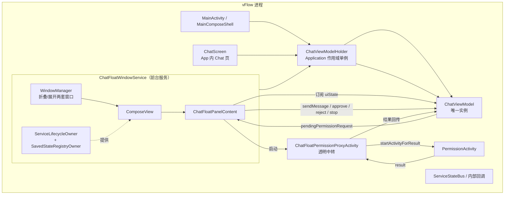
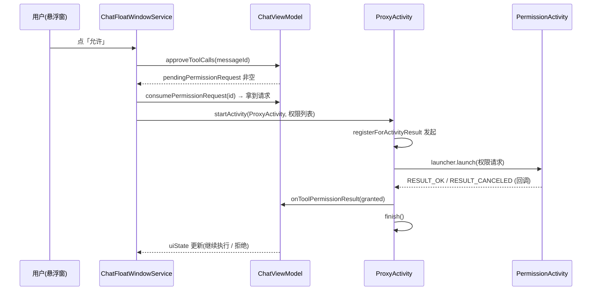
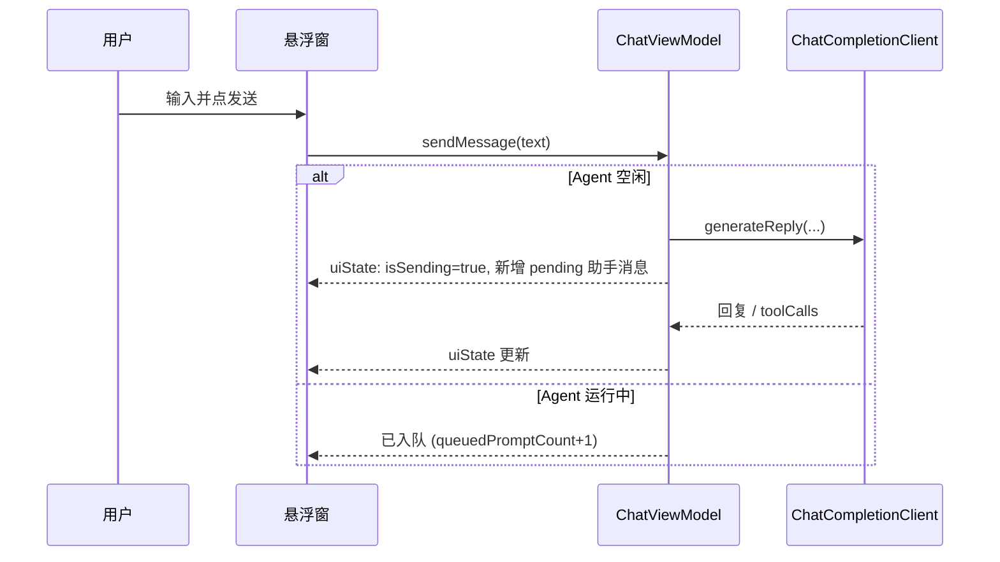
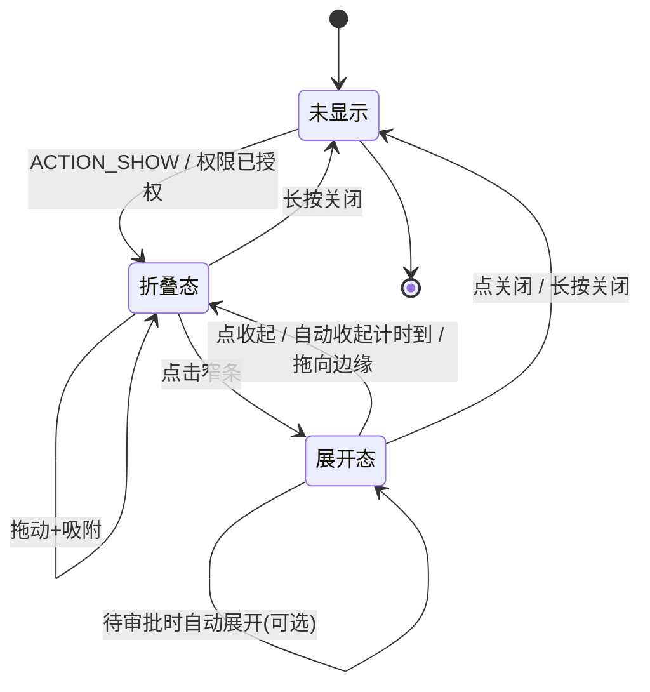

# Chat 悬浮窗 —— 需求设计

> 版本：v1.3（P1 折叠态实现完成 · 2026-09-13）
> 状态：**P1 折叠态已实现并可运行**（真机验证过：拖动、展开/收起、边界吸附、长按关闭）；展开态内容、审批、动画待后续
> 目录：`docs/fork/`（fork 新增文件，上游无此文件，冲突归属**我方**）
> 上游方案来源：[`chat-agent-enhancement-plan.md`](chat-agent-enhancement-plan.md) §4（改造四）
> 现状依据：[`surveys/ai-system-overview.md`](surveys/ai-system-overview.md)
>
> **本文定位**：把方案文档 §4 的调研结论推进成**可评审、可开工的需求设计**——补齐方案文档未定的两个决策点（形态、审批方式），并把「跨 Activity 状态存活」这一真正难点落到具体类与改动点上。**不写实现代码**。
>
> **配套原型**：[`chat-float-window-ui.html`](chat-float-window-ui.html) —— 可交互 UI 原型（折叠 / 展开 / 审批 / 输入 / 状态一致性五组），用于对齐交互与信息层级，不作为视觉定稿。
>
> **P0 实测结论**：见 **§9.1**（七项真机验证结果，含 2 处必须修正的实现细节）。
> **P1 实现状态**：见 **§9.2**（当前可用实现、动画尝试的失败结论）。

## 修订记录

| 版本 | 日期 | 内容 |
|---|---|---|
| v1.3 | 2026-09-13 | **P1 折叠态实现完成**。新增 §9.2 记录实现状态与关键结论：① P1 已实现（窗口/拖动/吸附/长按关闭/折叠态文案）；② **动画尝试失败**——overlay 窗口逐帧同时改「位置+尺寸」会掉帧产生错配帧（实测闪烁），故当前为**瞬时切换、无动画**；③ 记录 `gravity=BOTTOM` 方案实现错误导致功能损坏的原因。 |
| v1.2 | 2026-09-12 | **P0 真机验证后修订**（Xiaomi MIX Fold 3 · Android 17 / API 37 · HyperOS V816）。§9 新增 §9.1 实测结果：**P1/P2/P3/P6 四项通过**，P4/P5 待 P3 阶段，P7 确认截图会拍进悬浮窗。五处修正：① `ViewTreeLifecycleOwner` 必须挂**父容器**（否则实测崩溃）；② IME 必须「创建即可聚焦 + Compose `requestFocus()` + 对 `findFocus()` 调 `showSoftInput`」；③ **`FrameLayout.addView` 默认 MATCH_PARENT 的拖动把手会盖住 Compose、吞掉全部触摸**（本轮最难找的 bug，与 flag 无关）；④ 窗口 flags 采用 `LAYOUT_IN_SCREEN \| NOT_TOUCH_MODAL`——官方推荐的 `NOT_FOCUSABLE\|ALT_FOCUSABLE_IM` 在 HyperOS 上 IME 失效；⑤ remove→add 会重建 composition。另：§10 新增 HyperOS 拦截 overlay 显示在设置页（影响主场景）。 |
| v1.1 | 2026-09-12 | **评审后修订**。① 修正 §1.1 的因果错误（不是看不到 AI 在做什么，而是看不到 AI 在说什么）；② **§5.3 重写**：发现并解决「审批双观察者竞态」（`beyondViewportPageCount` 使 ChatScreen 常驻），Proxy 改用 `registerForActivityResult` 且去掉 `noHistory`；③ §5.4 Owner 改按需（`ViewModelStoreOwner` 不需要）；④ §5.5 删除对死代码 `InsetAwareComposeContainer` 的错误引用；⑤ §5.6.1 修正"双栈切换已验证"的说法并给备选；⑥ §8.2 **diff 面积重估**（MainComposeShell 4 处 + ChatScreen + ChatViewModel，v1.0 低估）；⑦ 补 §10 遗漏风险（截图拍进悬浮窗、划掉 App 后 Agent 仍操作屏幕、旋转坐标错乱）；⑧ §11 验收从 14 项扩到 21 项；⑨ §9 P0 从 3 项扩到 7 项。 |
| v1.0 | 2026-09-12 | 初稿。 |

---

## 0. 决策基线（已定，不再重开）

| 决策点 | 结论 | 影响 |
|---|---|---|
| **悬浮窗形态** | **折叠 / 展开双形态**：默认窄状态条，点击展开为完整对话面板 | 需要折叠↔展开两套窗口与布局，复用 `WorkflowsFloatPanelService` 的吸附/拖动基建 |
| **工具审批** | **悬浮窗内直接审批**（允许/拒绝按钮在窗内），缺系统权限时用透明中转 Activity 承载 `PermissionActivity` 的启动与结果回传 | 必须解决「Service 内无 `ActivityResultLauncher`」；必须共享同一 `ChatViewModel` |
| **状态承载** | 悬浮窗与 App 内 Chat **共用同一个 `ChatViewModel` 实例**（会话不分裂） | 排除方案 C（只读遥控）、方案 D（双 VM 同步）；采用 Application 作用域单例 |
| **UI 技术栈** | Compose（`ComposeView` 承载），与现有 `ChatScreen` 同栈 | 需手动提供 `ViewTreeLifecycleOwner` / `SavedStateRegistryOwner` |

---

## 1. 背景与目标

### 1.1 现状问题

AI 执行屏幕操作时，**操作本身是可见的**——它通过无障碍直接点目标 App，用户就看着那个 App 被操作。真正断掉的是**对话通道**：AI 的回复、思考、状态与对结果的解释都留在 Chat 页里，而用户一旦跟着 AI 离开 Chat 页去看目标页面，就**再也看不到 AI 在说什么**。

具体表现（用户让 AI「帮我把设置里的深色模式打开」）：

- **看不到 AI 在说什么**：AI 的「我先看一下当前页面」「没找到深色模式，我去『显示』里找」这类说明，只有留在 Chat 页才能看到；跟着它切到设置页，这条信息通道就断了；
- **无法中途补充指令**：想纠正它（「不是这里」）只能切回 Chat 页，而切回即离开现场；
- **无法在关键时刻审批**：工具审批在 Chat 页，切回去时 AI 已停等在原地。

`ChatScreen` 是 `MainTopLevelTab.CHAT` 的一个 Pager 页（`MainComposeShell.kt:1032`），与目标 App 互斥，这是结构性问题，无法靠 UI 微调解决。

### 1.2 目标

提供一个**常驻屏幕、可边看边聊**的 Chat 悬浮窗。核心是**把对话通道随身带走**——用户跟着 AI 到任意页面时，AI 的回复、状态与解释仍在眼前：

| # | 目标 | 验收口径 |
|---|---|---|
| G1 | 跟着 AI 走也不断对话 | 悬浮窗可在任意 App 之上显示；AI 每轮回复（含状态摘要）在窗内可见，无需切回 Chat 页 |
| G2 | 会话状态与 App 内一致 | 悬浮窗发的话，回到 App 内 Chat 页能看到；反之亦然 |
| G3 | 可在悬浮窗内审批工具调用 | 工具请求出现时，窗内直接点「允许/拒绝」，无需切 App |
| G4 | 不干扰被操作界面 | 折叠态仅占窄条，可拖动、可侧边吸附、可半透明（操作本身在目标 App 可见，窗只需不挡住它） |
| G5 | 复用现有能力 | 不新造 Chat 引擎，复用 `ChatViewModel` 的全部逻辑 |

### 1.3 非目标（本期不做）

- ❌ 不做独立的第二套会话（不新建 VM、不改会话存储结构）。
- ❌ 不在悬浮窗内做附件/相册/拍照（`ChatScreen` 的附件能力本期不移植）。
- ❌ 不在悬浮窗内做 Benchmark、会话历史管理（侧边栏）、预设切换（仅展示当前预设名，不支持切换）。
- ❌ **不支持在悬浮窗内切换/删除会话**（FR4 的"活动会话切换"仅指**被动跟随** `activeConversationId` 变化，不提供切换入口）。
- ❌ 不引入流式输出（沿用现状 `stream=false`，见 `AGENTS.md` 已知限制）。
- ❌ 不改动工具审批的**业务语义**（风险分级、自动审批作用域保持原样）。但需注意：悬浮窗审批**绕过了 `ChatScreen` 的界面约束**（如 `actionsEnabled = !chatUiState.isSending`，`ChatScreen.kt:379`），悬浮窗需定义**等价的禁用规则**（Agent 运行中不可点审批按钮）。
- ❌ **不支持多显示器**（副屏）。vFlow 屏幕工具普遍带 `displayId`，若 AI 在副屏操作而悬浮窗在主屏，G1 会失效。**本期明确排除并豁免验收**（不是"待定"，避免验收时被当缺陷）。

---

## 2. 用户场景

### S1 主场景：跟着 AI 到现场，仍能听到它在说什么

1. 用户在 Chat 页说「帮我把设置里的深色模式打开」。
2. 点顶栏「悬浮窗」按钮（新增）→ 悬浮窗以折叠态出现。
3. 用户手动切到系统设置页（AI 的操作目标）——操作本身看得见，但 AI 的说明原本留在 Chat 页里；现在悬浮窗仍浮在其上，显示 AI 最新一句，如 `● AI: 先看看当前页面有什么…`。
4. AI 请求执行 `vflow.interaction.click`（STANDARD 风险）→ 悬浮窗自动展开到审批卡片，用户点「允许」。
5. AI 继续操作并说明「没找到深色模式，我去『显示』里找」——这句话用户直接在悬浮窗看到，不会因为人在设置页而错过。
6. 用户发现它在错误的页面找，直接在输入框敲「不是这里，先点最上面的搜索」→ 发送。
7. AI 收到新指令（追加到同一会话），继续。

### S2 审批兜底：缺系统权限

AI 需要截图（`MediaProjection`）→ 悬浮窗点「允许」后发现缺权限 → 悬浮窗弹出透明 Activity 请求授权 → 返回后自动继续，悬浮窗状态更新。

### S3 折叠态低干扰

用户把悬浮窗拖到右边缘自动吸附；AI 长时间操作时，折叠态窄条半透明，只占屏幕边缘一小块，不挡住目标 App 的操作区域；AI 完成时窄条显示最终回复摘要，用户扫一眼即可知道结果。

### S4 与 App 内一致性

用户中途回到 vFlow App 的 Chat 页，看到悬浮窗里刚才的完整对话；关闭悬浮窗后会话仍在。

---

## 3. 功能需求

### FR1 悬浮窗入口

| 项 | 要求 |
|---|---|
| 触发位置 | Chat 页顶栏 actions 新增「悬浮窗」按钮（与「新对话」「历史」并列）。参考 `MainComposeShell.kt:536-556` 的 `ChatTopBarActions` |
| 前置校验 | `Settings.canDrawOverlays()`；未授权时走 `PermissionManager` 的 overlay 引导策略（`permissions/PermissionManager.kt:321-327`）。⚠️ 不要引用 `WorkflowListRoute.kt:864` 的 `requestOverlayPermission`——它是 private 且文件专用 |
| 启动方式 | `ContextCompat.startForegroundService(Intent(context, ChatFloatWindowService::class.java).apply { action = ACTION_SHOW })`（前台服务，见 §5.2） |
| 已显示时 | 重复触发应「展开并前置」，不重复创建窗口 |

### FR2 折叠态

| 项 | 要求 |
|---|---|
| **内容** | 状态指示点 + **一行 AI 文本** + 展开按钮。这一行须承载 **AI 说的内容**（这是本需求的核心，见 §1.1）：Agent 运行时显示**最新一轮助手回复的摘要**（含"没找到，我去显示里找"这类过程说明）；仅在无助手文本可显示时才退化为状态动词（"正在观察…"）；空闲时显示最后一条回复。 |
| 尺寸 | 约 `280dp × 44dp`（可容纳中文摘要；具体以实测为准） |
| 可拖动 | 按住非按钮区域拖动，松手吸附最近左右边缘 |
| 自动折叠 | 无交互 N 秒（默认沿用 3000ms，可配置）后自动从展开态收回折叠态 |
| 半透明 | 默认 ~0.92 alpha，降低遮挡 |
| 待审批徽标 | 有 `PENDING` 审批时，窄条显示醒目标记（与 §6.3 的"自动展开"策略配合或二选一） |

### FR3 展开态

| 项 | 要求 |
|---|---|
| 内容 | ① 头部：标题 + 当前预设/模型名 + 收起/关闭 ② 消息列表（可滚动，自动滚到底）③ 输入框 + 发送/停止按钮 |
| 消息渲染 | 复用 `ChatMessage` 模型；用户/助手/工具/错误四类均有视觉区分 |
| 工具审批卡 | 助手消息 `toolApprovalState == PENDING` 时，在气泡内显示工具名、风险等级、参数摘要 + 「允许」「拒绝」按钮 |
| 尺寸 | `320dp` 宽 × 最高 `480dp`（可配置），内容超出滚动 |
| 停止 | Agent 运行中，发送键变为「停止」，调用 `ChatViewModel.stopAgent()` |
| **展开方向** | **按窄条位置决定，并保持所贴的那条边不动**（用户明确要求）：<br>· 窄条在屏幕**下方** → **向上展开**（底边固定，面板向上生长）<br>· 窄条在屏幕**上方** → **向下展开**（顶边固定）<br>· 折叠回窄条时仍停在原位（因为锚定边本就固定） |
| **标题栏位置** | **贴近窄条**（用户选定）：向上展开时标题栏放面板**底部**（用户视线所在处不动，内容向上延伸）；向下展开时放面板**顶部**。 |
| **过渡动画** | ⚠️ 当前为**瞬时切换、无动画**。原因见 §9.2：overlay 窗口逐帧同时改「位置+尺寸」会掉帧产生错配帧（闪烁）。**恢复动画的前置条件见 §9.2。** |

### FR4 状态展示与同步

悬浮窗订阅 `ChatViewModel.uiState`，需要正确呈现：

| UI 状态 | 悬浮窗表现 |
|---|---|
| `isSending` / `isAgentRunning` | 折叠态显示「思考中/执行中…」动画点；展开态输入框变停止键 |
| `pendingPermissionRequest != null` | 触发透明中转 Activity（见 §5.3） |
| `queuedPromptCount > 0` | 折叠态/输入框旁显示「已排队 N 条」 |
| `events`（`SharedFlow<String>`） | 窗内 Snackbar/轻提示（如「已加入队列」） |
| 活动会话切换 | 展开态列表随 `activeConversationId` 更新 |

### FR5 输入

| 项 | 要求 |
|---|---|
| 发送 | 调 `ChatViewModel.sendMessage(text)`；返回 `true` 时清空输入框 |
| 多行 | 最多 6 行，超出滚动（与 `ChatScreen` 一致） |
| IME | 窗口**创建时即**可聚焦（`LAYOUT_IN_SCREEN \| NOT_TOUCH_MODAL`）；输入框获焦后对 `findFocus()` 结果调 `showSoftInput`；失焦仅收键盘，**不退回 `NOT_FOCUSABLE`**（P0 实测，见 §9.1 修正②～④）。⚠️ 不可照抄 `DynamicFloatWindowService`——它的把手与 flags 都有问题 |
| Enter 行为 | `ImeAction.Send`，与 `ChatScreen` 一致 |

### FR6 关闭与生命周期

| 项 | 要求 |
|---|---|
| 关闭方式 | 头部关闭按钮；长按关闭（复用 `WorkflowsFloatPanelService.setupCloseHoldBehavior()`） |
| 关闭时 | 仅移除窗口、`stopSelf()`；**不清空会话、不 cancel 正在运行的 Agent**（Agent 继续在 VM 中跑，用户可在 App 内查看） |
| 与 App 内 Chat 页 | 两者可同时存在，共享同一状态；悬浮窗开着时 App 内 Chat 页正常显示同一会话 |

### FR7 权限

| 权限 | 现状 | 处理 |
|---|---|---|
| `SYSTEM_ALERT_WINDOW` | ✅ 已声明（`AndroidManifest.xml:18`） | 运行时校验 + 引导授权 |
| `FOREGROUND_SERVICE` + `FOREGROUND_SERVICE_SPECIAL_USE` | ✅ 已声明（`:13`、`:19`） | 提升为**前台服务**，避免进程被回收导致 VM 丢失（见 §5.2） |
| `POST_NOTIFICATIONS` | ✅ 已声明 | 前台服务通知；未授权时降级（Android 13+ 通知被拒仍可启动 FGS） |

---

## 4. 架构设计

### 4.1 整体结构



### 4.2 分层职责

| 层 | 新增/改动 | 职责 |
|---|---|---|
| **状态层** | 新增 `ChatViewModelHolder` | 提供 Application 作用域的唯一 `ChatViewModel`；App 与 Service 均从此取 |
| **服务层** | 新增 `ChatFloatWindowService` | 窗口创建、折叠/展开、拖动吸附、IME、生命周期 |
| **UI 层** | 新增 `ChatFloatPanelContent.kt` | 折叠态/展开态的 Compose UI；不依赖 Activity |
| **中转层** | 新增 `ChatFloatPermissionProxyActivity` | 透明 Activity，承载需要 `ActivityResult` 的权限请求 |
| **接入层** | 改 `MainComposeShell.kt`（1 处）+ 新增顶栏按钮 | 把 `viewModel()` 换成 `ChatViewModelHolder.get()`；加悬浮窗入口 |

---

## 5. 关键难点与方案

### 5.1 难点一：Chat 状态跨 Activity/Service 存活（**核心**）

**问题**：`ChatViewModel` 现由 `MainComposeShell.kt:199` 的 `viewModel()` 获取，绑定最近 `ViewModelStoreOwner`（即 `MainActivity`）。Service 拿不到同一实例；若 Service 自建 VM，则出现两套会话（悬浮窗说的话回 App 看不到），违反 G2。

**方案：Application 作用域单例持有者。**

```kotlin
// 新增文件（fork 独有）
object ChatViewModelHolder {
    private var store: ViewModelStore? = null

    @MainThread
    fun get(application: Application): ChatViewModel {
        val existing = store ?: ViewModelStore().also { store = it }
        return ViewModelProvider(
            existing,
            ViewModelProvider.AndroidViewModelFactory.getInstance(application)
        )[ChatViewModel::class.java]
    }

    @MainThread
    fun clear() { /* 仅用于测试/进程级清理，正常不调用 */ }
}
```

要点：

- **同一把 `ViewModelStore`** → `ViewModelProvider` 的 key 是规范化类名，对同一 store 必返回同一实例；`ChatViewModel(application: Application)`（`ChatViewModel.kt:58`）是 `AndroidViewModel`，`AndroidViewModelFactory.getInstance(app)` 可正确构造。方案成立。
- **更标准的替代**：让 `VFlowApplication`（当前是空壳，只初始化日志/埋点）实现 `ViewModelStoreOwner`，`ChatViewModelHolder` 退化为取 VM 的工具函数。更符合 Android 惯例，但会改到 Application 类；本方案保持 `Holder` 自持 store，对上游侵入更小。
- **生命周期**：VM 随**进程**存活——这正是悬浮窗需要的（Activity 销毁后 Agent 仍应继续）。
- ⚠️ **必须显式认识到「进程级常驻」的两面**：
  - `onCleared()`（`ChatViewModel.kt:105-109`）**永不触发** → `repository.unregisterChangeListener(prefsListener)`（`:106`）永不执行 → `SharedPreferences` 会**永久持有 prefsListener → ChatViewModel**。
  - `artifactStores`（`:64`）等状态同样与进程同寿，不释放。
  - 这是**有意为之**（与进程同生命周期），不是 bug；但文档需明确登记，不能轻描淡写。Application 退出即随之释放。
- **清理责任**：不做主动清理。若后续要支持「退出 App 即停 Agent」，再引入显式 stop。

**接入改动**：

| 文件 | 改动 | diff 面 |
|---|---|---|
| `ui/main/MainComposeShell.kt:199` | `val chatViewModel = viewModel()` → `ChatViewModelHolder.get(application)` | 小（上游文件，须登记 FORK.md） |
| `ui/chat/ChatScreen.kt:171` | 默认参数 `viewModel()` 保留（测试/预览用），实际调用方总是显式传入，可不改 | 零 |

> ⚠️ **备选（若不想动 `MainComposeShell`）**：`ChatScreen` 已接受 `chatViewModel` 参数，只有 `MainComposeShell` 那一处是 `viewModel()`。无法完全零改动，但只需改 1 行。

### 5.2 难点二：Service 进程存活与前台服务

**问题**：Agent 一次屏幕操作可能持续数十秒；普通后台 Service 在系统内存紧张时可能被杀，导致 VM 与运行中的 Agent 一起消失。悬浮窗消失后用户在 App 内也看不到结果。

**方案**：`ChatFloatWindowService` 以前台服务运行。

- **启动方式用 `ContextCompat.startForegroundService()`**，而非普通 `startService()`——否则与"前台保活"意图不一致，且面临后台服务限制。项目已有先例：`PermissionGuardianService.kt:77`、`TriggerService.kt:198-199`（注释明确"必须先 startForeground 满足契约"）。Service 内随即 `startForeground(id, notification)`。
- **通知 channel 需自建**，不能"复用 `ExecutionNotificationManager`"：它是 `object`（`:30`），channel id 固定为 `workflow_execution_channel`（`:32`），对外 API `updateState(workflow: Workflow, state)`（`:69`）要求传入 `Workflow` 对象，无法承载"Chat Agent 运行中"。直接扩展它需改上游文件，违背 diff 原则 → 新建独立 channel。
- 通知内容：`Chat Agent 运行中` + 点按回到 `MainActivity` 的 Chat 页。
- manifest 声明 `android:foregroundServiceType="specialUse"`（权限已具备）。
- 窗口仍在 `TYPE_APPLICATION_OVERLAY`，前台服务只解决进程优先级，不改变窗口性质。
- ⚠️ **`targetSdk 36` 上 `startForeground` 若不匹配类型/未在时限内调用会抛异常**，需真机验证（列入 P0）。

### 5.3 难点三：悬浮窗内审批（Service 无 `ActivityResultLauncher`）

> ⚠️ **本小节于评审后重写**（v1.1）。原方案有一个致命的**双观察者竞态**，且 Proxy 的 manifest 配置与回传机制不匹配。以下为修正版。

#### 5.3.1 现状链路（`ChatScreen.kt:274-337`）

```
ChatViewModel.approveToolCalls(messageId)     ChatViewModel.kt:519
  ├─ 无缺失权限 → 直接执行
  └─ 有缺失权限 → uiState.pendingPermissionRequest = ...   :555-565
        ↓ ChatScreen LaunchedEffect 观察          ChatScreen.kt:323-337
     markPermissionRequestLaunched()             :325  → VM:691 置 null
     toolPermissionLauncher.launch(PermissionActivity)   :336 ← 需要 Activity
        ↓ 返回
     ChatViewModel.onToolPermissionResult(granted)  ChatViewModel.kt:697
```

**两个问题**：

1. `rememberLauncherForActivityResult` 依赖 `ActivityResultRegistryOwner`，Service 的 `ComposeView` 不提供。
2. **更隐蔽**：App 内 `ChatScreen` 的审批 `LaunchedEffect` **始终在运行**——`MainComposeShell.kt:992` 的 `HorizontalPager` 设了 `beyondViewportPageCount = MainTopLevelTab.entries.size - 1`，即所有 Tab 页常驻组合，且 `ChatScreen` 没有 `isActive` 参数。**悬浮窗出现审批时，Service 与 App 内 ChatScreen 会同时观察 `pendingPermissionRequest` 并各自尝试消费。**

#### 5.3.2 竞态后果（必须先解决）

| 谁先 `markPermissionRequestLaunched()` | 后果 |
|---|---|
| Service 先 | ChatScreen 可能已读到非空值 → **两边各 launch 一次 → 权限页弹两次** |
| ChatScreen 先 | 从 MainActivity 拉起 `PermissionActivity`，把 vFlow 顶到前台 → **用户被迫切回 App，悬浮窗「不切 App」的目标失效** |

原方案只写了 Service 一侧，完全没有覆盖这个竞态。

#### 5.3.3 方案：审批 UI 的单一所有权 + 原子消费

**① 显式所有权（确定性，不靠抢）**

`ChatViewModel` 增加审批 UI 归属标记，由悬浮窗在可见性变化时声明：

```kotlin
enum class ChatPermissionUiOwner { IN_APP, FLOAT }

// ChatViewModel 新增
private var permissionUiOwner = ChatPermissionUiOwner.IN_APP
val currentPermissionUiOwner: ChatPermissionUiOwner get() = permissionUiOwner

@MainThread
fun setPermissionUiOwner(owner: ChatPermissionUiOwner) {
    permissionUiOwner = owner
}
```

- `ChatFloatWindowService` 窗口可见时 `setPermissionUiOwner(FLOAT)`；`onDestroy`/隐藏时恢复 `IN_APP`。
- `ChatScreen.kt:323` 的 `LaunchedEffect` 首行加守卫：`if (chatViewModel.currentPermissionUiOwner == FLOAT) return@LaunchedEffect`。

**② 原子消费（防重复，兜底）**

把 `markPermissionRequestLaunched()`（`:691-695`，只置 null）改为 CAS 语义——**取走并返回**，只有一方能拿到非空：

```kotlin
// 原：fun markPermissionRequestLaunched() { _uiState.update { it.copy(pendingPermissionRequest = null) } }

@MainThread
fun consumePermissionRequest(requestId: String): ChatPermissionRequest? {
    val current = _uiState.value.pendingPermissionRequest ?: return null
    if (current.requestId != requestId) return null
    _uiState.update { it.copy(pendingPermissionRequest = null) }
    return current   // 只有第一个调用者拿到非 null
}
```

> 这是对上游 `ChatViewModel` 的**语义改动**（`markPermissionRequestLaunched` → `consumePermissionRequest`），须登记 FORK.md。守卫 + CAS 双保险：所有权决定"该谁弹"，CAS 保证"只弹一次"。

#### 5.3.4 透明中转 Activity

Service 侧仍需一个 Activity 来承载 `PermissionActivity` 的启动与结果回传。**关键修正：不要用 `noHistory="true"` + `startActivityForResult`**——`noHistory` 的 Activity 在被权限页覆盖时会先被销毁，结果回不来。

正确范式**项目里已有**：`OverlayUIActivity` 用 `registerForActivityResult`（`OverlayUIActivity.kt:83/96/108`）在自己内部接结果，再通过 `ExecutionUIService.inputCompletable`（`:88/101`）回传——不是 `startActivityForResult`。

```xml
<!-- manifest 新增：注意没有 noHistory -->
<activity
    android:name=".ui.chat.ChatFloatPermissionProxyActivity"
    android:theme="@style/Theme.vFlow.Transparent.Default"
    android:exported="false"
    android:taskAffinity=""
    android:excludeFromRecents="true" />
```

流程：



要点：

- **无缺失权限时**：不启动 Proxy，`approveToolCalls` 内部直接执行——零额外往返（`ChatViewModel.kt:568-570` 现有逻辑已如此）。
- **Proxy 是纯哑终端**：只做 `registerForActivityResult` + 回传，不含业务判断。
- **窗口刷新无需回传通道**：VM 是共享单例，Compose 已订阅 `uiState` 的 `StateFlow`，状态自动刷新。**不需要 `ServiceStateBus`**（它的职责只有无障碍状态与窗口变化事件，`ServiceStateBus.kt` 全文无通用消息通道）。
- **Proxy 需带上足够的上下文**：`requestId`、权限列表（`putParcelableArrayListExtra`，`Permission` 已是 Parcelable，见 `ChatScreen.kt:326-330` 现成用法）、`conversationId`/`messageId`，以便回传时定位。

### 5.4 难点四：ComposeView 在 Service 中的承载

**问题**：`ComposeView` 需要 `ViewTreeLifecycleOwner`，缺失会直接抛 `ViewTreeLifecycleOwner not found`。

**按需实现 Owner**（不是三个都必须，见下表）：

| Owner | 何时必需 | 本方案 |
|---|---|---|
| `LifecycleOwner` | **无条件必需**（`ComposeView` 硬要求） | ✅ 必须 |
| `SavedStateRegistryOwner` | composition 内使用 `rememberSaveable` 时必需 | ✅ 需要（输入框草稿、展开态等大概率用到） |
| `ViewModelStoreOwner` | composition 内调用 `viewModel()` 时必需 | ❌ **不需要**——本方案 VM 从 `ChatViewModelHolder` 取，不在 composition 内创建 VM |

**依赖已具备，无需改 `build.gradle.kts`**：`lifecycle-runtime-compose` 虽未在 `app/build.gradle.kts:148-244` 直接声明，但经传递已解析到 2.10.0；`setViewTreeSavedStateRegistryOwner` 属 `androidx.savedstate`（已解析 1.4.0）。

```kotlin
class ChatFloatWindowService : Service(), LifecycleOwner, SavedStateRegistryOwner {
    private val lifecycleRegistry = LifecycleRegistry(this)
    private val savedStateController = SavedStateRegistryController.create(this)

    override val lifecycle get() = lifecycleRegistry
    override val savedStateRegistry get() = savedStateController.savedStateRegistry

    // onCreate: savedStateController.performRestore(null); lifecycleRegistry.currentState = CREATED
    // 窗口显示后: currentState = RESUMED
    // onDestroy: currentState = DESTROYED; 解绑
}
```

窗口创建时绑定：

```kotlin
// ⚠️ 修正（P0 实测）：owner 必须设在**父容器**上，不能设在 ComposeView 自己身上，
//    否则 attachedToWindow 时抛 "ViewTreeLifecycleOwner not found"（见 §9.1 修正①）。
val container = FrameLayout(themedContext).apply {
    setViewTreeLifecycleOwner(this@ChatFloatWindowService)
    setViewTreeSavedStateRegistryOwner(this@ChatFloatWindowService)
}
val composeView = ComposeView(themedContext).apply {
    setViewCompositionStrategy(ViewCompositionStrategy.DisposeOnViewTreeLifecycleDestroyed)
    setContent {
        VFlowTheme { ChatFloatPanelContent(...) }
    }
}
container.addView(composeView)
```

`DisposeOnViewTreeLifecycleDestroyed` 仍是正确选择（避免 detach 时 dispose composition）。但 **P0 实测发现：即便用它，`remove→add` 同一个 View 仍会重建 composition**（§9.1 修正⑤）——因此**不推荐 remove/add 的双栈切换**，改用两态都 Compose + 改 `params` 宽高（§5.6.1）。

> **注意**：`ChatFloatPanelContent` 内部**不得使用** `rememberLauncherForActivityResult`（无 `ActivityResultRegistryOwner`），也不应调用 `viewModel()`（无 `ViewModelStoreOwner`，且 VM 应从 Holder 取）。需 Activity 的动作一律走 §5.3.4 的 Proxy。

### 5.5 难点五：IME（软键盘）与窗口尺寸

**问题**：overlay 窗口不在标准 inset 分发链上，`imePadding()` 不可靠；键盘弹出时窗口可能被遮挡或不上移。

**方案（P0 实测定稿）**：

1. **窗口创建时即设可聚焦**：`FLAG_LAYOUT_IN_SCREEN | FLAG_NOT_TOUCH_MODAL`。
   - ❌ **不要**"创建时 `NOT_FOCUSABLE`、点击后再切"——会死锁（拿不到焦点 → 回调不触发 → 切不了）。
   - ❌ **不要**只写 `FLAG_LAYOUT_IN_SCREEN`——会变成模态窗口吞掉背景触摸（用户实际遭遇）。
   - ❌ **不要**用官方文档的 `NOT_FOCUSABLE | ALT_FOCUSABLE_IM`——HyperOS 上 IME 拒绝。
2. **Compose 侧重申请焦点**：`FocusRequester.requestFocus()`。**少了这步 `showSoftInput` 返回 false。**
3. **对焦点 View 请求 IME**：对 `rootView.findFocus()`（实测 `AndroidComposeView`）调 `showSoftInput`，**传 `ComposeView` 或容器会返回 false**。

> **P0 实测结论：`showSoftInput=true isAcceptingText=true`，用户手点确认键盘弹出**（§9.1 修正②～④有完整代码与三组 flags 对照）。

⚠️ **还要确认触摸真的到达输入框**：见 §9.1 修正③——若窗口内有其他 View（如拖动把手）默认 `MATCH_PARENT` 盖在 ComposeView 之上，输入框永远收不到触摸，表现为"点不动"。**这不是 IME 问题**，是布局问题。

4. **键盘避让**：overlay 窗口不在标准 inset 分发链上，`imePadding()` 不可靠。**P0 观察：键盘弹出时窗口未自动上移**（截图确认窗口被键盘遮挡）。需监听 IME 高度手动改 `params.y`，或用 `setOnApplyWindowInsetsListener` 取 `WindowInsets.Type.ime()`。**此项仍未验证**，列入 P2。
   - ❌ 原 v1.0 称「`InsetAwareComposeContainer` 已具备该模式」是**错误引用**：该文件（`ui/common/InsetAwareComposeContainer.kt`）只是一个 FrameLayout + `mutableIntStateOf`，**不挂任何 `setOnApplyWindowInsetsListener`**，且全仓无引用（死代码）。仅在"手动把 inset 传入 Compose"这一点上可作形态参考，不提供现成机制。
5. **窗口高度**：展开态用 `WRAP_CONTENT` + `heightIn(max=480.dp)`；不要固定高度，避免键盘弹出时压缩内容。

### 5.6 难点六：UI 复用与 diff 面积

**冲突**：`ChatScreen`（2,223 行）里 composer 与 `ChatMessageBubble` 均为 `private` 且内联依赖 Activity，直接复用需大改上游文件，违背 FORK 的「控制 diff 面积」原则。

**方案对比**：

| 方案 | 做法 | diff 面 | 一致性 |
|---|---|---|---|
| **A（推荐）新增独立 UI** | 新建 `ChatFloatPanelContent.kt`，自建折叠态/展开态与轻量消息气泡；复用 `ChatMarkdown`（已是独立文件）做渲染 | **小**（UI 部分上游零改动） | 中（气泡视觉可能略有差异） |
| **B 提取共享组件** | 把 `ChatMessageBubble` 等从 `ChatScreen.kt` 提取到新文件并改 `internal`，两处共用 | **大**（大范围移动上游代码，合并冲突高） | 高 |

**推荐 A**：本期悬浮窗是「边看边聊」的高频轻量场景，不需要完整气泡（如附件预览、Benchmark 按钮、复制等可省略）。未来若两处 UI 趋于一致，再评估向 B 收敛。

> **注意**：UI 复用可以做到零上游改动，但**整体改动不止 UI**。审批仲裁必须动 `ChatScreen.kt`（见 §5.3.3），完整的 diff 清单见 §8.2。

#### 5.6.1 折叠态实现选择（**P0 已作结论：两态都用 Compose**）

原 v1.0/v1.1 建议折叠态用纯 View、展开态用 Compose，借鉴 `WorkflowsFloatPanelService` 的 add/remove 双窗口切换。

**P0 实测否定了这个方向**（§9.1 修正⑤）：

- `remove → add` 同一 View 后，`setContent` **被再次触发**——composition 被重建，`rememberSaveable` 内容会丢。
- 即使用 `DisposeOnViewTreeLifecycleDestroyed` 也未能避免。
- 该参照实现切换的是**纯 XML View**，从未验证过 ComposeView 的重挂载。

**结论：折叠态与展开态都用 Compose**，作为**同一个 composition 的两种形态**，由状态驱动切换——**只改 `params` 宽高与内容，不做 remove/add**。这样：

- 状态天然保留（无重挂载）
- 绕开双栈复杂度，少一个 XML 布局文件
- 代价是折叠态也常驻 composition（窄条内容极简，开销可忽略）

---

## 6. 数据流

### 6.1 发送指令



### 6.2 工具审批

见 §5.3 时序图。

### 6.3 窗口状态机



> 「待审批时自动展开」为可选增强：若用户把窗口折叠后 AI 请求审批，自动展开能避免遗漏。建议**默认开启**（可在设置中关闭）。触发条件：`activeConversation` 出现 `toolApprovalState == PENDING` 的助手消息。

---

## 7. 与现有资产的对齐

| 资产 | 现状 | 本期用法 |
|---|---|---|
| `WorkflowsFloatPanelService.kt`（514 行） | 折叠/展开、侧边吸附、拖动、长按关闭、自动收起 | **抄代码**（方法均为 `private`）：`collapseToSidebar` / `snapToEdge` / `setupCloseHoldBehavior` / `startAutoCollapseTimer`。注意其 `collapseToSidebar` 不移除 View 引用（`:303`），移植需保持一致 |
| `DynamicFloatWindowService.kt` | 声称**可输入**：切 focusable + IME + 失焦恢复 | ⚠️ **不可照抄**：① 它的 `setWindowFocusable`（`:399-403`）切聚焦时**未加 `FLAG_NOT_TOUCH_MODAL`**，会吞掉背景触摸（P0 已证实此坑）；② 它的焦点切换时机与 Compose 不兼容（见 §5.5）。**只参考思路，实现按 §5.5 定稿方案** |
| `ExecutionUIService` + `OverlayUIActivity` | 透明 Activity + `registerForActivityResult` + `CompletableDeferred` 回传 | §5.3.4 Proxy 的**正确范式**（不要用 `noHistory` + `startActivityForResult`） |
| `AgentOverlayManager.kt`（374 行） | AI 状态显示 + 底部控制面板 + **`hideForScreenshot()`/`restoreAfterScreenshot()`** | 折叠态状态展示的参照；**截图 hide/restore 的现成解法**（§10#5）。⚠️ v1.0 遗漏了它 |
| `ChatViewModel` | 全部会话/审批/工具执行逻辑 | 基本复用，但**审批消费语义需改**（`markPermissionRequestLaunched` → `consumePermissionRequest`，§5.3.3） |
| `ChatModels.kt`（`ChatMessage` 等） | 数据模型 | 直接复用 |
| `ChatMarkdownContent`（`ChatMarkdown.kt:15`） | Markdown 渲染，**公开可复用** | 悬浮窗消息渲染复用 |
| `VFlowTheme` / `ThemeUtils.createThemedContext` | 主题应用 | 窗口视图主题（含深色模式） |
| `PermissionManager`（`:321-327`） | overlay 校验 + 引导策略 | 悬浮窗权限校验。⚠️ v1.0 误引 `WorkflowListRoute.kt:864` 的 `requestOverlayPermission`——它是 **private 且文件专用**，不可复用 |
| `MainTopLevelTab` / `ChatTopBarActions` | Chat 顶栏 | 新增悬浮窗入口按钮（`MainComposeShell.kt:144` 枚举 + `:298` 分支 + `:536` 按钮） |
| ❌ `InsetAwareComposeContainer.kt` | 死代码（全仓 0 引用），无 inset listener | **不可作"现成机制"引用**，仅形态参考（§5.5） |
| ❌ `ServiceStateBus` | 仅无障碍状态 + 窗口变化事件，无通用消息通道 | **不可作 Proxy→窗口回传通道**（§5.3.4） |

---

## 8. 新增与改动清单

### 8.1 新增文件（fork 独有 → 冲突归属我方）

| 文件 | 类型 | 说明 |
|---|---|---|
| `app/src/main/java/com/chaomixian/vflow/ui/chat/ChatViewModelHolder.kt` | Kotlin | Application 作用域唯一 VM 持有者 |
| `app/src/main/java/com/chaomixian/vflow/ui/float/ChatFloatWindowService.kt` | Kotlin | 前台服务：窗口、折叠/展开、拖动、IME、生命周期 |
| `app/src/main/java/com/chaomixian/vflow/ui/chat/ChatFloatPanelContent.kt` | Kotlin | 悬浮窗 Compose UI（折叠态 + 展开态 + 审批卡 + 输入框） |
| `app/src/main/java/com/chaomixian/vflow/ui/chat/ChatFloatPermissionProxyActivity.kt` | Kotlin | 透明中转 Activity |

> **不需要 XML 布局文件**：P0 已定两态都用 Compose（§5.6.1），Service 直接构造 `FrameLayout` + `ComposeView` 作为根 View。~~原计划的 `chat_float_window_collapsed.xml` 取消。~~

### 8.2 改动上游文件（须登记 FORK.md）

> ⚠️ **v1.0 低估了 diff 面积**（原文称"只改 MainComposeShell 1 行"）。评审后重估如下。

| 文件 | 改动 | 冲突归属 |
|---|---|---|
| `ui/main/MainComposeShell.kt` | **4 处**：① `ChatTopBarAction` 枚举新增 `ShowFloatWindow`（`:144`）② `when` 分支新增处理（`:298-308`）③ `ChatTopBarActions` 加 IconButton（`:536-556`）④ VM 获取改为 `ChatViewModelHolder.get(application)`（`:199`） | **手动合并**（4 处均为追加，若上游改同区域需逐块判断） |
| `ui/chat/ChatScreen.kt` | **1–2 处**：审批 `LaunchedEffect`（`:323-337`）加 owner 守卫；`markPermissionRequestLaunched()` 调用点改为 `consumePermissionRequest()` | **手动合并**（改动审批观察逻辑，是行为变更不是纯追加，风险较高） |
| `ui/chat/ChatViewModel.kt` | 新增 `permissionUiOwner` + `setPermissionUiOwner()`；`markPermissionRequestLaunched()` → `consumePermissionRequest(requestId)`（语义变更，`ChatViewModel.kt:691-695`） | **手动合并**（改既有方法语义，须重新登记） |
| `AndroidManifest.xml` | 新增 `.ui.float.ChatFloatWindowService`（`foregroundServiceType="specialUse"`）与 `.ui.chat.ChatFloatPermissionProxyActivity`（透明，**无 `noHistory`**）声明 | **手动合并**（追加声明） |
| `res/values/strings.xml`、`values-en/`、`values-ja/` | 新增悬浮窗相关文案（中/英/日 **3 个文件**） | 手动合并（追加条目） |

**无需改动**：`app/build.gradle.kts`（依赖已传递具备）、`values/themes.xml`（`Theme.vFlow.Transparent.Default` 已存在）。

---

## 9. 实施拆解（建议顺序）

| 阶段 | 内容 | 产出 | 可独立验证 |
|---|---|---|---|
| **P0 技术验证（Spike，硬门槛）** | ① `ChatViewModelHolder` 共享验证（App 与测试 Service 各取一次，断言同一实例）② `ComposeView` 在 Service 中渲染 ③ 去 `FLAG_NOT_FOCUSABLE` 后 Compose 输入框能焦点+弹键盘+收起 ④ **审批双观察者竞态**：验证 `consumePermissionRequest` + owner 守卫能保证只弹一次 ⑤ **Proxy 回传**：验证 `registerForActivityResult`（无 `noHistory`）能拿到结果 ⑥ **前台服务**：`targetSdk 36` 上 `startForeground(specialUse)` 不抛异常 ⑦ **screencap** 是否会拍进悬浮窗（见 §10） | 最小 demo | ✅ 真机 |
| **P1 折叠态** | `ChatFloatWindowService` 创建折叠态窗口、拖动、吸附、长按关闭、显示 `uiState` 摘要 | 可拖动的状态窄条 | ✅ 真机 |
| **P2 展开态 + 输入** | 展开为对话面板、消息列表、输入框发送、停止 | 可边看边聊 | ✅ 真机 |
| **P3 审批闭环** | owner 仲裁 + `consumePermissionRequest` + ChatScreen 守卫 + Proxy Activity + `onToolPermissionResult` 回传 | 全流程不切 App、只弹一次 | ✅ 真机（用需要授权的工具验证） |
| **P4 打磨** | 半透明、自动折叠、自动展开、前台服务通知、深色模式、字符串三语、截图 hide/restore、异常态（无预设/网络失败） | 可发布形态 | ✅ 真机 |

**P0 是硬门槛**：七项任一不通过，需回头调整方案（例如 Compose 输入不可用则展开态改 View；双观察者无法仲裁则审批需重新设计）。原 v1.0 只列 3 项，遗漏了最可能推翻方案的 ④⑤。

### 9.1 P0 实测结果（2026-09-12 · 已完成）

**验证环境**：Xiaomi MIX Fold 3（2308CPXD0C / babylon）· Android 17 / **API 37** · HyperOS **V816** · arm64-v8a · 内屏 1916×2160。
**验证方式**：新增临时验证类 `ChatFloatP0{Activity,Service,Probe}.kt`（不触碰生产代码），逐项打点输出到 logcat `tag=P0_PROBE`。

| # | 项目 | 结果 | 实测证据 |
|---|---|---|---|
| P1 | **VM 共享** | ✅ **通过** | `Activity 与 Service 同一实例 vm@258144880` —— `ChatViewModelHolder`（同一 `ViewModelStore` + `AndroidViewModelFactory`）方案**成立** |
| P2 | **ComposeView 在 Service 渲染** | ✅ **通过**（修 ① 后） | `addView 成功 (660x140px)` + `setContent 已执行`；截图确认中文文本、圆角、半透明均正常。**首次实测崩溃**，见修正 ① |
| P3 | **IME 焦点 + 弹键盘** | ✅ **通过**（修 ②③④ 后） | 最终：`点击输入框弹键盘 \| showSoftInput=true isAcceptingText=true target=AndroidComposeView`；**用户手点实测确认键盘弹出**。过程中踩了 3 个坑（修正 ②③④） |
| P4 | 审批双观察者竞态 | ⏳ 未测 | 依赖 `ChatViewModel`/`ChatScreen` 改动，留待 P3 阶段 |
| P5 | Proxy 回传 | ⏳ 未测 | 同上 |
| P6 | **前台服务（API 37）** | ✅ **通过** | `API 37：未抛异常，已进入前台`；通知栏显示「P0 Probe 运行中」。设备 API 37 > targetSdk 36，**未出现版本兼容问题** |
| P7 | **screencap 是否拍进悬浮窗** | ❌ **确认会拍进** | 用 `adb shell screencap`（等同 Shizuku/root 路径）截图，悬浮窗文本与**键盘**均完整入镜。见 §10 #5 |

> **另需注意（P0 额外发现）**：`remove→add` 会重建 composition（修正 ⑤）；HyperOS 拦截 overlay 显示在设置页（§10 #4b）。

#### 修正 ①：`ViewTreeLifecycleOwner` 必须挂**父容器**（实测崩溃）

**首次实测抛出的异常**：

```
java.lang.IllegalStateException: ViewTreeLifecycleOwner not found
    from android.widget.FrameLayout{... 0,0-0,0}
    at androidx.compose.ui.platform.AbstractComposeView.attachedToWindow
```

**原因**：`ViewTreeLifecycleOwner` 的查找是从 View **沿父链向上**遍历的。把 owner 设在 `ComposeView` **自己**身上，在 `attachedToWindow` 触发的 `createLifecycleAwareWindowRecomposer` 时取不到。

**正确做法**（已实测通过）：

```kotlin
// ✅ owner 设在父容器上
val container = FrameLayout(this).apply {
    setViewTreeLifecycleOwner(service)
    setViewTreeSavedStateRegistryOwner(service)
}
val composeView = ComposeView(this).apply {
    setViewCompositionStrategy(ViewCompositionStrategy.DisposeOnViewTreeLifecycleDestroyed)
    setContent { VFlowTheme { ChatFloatPanelContent(...) } }
}
container.addView(composeView)
```

> ⚠️ **设计文档原文（§5.4 v1.1）把 owner 设在 ComposeView 自己身上，是错误的**——已修正。

#### 修正 ②：IME 的完整正确路径（实测通过）

**首次失败**：`showSoftInput 返回=false`、`isAcceptingText=false`（注：当时设备处于**熄屏+锁屏**，但这掩盖不了实现本身的问题——直接传 `ComposeView` 确实被拒）。

**实测得出的完整要求**：

```kotlin
// 1. 窗口**创建时**就设为可聚焦。绝不能创建时 NOT_FOCUSABLE、指望「点击后再切」——
//    那会形成死锁：拿不到焦点 → onFocusChanged 不触发 → 永远切不了。
//    正确组合 = 可聚焦 + 触摸穿透（见下方「修正④」）：
params.flags = FLAG_LAYOUT_IN_SCREEN or FLAG_NOT_TOUCH_MODAL

// 2. 让 Compose 输入框真正拿到焦点（XML EditText 方案不需要、Compose 必须的一步）
LaunchedEffect(focusSignal) { focusRequester.requestFocus() }

// 3. 对「真正持有焦点的那个 View」请求 IME，而不是 ComposeView 或容器
val target = rootView.findFocus() ?: composeView   // 实测拿到 AndroidComposeView
imm.showSoftInput(target, InputMethodManager.SHOW_IMPLICIT)   // → true
```

**实测日志（成功）**：
```
[PASS] P3 | 点击输入框弹键盘 | showSoftInput=true isAcceptingText=true target=AndroidComposeView
```

> ⚠️ **v1.1 原文只写了"去掉 `FLAG_NOT_FOCUSABLE`"**，方向对但不完整：真正致命的是**创建时**就不可聚焦造成的死锁（见修正④）。

#### 修正 ③（**最重要**）：`FrameLayout.addView` 默认 MATCH_PARENT 会吞掉全部触摸

**这是整个 P0 排查中最难找的 bug，且与 IME/flag 完全无关**。

现象：悬浮窗能拖动，但**点击输入框毫无反应**，`onFocusChanged` 从不触发。用户反馈「只有 Claude 用 adb 调试时能唤醒键盘，自己手点不行」——因为 adb 直接调函数，绕过了触摸链路。

**根因**：验证 demo 在窗口里加了个拖动把手，用了：

```kotlin
container.addView(dragHandle)   // ❌ FrameLayout 默认给 MATCH_PARENT + 位于 ComposeView 之上
```

于是这个"把手" **铺满整个窗口**并盖在 ComposeView 上层，**吞掉所有点击**并当作拖动处理。

**诊断方法（值得复用）**：在 `dispatchTouchEvent` 打点，打印触摸坐标与命中的子 View：

```
①dispatchTouchEvent | down x=439 y=245  childCount=2  hit=TextView   ← 命中把手，不是输入框!
①处理结果 | handled=true
```

修复后：
```
①dispatchTouchEvent | hit=ComposeView          ← 触摸正确到达 Compose
②Compose 输入框收到触摸 | Press
```

**修复**：给把手显式 `WRAP_CONTENT` 与 `Gravity.TOP|START`：

```kotlin
container.addView(
    dragHandle,
    FrameLayout.LayoutParams(WRAP_CONTENT, WRAP_CONTENT, Gravity.TOP or Gravity.START)
)
```

> **教训**：排查时不要只盯着 flag 组合反复试（本次前 5 轮都耗在这上面且全部走错方向）。**先用探针确认事件流走到哪一层**，比猜 flag 快得多。

#### 修正 ④：窗口 flags —— 三组实测对照结论

在真机同环境对照三组 flags：

| flags 组合 | 键盘 | 背景触摸穿透 | 结论 |
|---|---|---|---|
| `LAYOUT_IN_SCREEN` | ✅ | ❌ **吞掉背景触摸** | 用户遭遇的"只能拖悬浮窗、背景点不动"即此 |
| **`LAYOUT_IN_SCREEN \| NOT_TOUCH_MODAL`** | ✅ | ✅ | **【采用】** |
| `NOT_FOCUSABLE \| ALT_FOCUSABLE_IM` | ❌ | ✅ | 官方文档方案，**HyperOS 上 IME 拒绝** |

**关键机制**：`FLAG_NOT_FOCUSABLE` **隐含** `FLAG_NOT_TOUCH_MODAL`（Android 官方文档明确）。所以窗口默认不可聚焦时背景可用；一旦为输入而"去掉 `NOT_FOCUSABLE`"，就会**连带失去触摸穿透**，变成模态窗口吞掉全部外部触摸。

**采用方案**：窗口**始终**保持 `LAYOUT_IN_SCREEN | NOT_TOUCH_MODAL`——既收输入，又放行边界外触摸。**失焦时不退回 `NOT_FOCUSABLE`**（否则重现修正②的死锁）。

> ⚠️ **官方文档的 `NOT_FOCUSABLE + ALT_FOCUSABLE_IM` 在 Xiaomi HyperOS 上不成立**（实测 `showSoftInput=false`、`isAcceptingText=false`）。跨 ROM 需实测。

#### 修正 ⑤：折叠/展开实测会**重建 composition**

`remove → add` 同一 View 后，`setContent` 被**再次触发**（`P2 ComposeView 渲染` 打了两次），说明 composition 被重建，`rememberSaveable` 的内容会丢。

**这与 v1.1 §5.6.1 的预期（"配合 `DisposeOnViewTreeLifecycleDestroyed` 状态可保留"）不符**。虽然本次没输入文本、无法确认丢失程度，但 `setContent` 二次执行是明确信号。

**结论**：**推荐采用备选方案——两态都用 Compose**，通过改 `params` 宽高 + 状态驱动内容切换，**不做 remove/add**。这也绕开了"折叠态用纯 View"的双栈复杂度（原 §5.6.1 的建议据此推翻）。

#### 环境注意事项（踩过的坑，供后续验证参考）

- 验证前必须确认 **`isKeyguardShowing=false` 且 `mWakefulness=Awake` 且 `mIsFolded=false`**；锁屏/息屏状态下 `mCurrentFocus=NotificationShade`，IME 与触摸全部失效，会得出**假阴性结论**（本人第一轮 IME 验证即因此误判）。
- `screencap` 需带 `-d <display-id>`，折叠屏有**两个 display**（本机 `4630947024259405956` 与 `...955`）。
- MSYS(Git Bash) 会把 `/sdcard/...` 改写成 Windows 路径，需 `MSYS_NO_PATHCONV=1`。
- `adb shell am start` 对已存在任务栈的 Activity **不会重跑 `onCreate`**，需 `-f 0x10000000`（NEW_TASK）。

---

### 9.2 P1 实现状态与交接（2026-09-13）

#### 当前实现：折叠态可用

**分支**：`feature/chat-float-window`（未提交，工作区包含全部改动）。

| 文件 | 状态 | 说明 |
|---|---|---|
| `ui/chat/ChatFloatWindowService.kt` | 新增 | 悬浮窗前台服务：窗口、拖动、边缘吸附、展开/折叠、长按关闭 |
| `ui/chat/ChatFloatPanelContent.kt` | 新增 | 折叠态 Compose UI（状态点 + AI 一行文本 + 展开按钮 + 待审批徽标） |
| `ui/chat/ChatFloatSummary.kt` | 新增 | 折叠态文案推导（纯函数） |
| `ui/chat/ChatViewModelHolder.kt` | 新增 | Application 作用域共享 VM（**P0 阶段验证通过**） |
| `ui/chat/ChatFloatWindowLauncher.kt` | 新增 | 权限校验 + 启动封装 |
| `ui/chat/ChatFloatGeometry.kt` | 新增 | 锚定边计算（展开时保持底边/顶边不动） |
| `ui/main/MainComposeShell.kt` | **改上游** | 顶栏加悬浮窗按钮；VM 改用 `ChatViewModelHolder`（4 处） |
| `AndroidManifest.xml` | **改上游** | 注册 `ChatFloatWindowService`（`foregroundServiceType="specialUse"`） |
| 3 个 `strings*.xml` | **改上游** | 悬浮窗文案（中/英/日） |
| 2 个测试文件 | 新增 | `ChatFloatSummaryTest`(9) + `ChatFloatGeometryTest`(16)，均通过 |

**已真机验证可用**：显示/拖动（自由到任意位置）/左右边缘吸附/展开收起/长按关闭/折叠态显示 AI 文本。

#### ⚠️ 关键结论：展开动画在 overlay 窗口上不可靠

**这是本阶段的主要技术结论。**

实测数据（逐帧日志 + 录屏分析，向上展开）：

| 帧 | 窗口 y | 窗口 height | bottom |
|---|---|---|---|
| t=0.00 | 1339 | 110 | 1449 |
| t=0.29 | 1067 | 382 | 1449 |
| t=0.53 | 841 | 608 | 1449 |
| t=0.72 | 660 | 789 | 1449 |

**我们下发的几何完全正确**（`bottom` 全程恒为 1449），但**画面上出现错配帧**。

**原因**：向上展开要锚定底边，意味着**每帧必须同时修改窗口原点 `y` 和高度 `height`**（`y` 减小多少、`height` 就得增大多少）。overlay 窗口的 `updateViewLayout` 是**异步重排**，两个属性每帧同时变化时渲染管线跟不上，就会画出「旧位置 + 新尺寸」或「新位置 + 旧尺寸」的中间态 —— 表现为**闪烁**。

**对比：向下展开只改 `height`（原点不动），所以从不闪烁。**

**因此当前实现选择「瞬时切换，无动画」**：一次 `updateViewLayout` 到位，没有中间帧就没有错配帧。代价是没有过渡感（"啪"地一下到位）。

#### 曾尝试并失败的三条路（勿重走）

| 尝试 | 结果 | 原因 |
|---|---|---|
| 逐帧动画（独立插值 top 与 height） | ❌ 闪烁 | 锚定边 = `top + height`，两个非线性插值相加 ≠ 线性，底边来回抖（实测 1879→1694→1790→1874） |
| 逐帧动画（只插值尺寸，位置用几何重算） | ❌ 闪烁 | 见上方结论：**每帧仍要改两个属性**，异步重排掉帧 |
| 改用 `gravity=BOTTOM` 让系统钉住底边 | ❌ **功能损坏** | `gravity=BOTTOM` 时 `p.y` 语义变为「距底部距离」，而拖动/展开代码仍按「距顶部」处理 → 拖动不跟手、展开错位。**方向本身正确**（可让两种方向都只改 height），但需**把整个文件里 `y` 的语义改彻底**，当时急于验证导致改坏 |

---

## 10. 风险与开放问题

| # | 风险 | 影响 | 应对 |
|---|---|---|---|
| 1 | Application 作用域 VM 使会话状态生命周期变长 | 内存常驻；`prefsListener` 永不注销（§5.1） | **有意为之**（与进程同寿）；落盘逻辑保留 |
| 2 | 悬浮窗与 App 内 Chat 页同时发送 | 两处都能触发同一 VM，可能竞争 | VM 已有 `isSending`/队列机制，行为一致；UI 上两处都显示排队数与停止键 |
| 3 | **审批双观察者竞态**（评审新增） | 权限页弹两次 / 用户被迫切回 App | §5.3.3 的 owner 仲裁 + 原子消费；**必须修 `ChatScreen.kt`** |
| 4 | overlay 窗口的 IME 表现因 ROM 而异 | 键盘遮挡/不上移 | **P0 已验证可弹键盘**（§9.1 修正②）；但**键盘会遮挡窗口**（实测未自动上移），避让逻辑待 P2 实现 |
| 4b | **HyperOS 拦截 overlay 显示在「设置」界面**（P0 新发现，**影响主场景**） | 本需求主场景就是「AI 操作设置页时看悬浮窗」，若被拦则该场景失效 | 实测开发者选项中存在开关「**允许"设置"界面上出现屏幕叠加**」，**默认关闭时 overlay 在设置页不可见**（窗口 attribute 显示 `mPolicyVisibility=false`、`mIsForceHiddenNonSystemOverlayWindow=true`）。应对：① 入口处检测并引导用户开启；② 文档标注该限制；③ 验证「不影响其他 App」 |
| 5 | **悬浮窗被 AI 截图拍进去**（评审新增，**P0 已确认**） | 干扰模型决策，甚至把窗口内容泄露进 prompt | **实测确认会拍进**（含键盘）。Chat Agent 截图走 `screencap -p`（`CaptureScreenModule.kt:322`，经 `ShellManager`），会合成 overlay。工作流 Agent 已有 `AgentOverlayManager.hideForScreenshot()/restoreAfterScreenshot()`，**Chat 链路没有**。需新增 hide/restore 钩子（列入 P4） |
| 6 | **划掉 App 后 Agent 仍操作屏幕**（评审新增） | 用户无从感知也无法停止 | 进程级 VM + `viewModelScope` 持续运行。需常驻通知提供停止入口，或在文档明确为可接受行为 |
| 7 | 前台服务通知打扰用户 | 体验 | 通知静默、可折叠；Agent 闲时可降级为普通服务（可选优化） |
| 8 | 待审批时自动展开可能打断用户 | 体验 | 默认开启但提供开关；或改为折叠态高亮 + 徽标不强制展开 |
| 9 | 悬浮窗 UI 与 `ChatScreen` 视觉不一致 | 体验 | 复用 `VFlowTheme`；未来评估向方案 B 收敛 |
| 10 | ~~折叠态纯 View + 展开态 Compose 的双栈切换~~ | — | **P0 已否定**：remove→add 会重建 composition（§9.1 修正⑤）。改为两态都用 Compose（§5.6.1） |
| 11 | 用户关闭悬浮窗时 Agent 仍在跑 | 认知落差 | 关闭时若 Agent 运行中，提示「Agent 仍在后台运行」 |
| 12 | 屏幕旋转后吸附坐标错乱 | 窗口跑到屏幕外 | `WorkflowsFloatPanelService.kt:105-107` 的 `screenWidth/Height` 只在创建时取一次；需监听配置变化重算（列入 §11 验证） |

### 开放问题（待评审确认）

1. **折叠态内容**：显示「AI 当前状态」还是「最近一条回复」？建议运行时优先显示状态（执行中），空闲时显示最近回复。
2. **是否需要常驻入口**：除了 Chat 顶栏按钮，是否需要在系统快捷设置 Tile / 通知栏提供开关？（本期建议只做顶栏按钮）
3. **悬浮窗内是否显示推理过程**（`reasoningContent`）：`ChatScreen` 有该展示，悬浮窗空间有限。建议默认折叠、可展开。
4. **`ChatViewModel` 语义变更的接受度**：`markPermissionRequestLaunched` → `consumePermissionRequest` 是**改上游既有方法**。是否有更小侵入的替代（例如在 `ChatScreen` 侧只加守卫、不改 VM）？需权衡：只加守卫无法防"同进程双实例"，但本方案 VM 唯一，理论上守卫即可。**建议 P0 验证后决定是否真的需要改 VM。**
5. **多屏**已从开放问题**移入非目标**（§1.3），不再待定。

---

## 11. 验证清单（验收）

| # | 场景 | 预期 |
|---|---|---|
| 1 | Chat 页点「悬浮窗」，未授权 overlay | 权限引导，授权后窗口出现 |
| 2 | 折叠态拖到右边缘松手 | 吸附右边缘 |
| 3 | 点击折叠态 | 展开完整对话面板，显示当前会话消息 |
| 4 | 展开态输入指令发送 | 附带在**当前会话**上（回到 App 内 Chat 页可见同一消息） |
| 5 | 在悬浮窗内说「打开设置深色模式」，切到设置页 | AI 开始操作，悬浮窗持续显示 AI 的说明，不遮挡关键区域 |
| 6 | AI 请求工具审批 | 窗内出现审批卡；点「允许」后执行；点「拒绝」后 AI 收到拒绝结果继续 |
| 7 | **悬浮窗开着、App 内 Chat 页也在组合时触发审批** | **只弹一次，且不在 App 内弹**（竞态验证） |
| 8 | 缺系统权限的审批 | 透明 Proxy 拉起权限页，授权后自动继续，无需切 App |
| 9 | Agent 运行中点停止 | 停止，且与 App 内状态一致 |
| 10 | 悬浮窗开着时回到 App 内 Chat 页 | 看到完全相同的对话与状态，无分裂 |
| 11 | 关闭悬浮窗（Agent 未运行 / 运行中） | 窗口消失；运行中给出后台提示；会话保留 |
| 12 | 长按关闭 | 环形进度满后关闭 |
| 13 | 深色模式 | 窗口配色随主题 |
| 14 | 键盘弹出 | 输入框可见不被遮挡、可收起 |
| 15 | 进程被杀后重开 App | 会话从落盘恢复（现有能力） |
| 16 | **未配置模型预设时点发送** | 明确提示（`sendMessage` 返回 false 只发 `events`，`ChatViewModel.kt:361-364`；悬浮窗必须消费 events 并提示，否则"点了没反应"） |
| 17 | **网络失败 / AI 长时间无响应** | 错误在窗内可见；readTimeout 120s（`ChatCompletionClient.kt:131`），折叠态需能表达"卡住" |
| 18 | **屏幕旋转** | 窗口位置与吸附正确（不跑出屏幕外） |
| 19 | **Benchmark 运行中从悬浮窗发送** | 被拒绝并提示（`ChatViewModel.kt:355-358`） |
| 20 | **通知权限被拒** | 前台服务仍可启动（Android 13+），或给出降级行为 |
| 21 | **AI 截图时** | 悬浮窗不进入截图（若 P4 实现了 hide/restore） |

---

## 12. 与方案文档的关系

本文是 [`chat-agent-enhancement-plan.md`](chat-agent-enhancement-plan.md) §4「改造四：Chat 悬浮窗」的**展开**：

| 方案文档 §4 | 本文 |
|---|---|
| §4.1 需求 | §1、§2（细化为目标与场景） |
| §4.2 跨 Activity 状态（列出 A/B/C/D 四方案待决） | §5.1（**已定**：Application 作用域单例） |
| §4.3 可复用资产 | §7（逐项落到用法） |
| §4.4 关键约束 | §5.4–§5.6 |
| §4.5 MVP 形态 | §0 + §3（**已定**：折叠/展开双形态，非仅窄条） |
| §4.6 潜在价值 | §1.2 G1/G4 |
| §4.7 必查清单 | §9 P0（转为可执行 Spike） |

四项改造中悬浮窗**完全独立**，可在任意时间穿插实施，不阻塞前三项。
