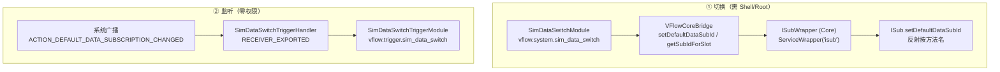

# 数据卡切换设计 —— 默认上网卡切换模块 + 切换监听触发器

> 版本：v1.0
> 状态：**已实现**（模块 + 触发器），真机验证见 §9
> 目录归属：**fork 独有**（冲突归我方），上游无此文件
> 关联：`core/workflow/module/system/SimDataSwitchModule.kt`（切换）、
> `core/workflow/module/triggers/SimDataSwitchTriggerModule.kt` + `handlers/SimDataSwitchTriggerHandler.kt`（监听）

---

## 0. 一句话方案

- **切换**：Shizuku/Root（UID 2000）→ Core 的 `isub` wrapper → 反射
  `ISub.setDefaultDataSubId(int)`。**没有** shell 命令可用，必须走 binder。
- **监听**：动态注册系统广播 `android.intent.action.ACTION_DEFAULT_DATA_SUBSCRIPTION_CHANGED`。
  **零权限**、extra 自带新 subId、发送方是系统不可伪造。

---

## 1. 需求澄清：一个必须先问清的分歧

「切换数据卡」在中文语境下有两种互不通用的含义，实现路径完全不同：

| 含义 | 对应 API | 是否本期 |
|---|---|---|
| **切换默认上网卡（DDS）** —— 卡1/卡2 谁负责蜂窝数据 | `setDefaultDataSubId(int)` | ✅ **本期需求** |
| 切换某张卡的数据启停 —— 单独关掉某张卡的数据 | `svc data` + `setSubscriptionOverride` | ❌ 不做 |

本文只涉及前者。用户已明确「我要的是开启卡1 卡2 谁上网」。

---

## 2. 从调研与实测中提炼的关键事实

### 2.1 切换侧：三条看似可行、实测全部排除的路径

| 路径 | 实测结果 | 依据 |
|---|---|---|
| `svc data prefer ...` | ❌ **不存在**。`svc data` 只有 `enable\|disable` | 真机 `svc data` 输出 |
| `cmd phone data ...` | ❌ 同上。`cmd phone` 全部子命令里 `data` 段只有 enable/disable | 真机 `cmd phone help`（348 行全文核对） |
| `settings put global multi_sim_data_call N` | ❌ **无效**。`SubscriptionManagerService` **没有 ContentObserver** 监听该 key | android-36 源码全文：仅第 521 行 `getInt` 初始化、529 行 `putInt` 写入 |

第三条尤其值得记下：默认数据卡**存储**在 `Settings.Global.MULTI_SIM_DATA_CALL_SUBSCRIPTION`
（键名 `multi_sim_data_call`），服务启动时读入内存 `WatchedInt mDefaultDataSubId`，
之后**只由服务自己写回**。外部直接改 Settings 不更新服务的内存态，所以「改了但没生效」。

### 2.2 唯一可行路径的权限链

```
SubscriptionManager.setDefaultDataSubId(int)      @SystemApi @hide
  └→ @RequiresPermission(MODIFY_PHONE_STATE)      App 侧连编译都过不了（@hide）
       └→ ISub.setDefaultDataSubId(int)           binder 接口，跨版本稳定
            └→ SubscriptionManagerService.setDefaultDataSubId()
                 enforcePermissions("setDefaultDataSubId", MODIFY_PHONE_STATE)
```

关键在于：**shell (UID 2000) 恰好持有 `MODIFY_PHONE_STATE`** ——
`frameworks/base/packages/Shell/AndroidManifest.xml` 有
`<uses-permission android:name="android.permission.MODIFY_PHONE_STATE" />`。
真机核实：`dumpsys package com.android.shell` 显示 `MODIFY_PHONE_STATE: granted=true`。

### 2.3 ⚠️ 一个误导性极强的报错

真机上执行 `cmd phone disable-physical-subscription 99999` 会报
**`cc: Permission denied.`** —— 看起来像「小米收紧了 shell 的 telephony 权限」，
从而否定整条方案。

**这是误判**：那是该子命令自身的检查，与 `MODIFY_PHONE_STATE` 无关。
同一时刻 `svc data enable`、`cmd phone data enable` 都正常工作。
排查此类问题时，先看 `dumpsys package com.android.shell` 的 grant 状态，
不要拿某个子命令的报错去推断权限。

### 2.4 监听侧：零权限 + 自带答案

`SubscriptionManagerService.broadcastSubId()`（android-36 源码）：

```java
private void broadcastSubId(@NonNull String action, int newSubId) {
    Intent intent = new Intent(action);
    intent.addFlags(Intent.FLAG_RECEIVER_REPLACE_PENDING);
    SubscriptionManager.putSubscriptionIdExtra(intent, newSubId);  // ← 携带新 subId
    mContext.sendBroadcastAsUser(intent, UserHandle.ALL);          // ← 无权限、发给所有人
}
```

四点对触发器极其有利的性质：

1. **接收不需要任何权限**（未指定 `receiverPermission`、未指定 target package）；
2. **extra 自带答案**：`putSubscriptionIdExtra` 同时写两个 key
   （`android.telephony.extra.SUBSCRIPTION_INDEX` 与 `subscription`），值都是新 subId；
3. **不可伪造**：该 action 在 `core/res/AndroidManifest.xml` 的 `<protected-broadcast>` 中
   （真机 dumpsys 亦确认 `caller=com.android.phone uid=1001`），强于可伪造的
   `ACTION_PHONE_STATE_CHANGED`；
4. **幂等无伪事件**：服务端 `if (mDefaultDataSubId.set(subId))` 守卫，
   目标值 == 当前值时直接 no-op、**不广播**。

### 2.5 ⚠️ 不要用同族的另一个 action

| action | 语义 | 本期是否用 |
|---|---|---|
| `android.intent.action.ACTION_DEFAULT_DATA_SUBSCRIPTION_CHANGED` | **默认数据卡**（DDS） | ✅ 用 |
| `android.telephony.action.DEFAULT_SUBSCRIPTION_CHANGED` | voice/data/sms 的**共同默认**，以 voice 优先 | ❌ 不用 |

后者在 DDS 变更时也会连带触发，但语义更宽、噪声更多。

---

## 3. 架构设计

### 3.1 分层



### 3.2 为什么「按方法名反射」而不是 `service call` + 事务码

调 binder 有两种方式，选后者：

| | `service call isub <code>` | 反射按方法名 |
|---|---|---|
| 依赖 | 事务码 = AIDL 编译产物的方法顺序 | 方法名 |
| 跨版本 | ⚠️ 逐机型/逐版本漂移，**调错码会改到相邻设置项** | 稳定 |
| 服务端实现类改名 | 无影响 | 无影响（走 ISub 接口） |

事务码方案适合一次性脚本（fork 在「流体云小窗」上用过 `service call activity_task 138`），
但**不适合做长期维护的模块** —— 静默改错设置项的风险不可接受。
反射走 `ISub` 接口，对 Android 14 起实现类由 `SubscriptionController` 换成
`SubscriptionManagerService` 这件事透明。

### 3.3 ⚠️⚠️ 广播必须用 `RECEIVER_EXPORTED` 注册 —— 全仓库唯一的例外

本仓库其它系统广播型触发器（`DoNotDisturbTriggerHandler`、`PowerTriggerHandler` 等）
惯用 `ContextCompat.RECEIVER_NOT_EXPORTED`，那也是 Android 14+ 的推荐写法。
**但这条广播用 NOT_EXPORTED 会静默收不到。**

真机实测（Android 17）：同一进程里同时注册两个 receiver，

```
[EXPORTED]     收到广播 ✅
[NOT_EXPORTED] 没有收到 ❌
```

3 次连续切换 3/3 复现，只有 EXPORTED 收到。原因是该广播走
`sendBroadcastAsUser(intent, UserHandle.ALL)`，属「跨应用投递」语义，
与 NOT_EXPORTED 的「只收同应用/系统定向广播」不匹配。

**症状是「能选能配、后台永不触发」**，属本仓库历史上最难查的一类静默失效。
改动这行前请先读本节。

### 3.4 subId → 卡槽 映射

广播只给 subId，而用户心智是「卡1/卡2」。映射靠 `SubscriptionManager.getActiveSubscriptionInfoList()`
（需 `READ_PHONE_STATE`）读 `simSlotIndex`。

⚠️ **不能用 `subId = 卡槽 + 1` 之类的算式**：subId 由系统分配，重插卡后同一卡槽可能拿到新 subId。
真机上 subId 1/2 对应卡槽 0/1 只是巧合。

**查不到就明确不触发**（`resolveSimSlotBySubId` 返回 null），不要猜测一个卡槽 ——
猜错的后果是「切卡1 却跑了配在卡2 上的工作流」，比触发器失灵更难发现。
未授权 `READ_PHONE_STATE` 时订阅列表为空，走同一条降级路径。

---

## 4. 输出与魔法变量

### 4.1 触发器输出

| id | 类型 | 说明 |
|---|---|---|
| `sim_slot` | NUMBER | 切换后的上网卡槽：0 = 卡1，1 = 卡2；无法判定为 **-1**（读不到订阅列表时） |
| `is_slot1` | BOOLEAN | 是卡1 |
| `is_slot2` | BOOLEAN | 是卡2 |
| `card_label` | STRING | 卡名（显示名或运营商名）；读不到时为空串 |
| `carrier_name` | STRING | 运营商名；读不到时为空串 |
| `sub_id` | NUMBER | 切换后的 subId（诊断用；**不要**做长期判据）。**任何路径下都真实可用** |

⚠️ 「读不到订阅列表」时 `sim_slot` 给的是 **-1 而不是 0** —— 0 会被下游误读成「卡1」。
配成「任意」的工作流在这条路径下仍会触发，所以下游要能容忍 -1。

`card_label` / `carrier_name` 在**广播到达时**取自订阅列表并随载荷传给下游 ——
下游若稍后再查，期间可能已再次切卡，得到的就不是「那次事件发生时」的卡了。

### 4.2 模块输出

| id | 类型 | 说明 |
|---|---|---|
| `success` | BOOLEAN | 是否成功 |
| `sub_id` | NUMBER | 切换后的 subId（回读值，回读失败时为请求值） |

---

## 5. 模块设计

### 5.1 切换模块 `vflow.system.sim_data_switch`

- `target_slot`：ENUM `slot1` / `slot2`（**稳定值**，不存本地化文案）；
  `acceptsMagicVariable = false`（卡槽是编译期确定的枚举）。
- 权限：`ShellManager.getRequiredPermissions()` —— 需要 Shell/Root。
- `aiMetadata`：`riskLevel = HIGH`（会断网），`requiredInputIds = {target_slot}`。

执行流程与**每一步的失败语义**：

1. `getSubIdForSlot(slotIndex)` → 卡槽无卡或 Core 不可用时**明确失败**，不猜 subId；
2. `getDefaultDataSubId()` → **已是目标卡则短路**，避免无谓的 modem 重附着；
3. `setDefaultDataSubId(targetSubId)` → 失败时报明确错误；
4. `delay(1500)` 后回读 → **回读不一致只记警告，不改判失败**。

第 4 条的取舍理由：切换是异步的（`remapRafIfApplicable` 会改 radio capability），
期间**蜂窝数据会短暂中断，这是正常现象不是失败**。回读只是确认，
真机上切换耗时 5–22ms，但 modem 重新附着更久。

### 5.2 监听触发器 `vflow.trigger.sim_data_switch`

- `target_slot`：ENUM `any` / `slot1` / `slot2`，默认 **`any`**。
  - `any`：任意一次默认上网卡变更都触发，**无需知道换成了哪张卡**；
  - 具体卡槽：只在切到该卡时触发。
- 权限：**`READ_PHONE_STATE`**（见 §8.6，这里踩过一次坑）。
- 继承 `ListeningTriggerHandler`（同 Wifi/Bluetooth/Call/DND），
  引用计数管理启停由基类负责。
- 注册用 `ContextCompat.registerReceiver(..., RECEIVER_EXPORTED)`，见 §3.3。

「任意」是**唯一不依赖订阅列表**的路径：`shouldTriggerForAny(subId)` 只校验 subId 不是哨兵值、
不收 `cards` 参数，因此即使读不到卡列表也能触发（此时 `sim_slot = -1`、
`card_label`/`carrier_name` 为空串，但 `sub_id` 真实）。
另有 `is_slot1`/`is_slot2` 两个布尔输出，用它们做分支比用魔法变量 `sim_slot` 比较更自然。

### 5.3 诊断探针 `probeSimState(context)`

与 `probeDndState` 同思路：把原始读数写进 vFlow 日志（`DebugLogger` → 应用内日志页），
提供**免改上游文件**的真机验证手段 —— 无需新增 Activity、无需动 `AndroidManifest.xml`。
仅在监听启动时调用一次，开销可忽略。

---

## 6. 文件级改动计划

### 6.1 新增文件（首选，符合 fork 原则）

| 文件 | 说明 |
|---|---|
| `core/workflow/module/system/SimDataSwitchModule.kt` | 切换模块 |
| `core/workflow/module/triggers/SimDataSwitchTriggerModule.kt` | 触发器模块定义 |
| `core/workflow/module/triggers/SimDataSwitchMath.kt` | 纯函数层（映射/归一化），可纯 JVM 单测 |
| `core/workflow/module/triggers/SimDataSwitchTriggerData.kt` | `@Parcelize` 载荷 |
| `core/workflow/module/triggers/handlers/SimDataSwitchTriggerHandler.kt` | 广播监听 + `probeSimState` |
| `core/src/main/java/.../server/wrappers/shell/ISubWrapper.kt` | Core 侧 isub wrapper |
| `res/drawable/rounded_swap_sim_24.xml` | 图标（上游无） |
| `test/.../triggers/SimDataSwitchMathTest.kt` | 19 例 |
| `test/.../triggers/SimDataSwitchTriggerModuleTest.kt` | 9 例 |
| `scripts/sim-data-verify.sh` | 跨机型 adb 验证脚本 |
| `docs/fork/sim-data-switch-design.md` | 本文件 |

### 6.2 修改的上游文件（已登记 FORK.md）

| 文件 | 改动 | 冲突归属 |
|---|---|---|
| `core/workflow/module/ModuleRegistry.kt` | 追加 2 行注册（触发器段 + 设备段） | 手动合并（追加） |
| `core/workflow/module/triggers/handlers/TriggerHandlerRegistry.kt` | 追加 1 行注册 | 手动合并（追加） |
| `services/VFlowCoreBridge.kt` | 新增 3 个方法（`setDefaultDataSubId` / `getDefaultDataSubId` / `getSubIdForSlot`） | 手动合并（新增方法） |
| `core/.../server/common/Config.kt` | `ROUTING_TABLE` 追加 `"isub" to WorkerType.SHELL` | 手动合并（追加） |
| `core/.../server/worker/ShellWorker.kt` | 追加 `serviceWrappers["isub"] = ISubWrapper()` | 手动合并（追加一行） |
| `res/values*/strings_module.xml`（×3） | 追加文案 13 + 20 条 ×3 语言 | 手动合并（追加条目） |
| `core/src/test/.../RoutingTableConsistencyTest.kt` | 追加 3 例（isub 路由） | 我方 |

---

## 7. 测试策略

纯函数层（`SimDataSwitchMath.kt`）承载了「改错了不报错、只静默变差」的判断，
故全部有测试覆盖，重点是**反向断言**：

- `unknown subId resolves to null instead of guessing a slot`
  —— 若实现回退到卡1，切到不存在的卡会误触发卡1 的工作流；
- `switching to slot 0 does not trigger a slot-2-configured workflow`
  —— 最要紧的反向断言；
- `empty card list never triggers any slot` —— 未授权时的降级路径；
- `subId is not simply slot plus one` —— 防止有人用算式替代查表；
- `trigger requires no permissions` —— 防止后人加上无谓权限（会导致工作流被静默禁用）。

Core 侧在 `RoutingTableConsistencyTest` 追加 3 例，在**构建期**拦住
「只加了 `serviceWrappers` 忘了加 `ROUTING_TABLE`」这个已踩过三次的坑。

---

## 8. 已知限制与风险

### 8.1 ⚠️ 前台服务降级会让本触发器静默失效（**既有缺陷**）

与 `fold-trigger-design.md` §8.1 记录的是同一条：**关闭后台服务通知会使 `TriggerService` 降级，
所有广播/传感器类触发器静默失效**。本触发器同样会踩。
**排查「触发器不触发」时先查这个。**

### 8.2 单卡机型

单卡机型上默认数据卡唯一，切换是 no-op（服务端守卫会拦住），触发器永不触发。
这是正确行为，但 UI 上可以更友好（P2）。

### 8.3 切换期间会断网

modem 重新附着期间蜂窝数据会短暂中断。模块已给进度提示，且**不把中断当失败**。
若工作流在下游紧接着依赖网络，需要自己加延迟。

### 8.4 厂商定制未做多机型覆盖

本次只在小米 HyperOS 4.0 / Android 17 上实测。虽然 action 字符串与 extra key
都未被小米改动，且都是 AOSP 标准值，但**其它厂商（尤其华为/荣耀等有私有 telephony 栈的）
仍需用 `scripts/sim-data-verify.sh` 复测**。注意 fork 在折叠屏上已吃过教训：
外部调研的结论在真机上被全部推翻。

### 8.5 `FLAG_RECEIVER_REPLACE_PENDING` 的影响

发送方带了这个 flag，只影响 pending 广播的去重。同一次切换若有多个 subId 变更连发，
中间态可能被替换掉。实测未见此现象（每次切换恰好一条广播），但值得记录。

### 8.6 ⚠️⚠️ 权限声明：初版把它误判成「无需权限」，导致静默永不触发

**实现过程中踩到的第二个静默失效，已修。**

初版根据「接收该广播实测零权限可收」这条正确事实，得出结论「触发器不需要任何权限」，
于是 `requiredPermissions` 留空。**这是错的**，因为漏掉了一半链路：

| 环节 | 是否需要权限 |
|---|---|
| 接收广播 | ❌ 不需要（实测成立） |
| **把 subId 映射成「卡1/卡2」** | ✅ 需要 `READ_PHONE_STATE`（读订阅列表） |

而 `TriggerService.handleWorkflowChanged` 会在注册前检查权限，**缺失时静默把工作流置为未启用**。
净效果：**新装设备上（vFlow 尚未因其它功能取得该权限）整个触发器静默永不触发**。

真机测试之所以通过，是因为那台设备上 vFlow **已经**因电话/短信触发器持有该权限 ——
这个缺陷在「权限齐全的设备上测不出来」，属最坏的一类 bug。

初版注释还写着「未授权时退化为只比对 subId」—— 但**代码没有这条路径**，
注释在描述一个不存在的行为，比缺陷本身更危险。

**修复**：声明 `PermissionManager.READ_PHONE_STATE`，与同为 telephony 触发器的
`CallTriggerModule` 对齐。同时把「任意」做成真正不依赖订阅列表的路径（§5.2），
让注释描述的行为真的存在。

**教训**：`requiredPermissions` 不是「要不要授权」的声明，而是
「**缺了它这个触发器还能不能工作**」的声明。声明少了 = 工作流被静默禁用，
比声明多了（用户多点一次授权）严重得多。有测试锁住这一点
（`trigger declares READ_PHONE_STATE ...`）。

---

## 9. 真机验证结论（2026-09-23 完成）

**设备**：Redmi K60 至尊版 `babylon` / HyperOS 4.0（OS4.0.0.21.XPACNXM）/ **Android 17（SDK 37）**
**卡况**：卡1 中国广电 `subId=1`（slot 0）/ 卡2 中国联通 `subId=2`（slot 1）

### 9.1 实测证实的事实

| 项 | 结论 | 证据 |
|---|---|---|
| 反射调 `setDefaultDataSubId` | ✅ 生效，**耗时 5–22ms** | `ISub$Stub$Proxy`，回读立刻一致 |
| 三方交叉核对 | ✅ 一致 | `settings get` / `dumpsys isub` / 反射回读 三者同步变为目标值 |
| shell 持有 `MODIFY_PHONE_STATE` | ✅ | `dumpsys package com.android.shell` → `granted=true` |
| 广播 action 未被小米改动 | ✅ | logcat `broadcastSubId action: android.intent.action.ACTION_DEFAULT_DATA_SUBSCRIPTION_CHANGED subId= 1` |
| 广播 extras | ✅ **两个 key 实测逐字确认** | `Bundle[{android.telephony.extra.SUBSCRIPTION_INDEX=2, subscription=2}]` |
| 第三方 App 零权限可收 | ✅ | 最小 APK（uid=10221，无任何权限）收到；**6/6 无丢失**，延迟约 2ms |
| 发送方不可伪造 | ✅ | `caller=com.android.phone uid=1001` |
| 幂等不广播 | ✅ | 目标值 == 当前值时 App 侧收不到任何广播 |
| subId → 卡槽映射 | ✅ | `READ_PHONE_STATE` 授权后读到 卡槽0/subId1、卡槽1/subId2 |

### 9.2 ⚠️ 实测发现的**新问题**（调研完全未提及）

**`RECEIVER_NOT_EXPORTED` 收不到这条广播。**

同一进程内两个 receiver 同时注册，三次切换 3/3 复现：

```
[EXPORTED]     收到广播 ✅
[NOT_EXPORTED] 没有收到 ❌
```

这是**会直接导致触发器静默失效**的坑 —— 本仓库其它触发器（DND 等）惯用 NOT_EXPORTED，
照抄就会踩。已在 Handler 类注释与 §3.3 显著标注。

### 9.3 排查过程中排除的误判

1. **`cmd phone disable-physical-subscription` 报 `Permission denied`** ——
   极具误导性，一度让人以为 shell 无权。实则与 `MODIFY_PHONE_STATE` 无关（见 §2.3）。
2. **shell 进程（`app_process`）里注册的 receiver 收不到任何广播** ——
   连自定义广播也收不到。这是 `app_process` 的进程身份问题，
   **不代表普通 App 收不到**。若只停在探针结果，会得出完全相反的结论。
   判断「App 能否收到」必须真机装 APK 实测。

### 9.4 未验证项

- 其它厂商 ROM（见 §8.4）；
- `SubscriptionInfoInternal.getSubscriptionId()` 在个别版本上的反射可达性
  （`ISubWrapper.readInt` 已用 `findMethodLoose` 兜底并返回 -1）；
- 单卡机型行为（§8.2）。

### 9.5 验证资产

`scripts/probe/SimDataProbe.java`（切换探针）、
`scripts/probe/SimDataReceiverProbe.java`（广播探针）、
`scripts/probe/apk/`（最小接收 APK 源码与打包链路）。
固化为 `scripts/sim-data-verify.sh` 供跨机型复测。

打包链路可复用的关键点：`javac`(带 platform android.jar) → `d8`
（**必须显式列出所有 `*.class`，否则匿名内部类丢失**）→ `aapt2 link` →
注入 `classes.dex` → `zipalign` → `apksigner`。
Git Bash 下 adb 推设备路径要 `MSYS_NO_PATHCONV=1`；
最小 APK 必须声明 `uses-sdk targetSdkVersion`，否则小米会拦到 `ReviewPermissionsActivity`。

---

## 10. 决策台账

| # | 决策 | 理由 |
|---|---|---|
| 1 | 用 `setDefaultDataSubId` 而非 `svc data`/`settings put` | 后两者实测做不到（§2.1） |
| 2 | 反射按方法名，不用 `service call` 事务码 | 事务码逐机型漂移，调错会改到相邻设置项（§3.2） |
| 3 | wrapper 反射 `ISub` **接口** 而非服务端实现类 | Android 14 起实现类改名，接口名稳定 |
| 4 | 广播用 `RECEIVER_EXPORTED` | 实测 NOT_EXPORTED 收不到（§3.3） |
| 5 | 触发器声明 `READ_PHONE_STATE`（与 `CallTriggerModule` 对齐） | ⚠️ **初版误判为零权限，已修**：接收广播确实无需权限，但映射卡槽需要；声明少了会被 `TriggerService` 静默禁用整个工作流（§8.6） |
| 5b | `target_slot` 默认 `any` | 多数用户要的是「切卡就触发」，而非「只在切到卡1 时」 |
| 5c | 「任意」判定**不读订阅列表** | 让它成为唯一在未授权/读不到卡列表时仍可用的路径，并让注释描述的行为真实存在 |
| 6 | 查不到 subId→卡槽映射时**不触发** | 猜错会触发错的工作流，比失灵更难发现（§3.4） |
| 7 | 切换成功后回读，但回读不一致**不改判失败** | 切换异步、期间断网是正常的（§5.1） |
| 8 | 已是目标卡则短路 | 避免无谓的 modem 重附着 |
| 9 | `card_label` 随载荷传递而非下游现查 | 下游现查可能已再次切卡（§4.1） |
| 10 | `target_slot` 不接受魔法变量 | 卡槽是编译期确定的枚举 |
| 11 | `aiMetadata.riskLevel = HIGH` | 会断网，属有感知影响的操作 |
| 12 | 诊断探针走 `DebugLogger` 而非新 Activity | 免改上游 `AndroidManifest.xml`（同 `probeDndState`） |
| 13 | 不用同族的 `ACTION_DEFAULT_SUBSCRIPTION_CHANGED` | 那是 voice/data/sms 共同默认，噪声更多（§2.5） |
