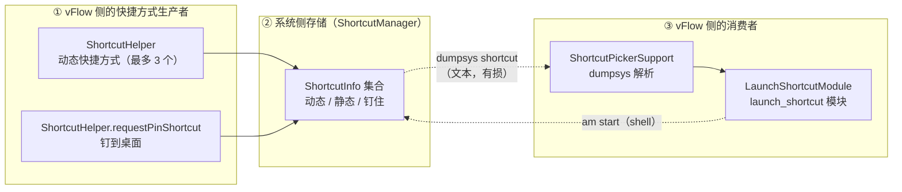

# vFlow 快捷方式能力梳理（fork 参考文档）

> 版本：v1.4（2026-09-26）
> 状态：代码走查 + **真机实测**（小米 2308CPXD0C / 澎湃 OS，2026-09-23 起，含 09-26 的米家故障排查）
> 目录归属：**fork 独有**（冲突归我方），上游无此文件
> 用途：改动「启动快捷方式」模块或其选择器前的**现状地图**。回答「现在能看到哪些快捷方式、为什么某些启动不了、扩展要动哪一处」。
> 与相邻文档的区别：本文件是**现状梳理**，不写需求与改造方案；§7 的候选方案仅记录取舍依据，不作为定稿。

> **口径声明**：本文数字来自**一次真机实测**（`dumpsys shortcut` 输出 8250 行 / 436 KB / 408 条 `ShortcutInfo`），
> 样本为单机单系统版本，**不代表跨机型分布**；AOSP 行号锚定 SDK `android-36`（设备 API 级别），
> 会随上游漂移，**引用前请以代码为准**。

---

## 0. 为什么写这份文档

「启动快捷方式」（`vflow.system.launch_shortcut`）是 vFlow 里**唯一依赖 shell 解析系统调试输出**的功能模块：

- 它**不通过任何公开 API** 获取快捷方式，而是 `dumpsys shortcut` + 正则解析（`ShortcutPickerSupport.kt:10-19`）；
- 因此它的能力边界由**系统调试输出的打印格式**决定，而非由 API 语义决定；
- 这个边界里藏着一个 **AOSP 缺陷**（§3.3），它让一批快捷方式**永久无法通过本模块正确启动**，且从代码上完全看不出来。

本文件把这些固定成文，目的是下次有人问「为什么这个快捷方式打开了主界面而不是功能页」时，不必重查一遍 AOSP 源码。

---

## 1. 总览：三块拼图



**关键认识**：②→③ 这一段是**有损**的——不是丢在解析层，而是丢在系统的**打印层**（§3.3）。理解这一点是理解本文其余部分的前提。

---

## 2. 生产者：vFlow 自己造了哪些快捷方式

`ui/common/ShortcutHelper.kt`（**上游文件**，`29dcf992`）：

| 能力 | 方法 | 行号 | 说明 |
|---|---|---|---|
| 动态快捷方式 | `updateShortcuts` | `:24` | 长按 vFlow 图标弹出。**上限 3 个**（`MAX_SHORTCUTS = 3`，`:19`），取「收藏优先 + 其余」前 3（`:35`）。用 `setDynamicShortcuts` **覆盖式**写入（`:43`） |
| 钉到桌面 | `requestPinShortcut` | `:52-74` | 走标准 `ShortcutManagerCompat.requestPinShortcut`（`:67`） |

两者的 Intent 都指向 `ShortcutExecutorActivity`，`id` = `workflow.id`，label = `workflow.shortcutName ?: workflow.name`（`:89-90`）。

> ⚠️ **上限 3 的后果**：第 4 个及以后的手动触发工作流**不会**有动态快捷方式，因此在选择器里也搜不到（除非曾被钉到桌面）。

**真机实测**（vFlow 自身条目，均**成功进入选择器**）：

```
[在列表] 聊天记录       id=chat_saved_20d7fa72-…      flags=0x85 [DynIc-rStr]
[在列表] 测试脚本工作流  id=98132a4a-5921-…            flags=0x85 [DynIc-rStr]
[在列表] 双击小猫       id=95c1992a-d08d-…            flags=0x85 [DynIc-rStr]
         → am start -a 'com.chaomixian.vflow.EXECUTE_WORKFLOW_SHORTCUT' flg=0x10008000
           -n 'com.chaomixian.vflow/.ui.common.ShortcutExecutorActivity'
```

---

## 3. 消费者：dumpsys 解析链路

### 3.1 完整链路

```
LaunchShortcutUIProvider（编辑器里的「选择快捷方式」按钮）
   → PickerHandler.launchIntentForResult(intent{shortcut_picker=true})   PickerHandler.kt:98
       → UnifiedShortcutPickerSheet                              （BottomSheet）
           → ShortcutPickerSupport.loadShortcuts()                ShortcutPickerSupport.kt:14
               → ShellManager.execShellCommand("dumpsys shortcut")          :19
               → shortcutBlockRegex 逐块抠字段                            :10
               → buildLaunchCommand(rawIntent)                            :56
                   → 正则切出 Intent 部分 + extras
                   → 拼成 am start 命令行
           → 结果回传 packageName / shortcutLabel / launchCommand
   → LaunchShortcutModule.execute() 里 execShellCommandWithResult(launchCommand)  LaunchShortcutModule.kt:174
```

**注意这条链路的本质**：它不是「调用某个 API 启动快捷方式」，而是**把快捷方式翻译成一条 `am start` shell 命令**再执行。所以它**必须**依赖 shell（Shizuku/Root）——`loadShortcuts` 开头就检查（`:15`），没有 shell 直接返回空列表（`:16`）。

### 3.2 解析层的实际健壮性（真机实测）

我用 Python 逐字复现了 Kotlin 正则和整条转换链，对 8250 行真实 dump 对账：

| 环节 | 结果 |
|---|---|
| 系统内 `ShortcutInfo` 块总数 | **408** |
| 正则匹配成功 | **408**（零遗漏、零误匹配） |
| `buildLaunchCommand` 返回 null | **0** |
| `distinctBy(stableId)` 合并 | 7（均为命令完全相同的真重复） |
| **最终列表条数** | **401** |

**结论：解析层本身是可靠的**。正则与 `readData` 对真实输出的适配是准确的——上游这块写得比预期好。问题不在解析。

被合并的 7 条中有 4 条属 `com.android.contacts`「新建/扫描名片/拨打」类，它们 **同 label、不同 `activity`、命令不同**，因此**未被合并**，在列表里会看到同名多条（属正常现象，非缺陷）。

### 3.3 核心缺陷：dumpsys 的 `intents=` 是**打印层省略**（数据本身完整）

> ⚠️ **口径澄清（v1.2 修正）**：本节早期版本写作「dat **结构性地**残缺」，容易读成「系统里存的就残缺」。
> **实测证明相反**：数据在系统内部是**完整的**，残缺只发生在 `dumpsys` 的**打印**这一步。
> 区分这两者很关键——前者无解，后者意味着「换个出口就能拿到完整值」。

**现象**（真机实测）：180 处 `dat=` 中 **176 处**形如 `imeituan://www.meituan.com/...`——path 被替换为 `...`。
决定性证据：美团「扫一扫」「搜索」「我的订单」「深度解锁」**四个不同功能**的 dat **完全相同**。不同功能的 URI 不可能相同。

**决定性实验（证明是打印省略而非数据残缺）**：向 `am start` 传入**完整**的 URI，回显的仍是省略形态：

```bash
$ adb shell "am start -a android.intent.action.VIEW -d 'imeituan://www.meituan.com/AAAABBBBCCCCDDDD'"
  dat=imeituan://www.meituan.com/...          ← 传入完整，回显被省略
$ adb shell "am start -a android.intent.action.VIEW -d 'https://a.com/very/long/path/here'"
  dat=https://a.com/...                        ← 对 https 同样生效
```

**即**：调用方拿到的是完整 URI，`...` 纯粹是**打印时的省略**。这条实验排除了「数据缺失」的可能。

**根因**（AOSP 源码直读，SDK `android-36`）：

```java
// ShortcutInfo.java:2500 —— 已经正确声明了「不要脱敏」
public String toDumpString(String indent) {
    return toStringInner(/* secure = */ false, /* includeInternalData = */ true, indent);
}

// ShortcutInfo.java:2667-2686 —— intents 字段的打印
sb.append("intents=");
...
for (int i = 0; i < size; i++) {
    sb.append(mIntents[i]);        // ← :2681 隐式 Intent.toString()
    sb.append("/");
    sb.append(mIntentPersistableExtrases[i]);
}

// Intent.java:11894 —— 隐式 toString() 内部硬编码 secure = true
public void toString(@NonNull StringBuilder b) {
    toShortString(b, /* secure = */ true, true, true, false);
}

// Intent.java:11944 —— secure 决定 dat 走哪条分支
b.append("dat=");
if (secure) {
    b.append(mData.toSafeString());   // → path/query/fragment 全丢
} else {
    b.append(mData);                  // → 完整值（永远走不到）
}

// Uri.java:400,422-424 —— toSafeString 的省略逻辑
// "For other schemes, let's be conservative about the data we include --
//  only the host and port, not the query params, path or fragment"
```

**即**：`toStringInner` 收到了 `secure = false`，但打印 `intents=` 时**用隐式 `toString()`，漏把该参数透传下去**。这是 AOSP 的疏漏，不是设计。

**版本核查**：`sb.append(mIntents[i])` 在 `android-34` / `android-36` / `android-36.1` 三份源码中**完全一致，从未修复**。

**为什么 `extras=` 的「值」是完整的**：同一段里 `sb.append(mExtras)`（`:2693`）走 `PersistableBundle.toString()`，没有 secure 概念——所以 `{shortcuts=true}` 这类 extras 的**值**一直可见。

> ⚠️ **但「值可见」不等于「信息完整」——extras 的 `类型` 在文本里彻底丢失**。
> 这是比 dat 省略**更根本**的一处信息损失，详见 §3.3.1。

### 3.3.1 更根本的损失：extras 的**类型**无法从文本还原

`PersistableBundle.toString()` 只打印 `key=value`，**不带类型标签**：

```
extra_scene_account=1462285899        ← 这是 String？Int？还是 Long？文本看不出来
```

而 `dumpsys` 的输出里**没有任何地方记录类型**。于是 vFlow 只能**按数字形态猜**（`ShortcutPickerSupport.buildLaunchCommand`）：

```kotlin
isBoolean(value) -> " --ez "
isInteger(value) && value.length < 10 -> " --ei "    // ← 数字且 <10 位 → 猜 Int
isLong(value)  -> " --el "                            // ← 其他数字 → 猜 Long
isFloat(value) -> " --ef "
else           -> " --es "                            // ← 非数字 → 猜 String
```

**这个猜测必然出错。** 因为同一个数字文本在 A 应用可能是 String、在 B 应用可能是 Long，而文本无法区分。

#### 真机实证：米家场景「无账号权限」（2026-09-26）

用户报「米家固定自动化场景，ShortX 能启动，vFlow 报无账号权限」。根因即本节所述：

```
米家的 extras：extra_scene_account=1462285899
vFlow 推断：1462285899 是 10 位数字 → 不是 <10 位 → 走 --el（Long）
米家的实际读取：bundle.getString("extra_scene_account")   ← 它要 String！
```

**米家的报错（logcat 原文）**：

```
W Bundle: Key extra_scene_account expected String but value was a java.lang.Long.
          The default value <null> was returned.
W Bundle: java.lang.ClassCastException: java.lang.Long cannot be cast to java.lang.String
    at android.os.Bundle.getString(BaseBundle.java:1456)
    at com.xiaomi.smarthome.scene.SmartHomeLauncherActivity.onCreate(SourceFile:57)
```

**`getString` 拿到 `null` → 账号为空 → 用户看到「无账号权限」**（不是权限问题，是类型不匹配）。

**强制停止后逐类型实测**（排除 Activity 复用干扰，米家每次重建 `onCreate`）：

| vFlow 传的类型 | 米家报 ClassCastException |
|---|---|
| `--el`（Long）——**vFlow 当前行为** | **1（报错）** |
| `--es`（String） | **0（正常）** |
| `--ei`（Int） | **1（报错）** |

**触发条件是 10 位数字**：`1462285899` 恰好卡在 `length < 10` 的边界外，于是被当成 Long。
（若换个位数会落到别的分支，**同样可能猜错**——这正说明「靠形态猜类型」不可能对所有 App 都对。）

#### 为什么 ShortX 没这个问题

ShortX 存的是**真实的 `ShortcutInfo` / `Intent` 对象**，类型信息随 Parcel 完整保留——该是 String 就是 String。
**vFlow 与 ShortX 最本质的差异在此**，而非调用身份（详见 §5.4）。

### 3.4 「取末项」语义（已在 fork 修复）

一个快捷方式可携带**多个 Intent**（真机 408 条中 **15 条**）：

- 语义：**最后一个才是启动目标**，前面的只负责堆栈回退。
  AOSP 依据：`ShortcutInfo.getIntent()` 返回 `mIntents[mIntents.length - 1]`；
  builder 文档原话：「The last element in the list represents the only intent that doesn't place an activity on the back stack.」
- 上游原实现取**第一个**（`Regex(...).find(...)`），会启动到错误目标。

真机 15 条多 Intent 里，12 条的**末项带 `cmp`、无 dat**，且首项**清一色是「主界面 + `flg=0x1000c000`」兜底项**：

| 快捷方式 | 首项（上游取的） | 末项（真正的目标） |
|---|---|---|
| 微博 扫一扫 | `.MainTabActivity` + flg | `act=com.sina.weibo.action.SCAN` `.SplashActivity` |
| 微博 发微博 | `.StatusActivity` | `.publish.StatusPublishActivity` |
| 医保 扫一扫 | `.home.ui.HomeActivity` + flg | `.home.ui.ScanCodeActivity` |
| 阅读 最后阅读 | `.ui.main.MainActivity` | `.ui.book.read.ReadBookActivity` |
| uptodown 设置 | `.activities.MainActivity` + flg | `.activities.preferences.PreferencesActivity` |

**即**：上游实现在这 12 条上等于「打开 App 主界面」，功能完全没生效。

> **fork 已修**（2026-09-23）：`buildLaunchCommand` 改取末项，并把正则收尾的 `\]` 改为 `\}` 界定（原写法在多 Intent 时会让 `.*?` 吞掉整段、把多个 Intent 的键值混成一个）。`pkg=` 键同时补上 `-p` 分支（53 条含该键，其中小米「垃圾清理」等只有 `act`+`pkg`、无 `cmp`，丢掉就无任何定位信息）。

### 3.5 问题场景量化（真机实测，按**末项**= 启动目标分型）

> **口径（v1.4 统一）**：本节早期版本只按「dat 是否残缺」二分（74 / 26），
> **未体现 extras 类型问题**（那是与 dat 独立的第二个损失，见 §3.3.1）。
> 现改为**按修复可行性五分类**，与 §4.1 引用的一致。

评判两个维度：**① 能否定位到目标组件**（`cmp` 有则足够）、**② 是否需要 dat／extras 类型**。

| 类别 | 条数 | 占比 | 状态 | 可修性 |
|---|---|---|---|---|
| **B. 有 `cmp`、无数字 extras** | **263** | **64.5%** | ✅ 已可靠（`am start -n` 直达） | — |
| **A. 有 `cmp`、有数字 extras** | **44** | **10.8%** | ⚠️ 值完整、**类型可能猜错** | ✅ **可修**（§4.1） |
| **D. 靠 dat、但 dat 被省略** | **74** | **18.1%** | ❌ 退化启动 / 报错 | ❌ 需换数据源 |
| **E. 无 `cmp` 无 dat** | **23** | 5.6% | ❌ 无任何定位信息 | ❌ **先天无解** |
| **C. 靠完整 dat**（均为 `tel:`） | 4 | 1.0% | ✅ 可用 | — |

**需要关注的是 A + D + E = 141 条（34.6%）**。

#### A 类：类型问题的真实暴露面（**≤ 44 条**）

A 类是「有 `cmp` 兜底定位、同时带纯数字 extras」的条目——**类型问题只可能发生在这里**
（B 类没有数字 extras；D/E 类问题在 dat 上，不在类型）。

涉及 16 个 App：

```
org.telegram.messenger（含 .web）  com.xunmeng.pinduoduo   com.eg.android.AlipayGphone
com.jingdong.app.mall              com.tencent.mobileqq     com.ss.android.lark
com.netease.cloudmusic             com.xiaomi.smarthome     cn.wps.moffice_eng
cmb.pb                             com.ct.client            com.vmos.pro
com.ktls.fileinfo                  com.arlosoft.macrodroid  ru.maximoff.apktool
```

⚠️ **这是上限，不是实际错误数** —— 多数 App 确实用 `getInt`/`getLong` 读取，猜对了。
**只有实际用 `getString` 读数字的才会错**（已确认 1 例：米家，见 §3.3.1）。
**该子集无法从 dumpsys 文本推断**，只能逐 App 实测。

#### D 类 74 条：dat 在系统里存在，仅打印时被省略

**理论上可救，但需换数据源**（§4.1 的能力矩阵）。原「A 类」编号已并入本类。

#### E 类 23 条：数据先天不存在（任何方案都拿不到）

末项既无 dat 也无 cmp —— 这些快捷方式**故意不携带可重放的定位信息**：

```
com.tencent.mm            扫一扫 / 收付款 / 我的二维码（6 条）
com.android.camera        自拍 / 录像 / 文档 / 专业（4 条）
com.miui.securitymanager  垃圾清理 / 微信专清 / 病毒扫描（3 条）
com.miui.notes / com.android.vending / com.sinovatech.unicom.ui …
```

微信那 6 条尤其典型：**App 有意让快捷方式无法被第三方重放**，ShortX 亦拿不到（§7.2 实测其不响应 `CREATE_SHORTCUT`）。

#### 为何「只有 18%」但痛感远高于 18%

受影响条目**集中在高频功能**上——微信扫一扫、美团扫一扫、支付宝、淘宝、抖音扫一扫、银行付款码；
不受影响的大多是「文件管理器浏览」「记事本新建」这类低频项。即**分布不是随机的**。

#### 实测的典型失败样本

- **美团**「扫一扫/搜索/我的订单/深度卸载」（4 条）→ dat 残缺 → 退化到 `MainActivity`
  （实测 `topResumedActivity` 确认）。**取首项还是末项都一样打不开**。
- **银行类** 付款码/账户（招行、交行、工行、建行…）→ dat 残缺，**比主界面更糟**：可能直接报错。
- **ChatGPT** 相机/语音/图片 → 同上，退化到主界面。

#### 曾漏掉的一类：extras **类型**猜错（已并入上表 A 类）

早期版本按「能否定位到目标组件」二分，**漏了「定位对了、参数传错了」这一类**——
米家「关闭灯与投影仪」有 `cmp`、看似可靠，实际因 `extra_scene_account` 类型传错而失败（§3.3.1）：

| 案例 | 旧二分法归类 | 实际 |
|---|---|---|
| 米家「关闭灯与投影仪」 | ✅ 有 `cmp`，看似可靠 | ❌ **String 传成 Long，米家报「无账号权限」** |

**教训**：「能否定位组件」与「参数是否传对」是**两个独立维度**，只统计前者会低估问题面。
现五分类表已把这类单列为 **A 类（44 条上限）**。

> ⚠️ **各数据源已实测互不重叠**：`dumpsys` 全量但有损（dat 省略 + 类型丢失）；
> `ACTION_CREATE_SHORTCUT` 无损但**恰好不覆盖出问题的 App**（§7.2）；
> `shortcuts.xml` **已证伪**（是元信息文件，§7.3）；
> **Xposed 采集（§5.4）**是唯一能覆盖米家这类的手段。完整能力矩阵见 §4.1。

---

## 4. 决策边界（事实部分）

由 §3.3 / §3.3.1 可直接推出，不依赖任何进一步实测：

> **只要数据源是 `dumpsys shortcut` 的文本，就同时丢掉两样东西：**
> 1. **dat 的内容**（打印层省略，§3.3）
> 2. **extras 的类型**（文本不带类型标签，§3.3.1）
>
> 这不是配置问题、不是解析问题，是「**从文本重建 Intent**」这一路线的固有损失，应用侧无解。

受此影响：

- **所有 dat 驱动**的快捷方式（美团、拼多多、中国银行、酷安、迅雷、闲鱼、钉钉、1688、招行…）**只能退化启动**（多数落到 App 主界面）。
- **extras 含数字参数的**（如米家 `extra_scene_account`）**可能静默传错类型**，App 侧报出与真实原因无关的错误（「无账号权限」）。
  这类失败**无法离线枚举**——文本里看不出类型，只能逐 App 实测。

`dumpsys` 的一切变体都走同一段代码，实测确认无效：

| 手段 | 结果 |
|---|---|
| `dumpsys shortcut`（无参） | ❌ 走 `toDumpString` |
| `cmd shortcut get-shortcuts --flags N` | ❌ 同样走 `toDumpString`（实测输出逐字一致） |
| `dumpsys shortcut -a` / `--all` | ❌ **被接受但无差别**：实测与默认输出**逐字节一致**（仅时间戳噪声） |
| `dumpsys shortcut -c` / `--checkin` | ❌ 输出统计 JSON（每包 dynamic/manifest/pinned 计数），**不含 Intent** |
| `dumpsys shortcut <其他参数>` | ❌ 抛 `Unknown option`（`ShortcutService.parseDumpArgs:4650`）——注意**服务层确实解析参数**，只是没有能改 `intents=` 输出的选项 |

> **更正（v1.2）**：早期版本称「`ShortcutPackage.dump()` 的 `DumpFilter` 参数在方法体内未被引用」，
> 并据此断言「参数一律无效」。**只对了一半**——`ShortcutPackage` 层确实没引用它，
> 但**服务层 `ShortcutService.parseDumpArgs` 会先解析参数**并可能走不同分支（`-c` 即走 JSON 统计路径）。
> 穷举后结论不变（**没有能拿到完整 Intent 的开关**），但推理依据已修正。

### 4.1 dumpsys 的定位：**它适合做「目录」，不适合做「可执行的调用」**

上文的缺陷容易被读成「dumpsys 根本不该用」。**更准确的表述是「用错了用途」**，区别在于前者导出「换源」，后者导出「分工」。

#### 根本原因：它是**调试接口**，不是**数据接口**

`dumpsys` 的设计目标是**给人看**（诊断系统状态），不是给程序消费。这一点决定了两个缺陷都是**设计意图、非实现疏漏**：

```java
// dumpsys 走的路
ShortcutInfo.toDumpString() → Intent.toString() → Uri.toSafeString()
```

而 `toSafeString()` 的源码注释写得很直白（`Uri.java:422-424`）：

> *"let's be conservative about the data we include -- only the host and port, not the query params, path or fragment, **because those can often have sensitive info**."*

**它是故意省略的**（调试输出可能被贴进 issue／截图）。所以这不是「上游疏漏可以催修」，**催改无意义**。

#### 按用途分：它够用 / 不够用

| 用途 | 是否适合 | 说明 |
|---|---|---|
| **列出有哪些快捷方式** | ✅ **适合** | label / 包名 / flags 完整，**覆盖全量** |
| **判断某快捷方式属于哪个 App** | ✅ 适合 | — |
| **重建可执行的 Intent** | ❌ **不适合** | dat 缺内容（§3.3）、extras 缺类型（§3.3.1） |

**即：dumpsys 能给「目录」，不能给「可执行的调用」。** 而 vFlow 现实现**同时用它做这两件事**——第二个用途正是它不适配的地方。

#### 这与实测的失败分布完全吻合

对照 §3.5 的五分类：

| 类别 | 条数 | 占比 | 为什么 |
|---|---|---|---|
| **B. 有 `cmp`、无数字 extras** | 263 | **64.5%** | ✅ **不需要 dat／extras 类型**（`am start -n` 只用 `cmp`）→ **dumpsys 够用** |
| **A. 有 `cmp`、有数字 extras** | 44 | 10.8% | ⚠️ 值完整、类型缺 → **半够用** |
| **D. 靠 dat、dat 被省略** | 74 | 18.1% | ❌ 需要 dat → **不够用** |
| **E. 无 `cmp` 无 dat** | 23 | 5.6% | ❌ 什么都给不了 → **任何文本源都不够用** |

**注意 B 类占 64.5%** —— 说明**对多数快捷方式，dumpsys 是够的**。所以准确的判断是：

> **dumpsys 对 64.5% 的场景合适，对 29%（A+D）勉强或不适配，对 5.6% 天然无解。**
> 问题不是「根本不适合」，而是「**被用在它不适配的那 29% 上，且没有备选通道**」。

#### 数据源能力矩阵：「全量 + 无损 + 免权限」三者不可兼得

| 源 | 覆盖 | 保真 | 权限门槛 |
|---|---|---|---|
| **`dumpsys`（现用）** | ✅ 全量（本机 408） | ❌ 有损 | 需 Shizuku/Root |
| `ACTION_CREATE_SHORTCUT` | ❌ 仅 28 个 App | ✅ 无损 | **零权限** |
| `LauncherApps.getShortcuts()` | ✅ 全量 | ✅ 无损 | ❌ **必须是当前默认桌面** |
| Xposed 采集（ShortX 固定快捷方式） | ❌ 仅用户 pin 过的 | ✅ 无损 | Root + Xposed |

**`LauncherApps` 那行最能说明问题**：它恰好满足「全量 + 无损」，代价是「必须是默认桌面」。
**AOSP 这么设计是有道理的——能拿到全部快捷方式的，本就该是桌面**（那是它的职责）。

> **这三者不可兼得，是 Android 安全模型决定的，不是 vFlow 实现的问题。**
> 因此**不存在「换一个更好的源」这种解法**，只有「按场景分工」或「接受取舍」。

#### 结论

1. **保留 dumpsys 作为目录**——它做这个最合适：全量、零额外成本、已实现。
2. **承认「重建 Intent」这一用途它有结构性缺陷**（29% 受影响），且**不可配置修复**。
3. **要修那 29%，只有加通道或换身份**，每条都有明确代价（上表）。

> **问题的本质不是「选错了源」，而是「只有一个源」。**

---

## 5. 外部对照：ShortX 的做法（源码直读）

参照对象：ShortX `tornaco.apps.shortx`（Xposed 框架），源码在 `D:/develop/references/shortx/`（仓库外，不进 git）。

**ShortX 的快捷方式功能有两个独立入口，走两条不同数据源**（§5.4 汇总）：

- **「应用快捷方式」** → `ACTION_CREATE_SHORTCUT`（零权限，但只覆盖响应该 action 的 App）——本节 §5.1 讲这条
- **「固定的快捷方式」** → **Xposed hook `requestPinItem` 采集**（覆盖用户手动 pin 的）——见 §5.4

**两条都完全不走 `dumpsys`。**

### 5.1 完整链路（四步）

```java
// ① 枚举候选 App —— 纯 PackageManager，零权限
//    C7170oOOOo0O.java:45
context.getPackageManager().queryIntentActivities(
        new Intent("android.intent.action.CREATE_SHORTCUT"), 131072 /* MATCH_DEFAULT_ONLY */);

// ② 用户选中某 App 后，以该 App 的 Activity 为 component 发起请求
//    C5967o000OOo0.java:59-67
Intent intent = new Intent("android.intent.action.CREATE_SHORTCUT");
intent.setComponent(new ComponentName(activityInfo.packageName, activityInfo.name));
// startActivityForResult → 目标 App 弹出它自己的快捷方式列表

// ③ 结果里拿真实 Intent
//    C1477OoooooO.java:269-278
data.getStringExtra("android.intent.extra.shortcut.NAME");
data.getParcelableExtra("android.intent.extra.shortcut.INTENT");   // ← 真实完整 Intent 对象

// ④ 存为 URI 字符串 / 执行时解析回来
//    ActionToProtoActionKt.java:3102   （存）
.setIntentUri(appShortcut.getIntent().toUri(1))    // 1 = URI_INTENT_SCHEME
//    o0OOO0OO.java:375                （执行）
Intent uri = Intent.parseUri(appShortcut.getIntentUri(), 1);
context.startActivity(uri.addFlags(FLAG_ACTIVITY_NEW_TASK));
```

`Intent.toUri(1)` 产出 `intent://…#Intent;scheme=…;…;end` 形式，**把 path / query / extras 全部编码进字符串**——完全绕开 `toString()` 的省略。**其 dat 是完整的**。

### 5.2 各「字符串化」出口的对照（**含一处自我更正**）

| 出口 | data 用的是 | 完整? | 应用层可用 |
|---|---|---|---|
| `Intent.toString()` / `toShortString(secure=true)` | `Uri.toSafeString()` | ❌ | 就是 dumpsys 走的 |
| `ShortcutInfo.toString()` | 同上（隐式） | ❌ | — |
| **`ShortcutInfo.toInsecureString()`** | **同上（同一个 bug）** | ❌ | ❌ |
| **`ShortcutInfo.toDumpString()`** | **同上** | ❌ | 就是 dumpsys 走的 |
| **`Intent.toUri(...)`** | **`Uri.toString()`** | ✅ | ✅ |

> ⚠️ **自我更正（v1.0 原文写错）**：原文把 `toInsecureString()` 列为「能拿到完整 dat 的出口」——**这是错的**。
> 看 `ShortcutInfo.java:2667-2686` 的结构：`secure` 参数**只控制**「打印 `size:N` 还是打印数组」，
> 而**非 secure 分支里同样是 `sb.append(mIntents[i])`**，走的是同一个隐式 `Intent.toString()`。
> 即 **`Secure` 没有任何 Intent 层面的脱敏开关**，`toInsecureString` / `toDumpString` / `toString` 三者在
> Intents 段的输出**完全一致**（无非 secure 时多打印数组本身而已）。

**真正的分野**在 `Uri.toString()` vs `Uri.toSafeString()`：

```java
// Intent.java:12186 —— toUri 用 toString()，完整
String data = mData.toString();
// Intent.java:11946 —— toShortString 用 toSafeString()，脱敏
b.append(mData.toSafeString());
```

**推论**：**任何经由 `toString()` 系列的出口都拿不到完整 dat**，只有 `toUri()` 系列可以。
这解释了为什么 `dumpsys` 的一切变体都无效（它只会 `toDumpString`），
也解释了为什么系统**磁盘上的 XML 是完整的**（`ShortcutService.writeAttr` 的 Intent 重载用的是
`intent.toUri(/* flags = */ 0)`，见 §7.3）。

> ⚠️ **易混淆点（勿重蹈）**：ShortX 里 `dumpsys` 与 `toInsecureString()` **都与它的快捷方式数据链路无关**，容易误读成「ShortX 也在用」。
> - **`dumpsys`**：ShortX 全仓库仅一处使用，为 `dumpsys display`（`services/ctrl/OooO00o.java:38`，取屏幕信息）；**`dumpsys shortcut` / `cmd shortcut` 零命中**。
> - **`toInsecureString()`**：仅出现在 Xposed hook 的**日志打点**里（`services/xposed/hooks/hook/ShortcutServiceHook.java:202`、`:210`，喂给 `logger`），**不在数据获取路径上**，且**即便用了也拿不到完整 dat**（上表）。

### 5.4 ShortX 有**两个**入口，走**两条不同**的数据源

> ⚠️ **本节更正 §5.1–5.3 的旧结论**：早期版本称「ShortX 获取快捷方式数据只有一条路径」。**错了。**
> 实测（用户反馈 + 文案 + 源码三方印证）——ShortX 的快捷方式功能分**两个独立入口**，
> **数据源完全不同**，`ACTION_CREATE_SHORTCUT` 只是其中之一。

| ShortX 入口 | 文案（`_i18n_zh.json`） | 数据源 | 覆盖 |
|---|---|---|---|
| **应用快捷方式** | `ui.action.shortcut = 应用快捷方式` | `ACTION_CREATE_SHORTCUT`（§5.1） | 仅响应该 action 的 App（米家**不**响应） |
| **固定的快捷方式** | `ui.action.launch.pined.item = 固定的快捷方式`<br>`...tip = 你需要先在桌面添加目标应用的快捷方式，随后该快捷方式就会被记录在这个列表中供你选择` | **Xposed hook 采集**（下） | 仅用户**手动 pin 过**的快捷方式 |

#### 「固定的快捷方式」的机制：在系统**写入时刻截获对象**

**完整证据链（四环，均为反编译源码实证）**：

```
① 用户在桌面 pin 快捷方式
     → 系统 ShortcutService.requestPinItem(...)
        ↓ Xposed hook (afterMethod)
② ShortcutInfo 对象 → VE2.OooOOOO.add(shortcutInfo)
        ↓ AIDL 跨进程（进程边界：系统侧 → ShortX 主进程）
③ ShortXService$serviceBinder$1.getRequestPinShortcuts()
        → return VE2.OooOOOO
        ↓ 客户端调用
④ 构造 PinedItem(label, intent, userHandle) 供用户选择
```

**逐环源码**：

```java
// ① ShortcutServiceHook.java —— hook 系统方法
Class cls = findClass(classLoader, "com.android.server.pm.ShortcutService");
Method m = findMethod(cls, "requestPinItem");
HooksKt.afterMethod(m, new C5063kT1(22));

// ② 回调（hookPinItem$lambda$4$lambda$3）—— 截获真实对象
ShortcutInfo shortcutInfo = (ShortcutInfo) param.getArgs()[2];
if (shortcutInfo != null) {
    VE2 ve2 = ((UX1) C7546oY1.OooOO0o.OooO00o).OooO;
    ve2.OooOOOO.add(shortcutInfo);        // ← 字段：VE2.OooOOOO（ArrayList）
}

// ③ AIDL 服务端暴露（ShortXService$serviceBinder$1.java:5839）
public List<ShortcutInfo> getRequestPinShortcuts() {
    return ((UX1) C7546oY1.OooOO0o.OooO00o).OooO.OooOOOO;   // ← 同一个列表
}

// ④ 客户端消费（C7551oa0.java:355-380）
objOooOOo3 = tornaco.apps.shortx.core.OooO00o.OooO00o().OooO00o.getRequestPinShortcuts();
for (ShortcutInfo shortcutInfo : (List) obj2) {
    Intent intent2 = shortcutInfo.getIntent();          // ← 真实 Intent 对象，类型完整
    CharSequence shortLabel = shortcutInfo.getShortLabel();
    ...
    pinedItem = new Action.LaunchPinedItem.PinedItem(string, intent2, KE2.OooO00o(userHandle));
}
```

> ⚠️ **方法论教训（记录以免重蹈）**：本文 v1.2 初稿只查到 ①②，随后搜「谁读 `VE2.OooOOOO`」时
> 把范围限定在 `kaa/tjo/ufanjca/`（混淆包），**漏了 `tornaco/apps/shortx/`**（ShortX 自身包），
> 于是得出「该列表只写不读、机制可能不成立」的**错误反证**，并据此要把本节降级为未定论。
> **实际读取方在 `ShortXService$serviceBinder$1`（AIDL 服务端）**——跨进程那一层。
> 教训：**混淆包名会把同类符号打散到多个包，搜引用时不要按包限定范围**。

**这解释了用户观察到的全部现象**：

- 为什么「固定的快捷方式」里**只有手动在米家创建的**那条 —— 它**只在 pin 的那一刻采集**，未 pin 的根本没有
- 为什么另一个入口（应用快捷方式）里**没有米家** —— 米家不响应 `ACTION_CREATE_SHORTCUT`
- 为什么 ShortX 启动米家场景**能成功** —— 它存的是**对象**，`extra_scene_account` 保持 String 类型，米家 `getString` 读得到

**ShortX 这套做法的本质是「取巧」**：不在事后查询，而在**系统写入的瞬间截获**。
好处是零权限门槛、类型完整；代价是**必须 Xposed 常驻**，且**只能覆盖 pin 之后新增的**。

> ⚠️ **这是纯内存列表，无持久化**（已核实）：全仓库对 `VE2.OooOOOO` 只有**两处**访问——
> 写入 `ShortcutServiceHook.java:374`、读取 `ShortXService$serviceBinder$1.java:5840`，
> **既无序列化落盘，也无启动回填**。因此 **ShortX 进程重启后 pin 历史即丢失**，
> 用户需重新 pin 才会被再次采集（或依赖其 Xposed 层另有机制，本次未见）。
> **若要照搬此方案，持久化是必须自行补上的一环。**

### 5.5 完整 Intent 的四条路径总表

拿到**类型完整**的 Intent 的全部途径（米家这类「不响应 CREATE_SHORTCUT」的 App 为准）：

| 路径 | 类型完整 | 门槛 | 对米家 | 备注 |
|---|---|---|---|---|
| `dumpsys` 文本（vFlow 现用） | ❌ **类型丢失**（§3.3.1） | Shell | ⚠️ 能列，**启动报错** | 本仓库当前实现 |
| `ACTION_CREATE_SHORTCUT` | ✅ | **零权限** | ❌ App 不响应 | ShortX 的「应用快捷方式」 |
| `LauncherApps.getShortcuts()` | ✅ | **须是当前默认桌面**，或活跃语音交互服务 | 理论上可用 | AOSP javadoc 明确限定（见下） |
| Xposed hook | ✅ | Root + Xposed | ✅ | ShortX 的「固定的快捷方式」，四环证据链见 §5.4 |

`LauncherApps` 的门槛来自 AOSP 源码的 javadoc（`LauncherApps.java:1391-1396`）：

> Access is currently available to: **The current launcher** (or default launcher if there is no set current launcher). / The currently active voice interaction service.

**即：不 root 的合法路径只有「让 vFlow 成为默认桌面」** —— 对一个非桌面 App 是很重的代价（用户切过去后手机没有正常桌面）。

---

### 5.6 两条路的互补性

| | `dumpsys` 路径（vFlow 现用） | `ACTION_CREATE_SHORTCUT` 路径（ShortX「应用快捷方式」用） |
|---|---|---|
| 枚举方式 | 解析调试输出文本 | `queryIntentActivities` |
| dat 完整性 | ❌ 打印省略 | ✅ 完整 |
| extras 类型 | ❌ **丢失**（§3.3.1） | ✅ 完整 |
| 需要 shell | ✅ Shizuku/Root | ❌ **零权限** |
| 覆盖范围 | **全量**（本机 408 条） | 仅**实现该 action** 的 App——实测本机 **28 个**，且**与 dat 残缺的那批几乎不相交**（§7.2）。**净收益 ≈ 0，已否决** |
| 交互形态 | 自弹 BottomSheet 单选 | 两级：先选 App → 跳出到该 App 界面选 |

---

## 6. 改动落点

| 想做的事 | 应改哪里 | 注意 |
|---|---|---|
| 修 dat 残缺 / 救 dat 驱动的快捷方式 | **必须换数据源**（§5.1） | 解析层无解（§4） |
| 调整解析健壮性、新增字段 | `ShortcutPickerSupport.buildLaunchCommand`（`:56`） | 纯函数，可纯 JVM 单测；已有 5 例（`ShortcutPickerSupportTest.kt`） |
| 改选择器交互 | `UnifiedShortcutPickerSheet` / `ShortcutPickerAdapter` | — |
| 加模块 | ⚠️ 见 §7.1 的取舍记录 | 会产生功能重复，且**无法回流修复存量步骤** |
| 上游文件清单 | 以上均属 `29dcf992`（上游）；**本模块整套是上游代码** | 与 `AGENTS.md` 的「新增为主」原则冲突，改动须登记 `FORK.md` |

**一个重要的接入点**（若日后引入 CREATE_SHORTCUT 路径）：`PickerHandler.launchIntentForResult` 对未命中的 Intent 直接走 `generalIntentLauncher.launch()` 兜底（`PickerHandler.kt:104-108`），而它注册的是通用 `StartActivityForResult`（`WorkflowEditorActivity.kt:156`）。
**这意味着新路径不需改任何上游文件即可接上编辑器**——模块的 `uiProvider` 发一个自定义 Intent，`launchIntentForResult` 自动兜底。

---

## 7. 候选方案与验证结论

> 本章的结论均已**实测**（真机，2026-09-23）。§7.1/7.2 为**否决记录**，§7.3 为**待验证的下一步**。

### 7.1 ~~方案：新增模块~~ —— **否决**

理由：
1. 与 `launch_shortcut` 功能重复，会让 AI 面板出现两个近同名工具（`ai-system-overview.md` 记过「模块可发现性」是既知痛点）；
2. 关键缺陷：**完整 Intent 只在选择那一刻可得**，无法事后补。新模块只能自己启动，**存量工作流里的旧步骤（如已配好的美团扫一扫）依然坏**。而改在选择器层，所有入口一次全好（存量步骤重选即可）。

### 7.2 ~~方案：两路合并（dumpsys + `ACTION_CREATE_SHORTCUT`）~~ —— **实测否决**

**原假设**（v1.0 本文的倾向方案）：ShortX 用 `ACTION_CREATE_SHORTCUT` 能拿到完整 Intent（§5.1），
故引入该路径可**补上** dumpsys 的 dat 残缺 → 保留 dumpsys 全量 + 新增该路径补完整 Intent。

**实测数据**（真机 `pm query-activities -a android.intent.action.CREATE_SHORTCUT`）——**假设不成立**：

| 指标 | 结果 |
|---|---|
| 响应 `CREATE_SHORTCUT` 的 App 总数 | **28** |
| 「真正打不开」的条目（§3.5 的 D+E 两类，即 dat 缺 / 无定位信息） | **97 条** |
| 其中被 `CREATE_SHORTCUT` 覆盖到的 | **仅 3 个 App** |
| 这批覆盖里的**有效救回数** | **4 条**（且属 `com.android.settings`，**本就不残缺**） |
| 净收益 | **≈ 0** |

响应者名单（**几乎全是文件管理器 / 自动化工具 / 系统组件**，恰好是「本就靠 `cmp`、dat 不残缺」那类）：

```
com.android.settings        com.android.contacts       com.google.android.gm
com.arlosoft.macrodroid     net.dinglisch.android.taskerm（Tasker）
tornaco.apps.shortx         ccc71.at.free（3C Toolbox）
com.ghisler.android.TotalCommander   com.mixplorer   com.estrongs.android.pop …
```

**目标 App 全部不响应**：`com.tencent.mm`（微信）、`com.sankuai.meituan`（美团）、`com.taobao.taobao`、
`com.ss.android.ugc.aweme`（抖音）、`com.openai.chatgpt`、`me.ele`、`com.kuaishou.nebula`、`com.baidu.*` …

> **为什么原假设错了**：ShortX 能拿到完整 Intent，是因为**目标 App 实现了这个接口**。
> 而 dat 残缺的那批（美团/微信/淘宝/抖音…）**恰恰不实现它**。两个集合**几乎不相交**。
> 这也说明 ShortX 的列表里**根本没有**美团扫一扫这类快捷方式。

**结论：不引入该路径。** 收益 4/100 远不值得一条新交互链路（两级跳转 + 状态同步）。
附带确认：vFlow 自身也不响应 `CREATE_SHORTCUT`（无妨，其快捷方式走 `cmp` 形态，dumpsys 路径正常）。

**⚠️ 但要补一句 v1.2 的更正**：本节标题原写作「两路合并」，暗示 `dumpsys + CREATE_SHORTCUT` 就是 ShortX 的全部。
**实际 ShortX 还有第二个入口（「固定的快捷方式」，走 Xposed 采集，§5.4）**——见 §7.5。

### 7.3 ⏳ 下一步线索：直接读 `shortcuts.xml`（**已部分验证：路径下是元信息**）

由 §5.2 的推论可得：**系统磁盘上的持久化文件是完整的**——因为
`ShortcutService.writeAttr` 的 Intent 重载用的是 `intent.toUri(/* flags = */ 0)`（**非** `toString()`）。

**真机已确认文件存在**（**非** AOSP 默认路径）：

```
/data/system_ce/0/shortcut_service/shortcuts.xml
```

（CE 存储 = 凭据加密，**需用户解锁后可读**；且 `/data/system*` 需 **root**，Shizuku/shell 通常不可读。
adb（UID 2000）实测 `Permission denied`，且本机无 `su`、production build 无法 `adb root`。）

#### ❌ 实测结论（v1.2 更新）：该文件是**元信息**，不含快捷方式数据

用户以 root 读取该文件，内容仅：

```xml
<user
    locales="zh-CN"
    last-app-scan-time2="1790118976684"
    last-app-scan-fp="Xiaomi/babylon/babylon:17/CP2A.260605.016/OS4.0.0.21.XPACNXM:user/release-keys" />
```

**没有 `<intent>` 标签、没有包名、没有任何快捷方式条目** —— 这解释了早期 `grep -c 'intent-base'` 返回 0。
**该路径不是快捷方式主数据的存放处**（澎湃 OS 的布局与 AOSP 默认不同 / 数据在别处）。

#### 若要继续（未做完）

```bash
# 在该目录下找其他文件
ls -la /data/system_ce/0/shortcut_service/
# 或全盘按内容搜（哪里出现美团 URI，数据就在哪）
grep -rl 'imeituan://' /data/system_ce/ /data/system_de/ 2>/dev/null
```

> ⚠️ **XML 转义**：若日后找到真文件，注意 `&` → `&amp;`、`"` → `&quot;`，解析前须反解义。

### 7.4 若 7.3 也失败：接受现状

届时「启动快捷方式」的能力边界就是 §3.5 的五分类：

```
64.5% 已可靠（B）
10.8% 类型可能猜错、可修但无实现路径（A，实际错误数 1~44 之间）
18.1% dat 被省略、需换数据源（D）
 5.6% 先天无解（E）
 1.0% 可用（C）
```

本文 §3.5 的量化即为其最终交付说明；数据源的能力取舍见 §4.1。

### 7.5 候选方案：Xposed 采集（ShortX「固定的快捷方式」同款，**未实现**）

**这是唯一能覆盖米家这类 App 的路径**（§5.4/§5.5）。
机制：hook `ShortcutService.requestPinItem`，在用户于桌面创建固定快捷方式时**截获 `ShortcutInfo` 对象**。

**优势**：
- **类型完整**（拿到的是对象，`extra_scene_account` 保持 String）
- 零权限门槛（不需要成为默认桌面）
- **有现成参照**：ShortX 已实测该 hook 点可用

**代价 / 前提**（与 `docs/fork/xposed-channel-design.md` 的地基问题同源）：
- 需 Root + Xposed 框架（vFlow 目前**没有** Xposed 通道）
- 需 hook 常驻，且**只能覆盖 pin 之后新增的**快捷方式（历史 pin 需用户重新 pin 或由该 hook 之外的路径补）
- 该文档 §8 列的 4 个地基问题（hook 点存在性 / 冷启动取条件 / hook 层能否读 `/sdcard/vFlow/` / 秘密信道）
  尚未答完，**不应单独为快捷方式开新路**

**结论**：**并入 Xposed 通道一起评估**，不单独立项。

---

## 8. 未决问题 / 已知限制

1. **占比为单机样本**（小米 2308CPXD0C / 澎湃 OS）。特别是 `flags` 分布（`[ImManIc-rStr]` 164 / `[DynIc-rStr]` 158 / …）与厂商定制相关，跨机型会变。
2. **`cat=` / `typ=` 未解析**：`buildLaunchCommand` 只认 `act`/`cmp`/`dat`/`flg`/`pkg`。实测含 `cat=[android.intent.category.LAUNCHER]` 的条目（如系统录音机）会丢掉 category。
3. **`dumpsys shortcut` 输出量大**（本机 8250 行 / 436 KB）且**无限流**——与本项目在 logcat 侧明确处理过的「大数据量命令」风险同类，值得对照 `docs/fork/logcat-debug-tool.md` 的处理方式。
4. **`distinctBy` 的 `stableId` 含完整命令**，故同 label 不同 `activity` 的条目（如联系人「新建」）会**并列显示**。是否为期望行为需产品决定。
5. **§7.3 已证伪**：`/data/system_ce/0/shortcut_service/shortcuts.xml` 是**元信息**（locales / scan-time），非快捷方式数据。真数据位置未找到。
6. **extras 类型错误**（§3.3.1）：**上限可量化、实际数不可**。只在 A 类发生（44 条 / 16 个 App 封顶），
   但「哪些 App 用 `getString` 读数字」只有运行时才知道，**已知 1 例（米家）**。离线无法进一步收窄。
7. **`length < 10` 阈值是启发式**：`buildLaunchCommand` 用它区分 Int/Long，边界值行为**未被任何真实数据依据支持**。米家案例正是卡在该边界。若要缓解，**不能简单调阈值**（别的 App 可能需要 Long），只能逐 App 建映射表或换数据源。

---

## 9. 附：复现用的实测命令

```bash
# 规模与总量
adb shell 'dumpsys shortcut | wc -l'
adb shell 'dumpsys shortcut | grep -c "ShortcutInfo {"'

# flags 分布（pin / 动态 / 静态）
adb shell 'dumpsys shortcut | grep "ShortcutInfo {" | grep -o "\[[A-Za-z-]*\]" | sort | uniq -c | sort -rn'

# 交叉验证：另一条代码路径，输出应一致（证明 dat 残缺非解析问题）
adb shell 'cmd shortcut get-shortcuts --flags 27 <PACKAGE>'

# 覆盖权限（本机实测 false —— 这正是本模块必须用 dumpsys 的原因）
adb shell 'cmd shortcut has-shortcut-access com.chaomixian.vflow'

# CREATE_SHORTCUT 覆盖率（§7.2 的判据；注意加 --brief，否则撞 Binder 上限）
adb shell 'pm query-activities --brief -a android.intent.action.CREATE_SHORTCUT'

# §7.3：shortcuts.xml 是否存在（非 AOSP 默认路径）
adb shell 'find /data -name "shortcuts.xml" 2>/dev/null'
```

> ⚠️ 无 adb 时的替代通道：用 vFlow 自身的 **Shell 命令模块**执行上述命令。
> 注意 `pm query-activities` 不加 `--brief` 会因 ResolveInfo 列表过大而报
> `Transaction failed on small parcel`（Binder 传输上限）——本项目的
> `docs/fork/logcat-debug-tool.md` 记过同类约束。

---

## 修订记录

| 版本 | 日期 | 变更 |
|---|---|---|
| v1.0 | 2026-09-23 | 初稿。基于一次真机实测（408 条）+ AOSP `android-34/36/36.1` 源码直读 + ShortX 反编译源码直读。含：解析层健壮性实测（408/408 全中）、dumpsys dat 残缺的 AOSP 根因定位（`ShortcutInfo.java:2681` 漏传 secure）、多 Intent 取末项语义、ShortX `ACTION_CREATE_SHORTCUT` 方案对照。**§7.2 覆盖率数据待补**（设备离线）。 |
| **v1.1** | 2026-09-23 | **补实测数据 + 两处自我更正**。① §3.5 改为按**末项定位信息形态**的量化分型（有 `cmp` 304 / dat 残缺无 cmp **74** / 无 dat 无 cmp **26** / dat 完整 4），并把「可修（A 类 74）」与「先天不可得（B 类 26）」拆开；② §7.2 `ACTION_CREATE_SHORTCUT` 由「待验证」改为**实测否决**（28 个响应者 vs 100 条受影响，净收益 ≈ 0，目标 App 全部不响应）；③ **更正 v1.0 的错误**——原文称 `toInsecureString()` 能拿到完整 dat，**实际走同一 bug**（`ShortcutInfo.java:2667-2686` 的 `secure` 无 Intent 层面作用）；真正的分野是 `Uri.toString()`（`toUri` 用，完整）vs `Uri.toSafeString()`（`toString` 用，脱敏）；④ §7.3 新增 `shortcuts.xml` 线索（真机确认真实路径 `/data/system_ce/0/shortcut_service/shortcuts.xml`，**`intent-base` 返回 0 待解**）。 |
| **v1.2** | 2026-09-26 | **由一处真实故障（米家场景「无账号权限」）深挖出的体系性更正**。① **新增 §3.3.1**——发现比 dat 省略**更根本**的信息损失：**extras 的「类型」在 dumpsys 文本里彻底丢失**，vFlow 只能按数字形态猜（`--ei`/`--el`/`--es`）。米家 `extra_scene_account=1462285899`（10 位数字）被猜成 Long，而米家 `getString()` 读它 → `null` → 报「无账号权限」。三种类型强制停止实测：`--el` 报错 1 次 / `--es` 0 次 / `--ei` 报错 1 次。② **§3.3 口径澄清**——原文「dat 结构性残缺」易被读成「系统里存的就残缺」，实测（传完整 URI 回显仍省略）证明**数据完整、仅打印省略**。③ **§5.4 新增**——发现 ShortX 有**两个**入口、走**两条不同**数据源：「应用快捷方式」=`ACTION_CREATE_SHORTCUT`，「**固定的快捷方式**」=**Xposed hook `requestPinItem` 采集对象**。**更正 §5.1-5.3「只有一条路径」的旧结论**。④ **§5.5 新增**「完整 Intent 的四条路径总表」（含 `LauncherApps` 须为**默认桌面**的 AOSP javadoc 依据）。⑤ **§3.5 新增 C 类失败**——指出旧量化**低估问题面**（只统计组件定位，未统计 extras 类型，米家那条被算进 ✅ 的 304 条里）。⑥ §4 更正「参数一律无效」的半错结论（服务层 `parseDumpArgs` 确实解析参数，穷举后结论不变）。⑦ §7.3 **已证伪**（该文件是元信息）；**§7.5 新增** Xposed 采集方案评估（结论：并入 `xposed-channel-design.md`，不单独立项）。 |
| **v1.3** | 2026-09-26 | **补齐 §5.4 的完整证据链（v1.2 只查到前两环）**，并纠正一次**因搜索范围错误导致的反证**。完整链路四环均为源码实证：① Xposed hook `ShortcutService.requestPinItem`（`ShortcutServiceHook.java`）→ ② `VE2.OooOOOO.add(shortcutInfo)`（`:374`）→ ③ **AIDL 服务端** `ShortXService$serviceBinder$1.getRequestPinShortcuts()`（`:5840`）→ ④ 客户端 `C7551oa0.java:355-380` 读 `getIntent()` 构造 `PinedItem`。**v1.2 初稿搜「谁读该列表」时把范围限定在混淆包 `kaa/tjo/ufanjca/`、漏了 `tornaco/apps/shortx/`**，据此得出「只写不读、机制存疑」的**错误反证**——实为跨进程那层。教训已写入该节（**混淆项目搜引用不可按包限定**）。另核实该列表**纯内存、无持久化无回填**（全仓库仅上述两处访问），故此方案**必须自行补持久化**。 |
| **v1.4** | 2026-09-26 | **新增 §4.1「dumpsys 的定位」**并**统一量化口径**。① 明确 `dumpsys` 是**调试接口而非数据接口**——`toSafeString()` 的省略是**设计意图**（源码注释：*"because those can often have sensitive info"*），**催改无意义**；它**适合做「目录」、不适合做「可执行的调用」**，而现实现两者兼用、第二项正是缺陷来源。② **§3.5 由二分法改为五分类**（B 263 / A 44 / D 74 / E 23 / C 4），与 §4.1 对齐——旧分型只统计「能否定位组件」，**漏了「参数是否传对」这个独立维度**。③ 新增**数据源能力矩阵**，点明「**全量 + 无损 + 免权限**」三者不可兼得（`LauncherApps` 恰好两者兼得、代价是须为默认桌面；AOSP 如此设计因为「能拿全部快捷方式的本就该是桌面」），**故不存在「换个更好的源」这种解法**。④ 更正 §3.5/§7.4/§8 中所有基于旧分型的数字。⑤ A 类（类型问题）**上限可量化**为 44 条——v1.2 曾称「无法量化」，**不准确**。 |
