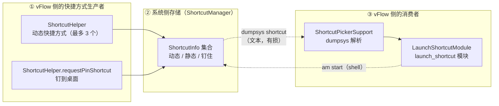

# vFlow 快捷方式能力梳理（fork 参考文档）

> 版本：v1.0
> 状态：代码走查 + **真机实测**（小米 2308CPXD0C / 澎湃 OS，2026-09-23）
> 目录归属：**fork 独有**（冲突归我方），上游无此文件
> 用途：改动「启动快捷方式」模块或其选择器前的**现状地图**。回答「现在能看到哪些快捷方式、为什么某些启动不了、扩展要动哪一处」。
> 与相邻文档的区别：本文件是**现状梳理**，不写需求与改造方案；§7 的候选方案仅记录取舍依据，不作为定稿。

> **口径声明**：本文数字来自**一次真机实测**（`dumpsys shortcut` 输出 8250 行 / 436 KB / 408 条 `ShortcutInfo`），
> 样本为单机单系统版本，**不代表跨机型分布**；AOSP 行号锚定 SDK `android-36`（设备 API 级别），
> 会随上游漂移，**引用前请以代码为准**。

---

## 0. 为什么写这份文档

「启动快捷方式」（`vflow.system.launch_shortcut`）是 vFlow 里**唯一依赖 shell 解析系统调试输出**的功能模块：

- 它**不通过任何公开 API** 获取快捷方式，而是 `dumpsys shortcut` + 正则解析（`ShortcutPickerSupport.kt:10-19`）；
- 因此它的能力边界由**系统调试输出的打印格式**决定，而非由 API 语义决定；
- 这个边界里藏着一个 **AOSP 缺陷**（§3.3），它让一批快捷方式**永久无法通过本模块正确启动**，且从代码上完全看不出来。

本文件把这些固定成文，目的是下次有人问「为什么这个快捷方式打开了主界面而不是功能页」时，不必重查一遍 AOSP 源码。

---

## 1. 总览：三块拼图



**关键认识**：②→③ 这一段是**有损**的——不是丢在解析层，而是丢在系统的**打印层**（§3.3）。理解这一点是理解本文其余部分的前提。

---

## 2. 生产者：vFlow 自己造了哪些快捷方式

`ui/common/ShortcutHelper.kt`（**上游文件**，`29dcf992`）：

| 能力 | 方法 | 行号 | 说明 |
|---|---|---|---|
| 动态快捷方式 | `updateShortcuts` | `:24` | 长按 vFlow 图标弹出。**上限 3 个**（`MAX_SHORTCUTS = 3`，`:19`），取「收藏优先 + 其余」前 3（`:35`）。用 `setDynamicShortcuts` **覆盖式**写入（`:43`） |
| 钉到桌面 | `requestPinShortcut` | `:52-74` | 走标准 `ShortcutManagerCompat.requestPinShortcut`（`:67`） |

两者的 Intent 都指向 `ShortcutExecutorActivity`，`id` = `workflow.id`，label = `workflow.shortcutName ?: workflow.name`（`:89-90`）。

> ⚠️ **上限 3 的后果**：第 4 个及以后的手动触发工作流**不会**有动态快捷方式，因此在选择器里也搜不到（除非曾被钉到桌面）。

**真机实测**（vFlow 自身条目，均**成功进入选择器**）：

```
[在列表] 聊天记录       id=chat_saved_20d7fa72-…      flags=0x85 [DynIc-rStr]
[在列表] 测试脚本工作流  id=98132a4a-5921-…            flags=0x85 [DynIc-rStr]
[在列表] 双击小猫       id=95c1992a-d08d-…            flags=0x85 [DynIc-rStr]
         → am start -a 'com.chaomixian.vflow.EXECUTE_WORKFLOW_SHORTCUT' flg=0x10008000
           -n 'com.chaomixian.vflow/.ui.common.ShortcutExecutorActivity'
```

---

## 3. 消费者：dumpsys 解析链路

### 3.1 完整链路

```
LaunchShortcutUIProvider（编辑器里的「选择快捷方式」按钮）
   → PickerHandler.launchIntentForResult(intent{shortcut_picker=true})   PickerHandler.kt:98
       → UnifiedShortcutPickerSheet                              （BottomSheet）
           → ShortcutPickerSupport.loadShortcuts()                ShortcutPickerSupport.kt:14
               → ShellManager.execShellCommand("dumpsys shortcut")          :19
               → shortcutBlockRegex 逐块抠字段                            :10
               → buildLaunchCommand(rawIntent)                            :56
                   → 正则切出 Intent 部分 + extras
                   → 拼成 am start 命令行
           → 结果回传 packageName / shortcutLabel / launchCommand
   → LaunchShortcutModule.execute() 里 execShellCommandWithResult(launchCommand)  LaunchShortcutModule.kt:174
```

**注意这条链路的本质**：它不是「调用某个 API 启动快捷方式」，而是**把快捷方式翻译成一条 `am start` shell 命令**再执行。所以它**必须**依赖 shell（Shizuku/Root）——`loadShortcuts` 开头就检查（`:15`），没有 shell 直接返回空列表（`:16`）。

### 3.2 解析层的实际健壮性（真机实测）

我用 Python 逐字复现了 Kotlin 正则和整条转换链，对 8250 行真实 dump 对账：

| 环节 | 结果 |
|---|---|
| 系统内 `ShortcutInfo` 块总数 | **408** |
| 正则匹配成功 | **408**（零遗漏、零误匹配） |
| `buildLaunchCommand` 返回 null | **0** |
| `distinctBy(stableId)` 合并 | 7（均为命令完全相同的真重复） |
| **最终列表条数** | **401** |

**结论：解析层本身是可靠的**。正则与 `readData` 对真实输出的适配是准确的——上游这块写得比预期好。问题不在解析。

被合并的 7 条中有 4 条属 `com.android.contacts`「新建/扫描名片/拨打」类，它们 **同 label、不同 `activity`、命令不同**，因此**未被合并**，在列表里会看到同名多条（属正常现象，非缺陷）。

### 3.3 核心缺陷：dumpsys 里 dat 是**结构性地**残缺

**现象**（真机实测）：180 处 `dat=` 中 **176 处**形如 `imeituan://www.meituan.com/...`——path 被替换为 `...`。
决定性证据：美团「扫一扫」「搜索」「我的订单」「深度解锁」**四个不同功能**的 dat **完全相同**。不同功能的 URI 不可能相同。

**根因**（AOSP 源码直读，SDK `android-36`）：

```java
// ShortcutInfo.java:2500 —— 已经正确声明了「不要脱敏」
public String toDumpString(String indent) {
    return toStringInner(/* secure = */ false, /* includeInternalData = */ true, indent);
}

// ShortcutInfo.java:2667-2686 —— intents 字段的打印
sb.append("intents=");
...
for (int i = 0; i < size; i++) {
    sb.append(mIntents[i]);        // ← :2681 隐式 Intent.toString()
    sb.append("/");
    sb.append(mIntentPersistableExtrases[i]);
}

// Intent.java:11894 —— 隐式 toString() 内部硬编码 secure = true
public void toString(@NonNull StringBuilder b) {
    toShortString(b, /* secure = */ true, true, true, false);
}

// Intent.java:11944 —— secure 决定 dat 走哪条分支
b.append("dat=");
if (secure) {
    b.append(mData.toSafeString());   // → path/query/fragment 全丢
} else {
    b.append(mData);                  // → 完整值（永远走不到）
}

// Uri.java:400,422-424 —— toSafeString 的省略逻辑
// "For other schemes, let's be conservative about the data we include --
//  only the host and port, not the query params, path or fragment"
```

**即**：`toStringInner` 收到了 `secure = false`，但打印 `intents=` 时**用隐式 `toString()`，漏把该参数透传下去**。这是 AOSP 的疏漏，不是设计。

**版本核查**：`sb.append(mIntents[i])` 在 `android-34` / `android-36` / `android-36.1` 三份源码中**完全一致，从未修复**。

**为什么 `extras=` 是完整的**：同一段里 `sb.append(mExtras)`（`:2693`）走 `PersistableBundle.toString()`，没有 secure 概念——所以 `{shortcuts=true}` 这类 extras 一直可见。这也与实测吻合，**可用来交叉验证**：**print 出的 extras 是真的，dat 不是**。

### 3.4 「取末项」语义（已在 fork 修复）

一个快捷方式可携带**多个 Intent**（真机 408 条中 **15 条**）：

- 语义：**最后一个才是启动目标**，前面的只负责堆栈回退。
  AOSP 依据：`ShortcutInfo.getIntent()` 返回 `mIntents[mIntents.length - 1]`；
  builder 文档原话：「The last element in the list represents the only intent that doesn't place an activity on the back stack.」
- 上游原实现取**第一个**（`Regex(...).find(...)`），会启动到错误目标。

真机 15 条多 Intent 里，12 条的**末项带 `cmp`、无 dat**，且首项**清一色是「主界面 + `flg=0x1000c000`」兜底项**：

| 快捷方式 | 首项（上游取的） | 末项（真正的目标） |
|---|---|---|
| 微博 扫一扫 | `.MainTabActivity` + flg | `act=com.sina.weibo.action.SCAN` `.SplashActivity` |
| 微博 发微博 | `.StatusActivity` | `.publish.StatusPublishActivity` |
| 医保 扫一扫 | `.home.ui.HomeActivity` + flg | `.home.ui.ScanCodeActivity` |
| 阅读 最后阅读 | `.ui.main.MainActivity` | `.ui.book.read.ReadBookActivity` |
| uptodown 设置 | `.activities.MainActivity` + flg | `.activities.preferences.PreferencesActivity` |

**即**：上游实现在这 12 条上等于「打开 App 主界面」，功能完全没生效。

> **fork 已修**（2026-09-23）：`buildLaunchCommand` 改取末项，并把正则收尾的 `\]` 改为 `\}` 界定（原写法在多 Intent 时会让 `.*?` 吞掉整段、把多个 Intent 的键值混成一个）。`pkg=` 键同时补上 `-p` 分支（53 条含该键，其中小米「垃圾清理」等只有 `act`+`pkg`、无 `cmp`，丢掉就无任何定位信息）。

### 3.5 问题场景量化（真机实测，按**末项**= 启动目标分型）

评判标准是「启动目标能否被精确定位」——**只要有 `cmp`，dat 残缺就无关紧要**（`am start -n` 直达）。

| 末项形态 | 条数 | 占比 | 状态 |
|---|---|---|---|
| 有 `cmp` | 304 | 74.5% | ✅ 可靠，**不受 dat 残缺影响** |
| dat 残缺且无 `cmp` | 74 | **18.1%** | ❌ 退化启动 / 报错（§3.3 所致） |
| 无 dat 无 cmp | 26 | **6.4%** | ❌ 无任何定位信息 |
| dat 完整且无 `cmp` | 4 | 1.0% | ✅ 可用（均为 `tel:`） |

**受影响合计 100 / 408 = 24.5%**，分布在 **32 个 App**。

#### 必须区分两种性质（这决定了「能修多少」）

**A. 74 条 = 本实现的后果（dat 在磁盘上存在，仅打印时被省略）** → **理论上可救**（§7.3）。

**B. 26 条 = 数据先天不存在** → **不是缺陷，任何方案都拿不到**。末项既无 dat 也无 cmp，
是这些快捷方式**故意不携带可重放的定位信息**：

```
com.tencent.mm            扫一扫 / 收付款 / 我的二维码（6 条）
com.android.camera        自拍 / 录像 / 文档 / 专业（4 条）
com.miui.securitymanager  垃圾清理 / 微信专清 / 病毒扫描（3 条）
com.miui.notes / com.android.vending / com.sinovatech.unicom.ui …
```

微信那 6 条尤其典型：**App 有意让快捷方式无法被第三方重放**，ShortX 同样拿不到（§5.3 实测其不响应 `CREATE_SHORTCUT`）。

#### 为何「只有 18%」但痛感远高于 18%

受影响条目**集中在高频功能**上——微信扫一扫、美团扫一扫、支付宝、淘宝、抖音扫一扫、银行付款码；
不受影响的大多是「文件管理器浏览」「记事本新建」这类低频项。即**分布不是随机的**。

#### 实测的典型失败样本

- **美团**「扫一扫/搜索/我的订单/深度卸载」（4 条）→ dat 残缺 → 退化到 `MainActivity`
  （实测 `topResumedActivity` 确认）。**取首项还是末项都一样打不开**。
- **银行类** 付款码/账户（招行、交行、工行、建行…）→ dat 残缺，**比主界面更糟**：可能直接报错。
- **ChatGPT** 相机/语音/图片 → 同上，退化到主界面。

> ⚠️ 三个数据源（本文写作时）已实测**互不重叠**：`dumpsys` 全量但 dat 残缺；
> `ACTION_CREATE_SHORTCUT` dat 完整但**恰好不覆盖这批 App**（§5.3）；`shortcuts.xml` 待验证（§7.3）。

---

## 4. 决策边界（事实部分）

由 §3.3 可直接推出，不依赖任何进一步实测：

> **只要数据源是 `dumpsys shortcut`，就不可能拿到完整的 dat。**
> 这不是配置问题、不是解析问题，是 AOSP 打印层的固有缺失，应用侧无解。

受此影响，**所有 dat 驱动**的快捷方式（美团、拼多多、中国银行、酷安、迅雷、闲鱼、钉钉、1688、招行…）
**在本模块下永远只能退化启动**（多数会落到 App 主界面）。

`dumpsys` 的一切变体都走同一段代码，实测确认无效：

| 手段 | 结果 |
|---|---|
| `dumpsys shortcut`（无参） | ❌ 走 `toDumpString` |
| `cmd shortcut get-shortcuts --flags N` | ❌ 同样走 `toDumpString`（实测输出逐字一致） |
| `dumpsys shortcut <其他参数>` | ❌ `ShortcutPackage.dump()` 的 `DumpFilter` 参数**在方法体内未被引用** |

---

## 5. 外部对照：ShortX 的做法（源码直读）

参照对象：ShortX `tornaco.apps.shortx`（Xposed 框架），源码在 `D:/develop/references/shortx/`（仓库外，不进 git）。

**ShortX 完全不走 dumpsys**，而是用 `ACTION_CREATE_SHORTCUT` 让**目标 App 自己交出 Intent 对象**。

### 5.1 完整链路（四步）

```java
// ① 枚举候选 App —— 纯 PackageManager，零权限
//    C7170oOOOo0O.java:45
context.getPackageManager().queryIntentActivities(
        new Intent("android.intent.action.CREATE_SHORTCUT"), 131072 /* MATCH_DEFAULT_ONLY */);

// ② 用户选中某 App 后，以该 App 的 Activity 为 component 发起请求
//    C5967o000OOo0.java:59-67
Intent intent = new Intent("android.intent.action.CREATE_SHORTCUT");
intent.setComponent(new ComponentName(activityInfo.packageName, activityInfo.name));
// startActivityForResult → 目标 App 弹出它自己的快捷方式列表

// ③ 结果里拿真实 Intent
//    C1477OoooooO.java:269-278
data.getStringExtra("android.intent.extra.shortcut.NAME");
data.getParcelableExtra("android.intent.extra.shortcut.INTENT");   // ← 真实完整 Intent 对象

// ④ 存为 URI 字符串 / 执行时解析回来
//    ActionToProtoActionKt.java:3102   （存）
.setIntentUri(appShortcut.getIntent().toUri(1))    // 1 = URI_INTENT_SCHEME
//    o0OOO0OO.java:375                （执行）
Intent uri = Intent.parseUri(appShortcut.getIntentUri(), 1);
context.startActivity(uri.addFlags(FLAG_ACTIVITY_NEW_TASK));
```

`Intent.toUri(1)` 产出 `intent://…#Intent;scheme=…;…;end` 形式，**把 path / query / extras 全部编码进字符串**——完全绕开 `toString()` 的省略。**其 dat 是完整的**。

### 5.2 各「字符串化」出口的对照（**含一处自我更正**）

| 出口 | data 用的是 | 完整? | 应用层可用 |
|---|---|---|---|
| `Intent.toString()` / `toShortString(secure=true)` | `Uri.toSafeString()` | ❌ | 就是 dumpsys 走的 |
| `ShortcutInfo.toString()` | 同上（隐式） | ❌ | — |
| **`ShortcutInfo.toInsecureString()`** | **同上（同一个 bug）** | ❌ | ❌ |
| **`ShortcutInfo.toDumpString()`** | **同上** | ❌ | 就是 dumpsys 走的 |
| **`Intent.toUri(...)`** | **`Uri.toString()`** | ✅ | ✅ |

> ⚠️ **自我更正（v1.0 原文写错）**：原文把 `toInsecureString()` 列为「能拿到完整 dat 的出口」——**这是错的**。
> 看 `ShortcutInfo.java:2667-2686` 的结构：`secure` 参数**只控制**「打印 `size:N` 还是打印数组」，
> 而**非 secure 分支里同样是 `sb.append(mIntents[i])`**，走的是同一个隐式 `Intent.toString()`。
> 即 **`Secure` 没有任何 Intent 层面的脱敏开关**，`toInsecureString` / `toDumpString` / `toString` 三者在
> Intents 段的输出**完全一致**（无非 secure 时多打印数组本身而已）。

**真正的分野**在 `Uri.toString()` vs `Uri.toSafeString()`：

```java
// Intent.java:12186 —— toUri 用 toString()，完整
String data = mData.toString();
// Intent.java:11946 —— toShortString 用 toSafeString()，脱敏
b.append(mData.toSafeString());
```

**推论**：**任何经由 `toString()` 系列的出口都拿不到完整 dat**，只有 `toUri()` 系列可以。
这解释了为什么 `dumpsys` 的一切变体都无效（它只会 `toDumpString`），
也解释了为什么系统**磁盘上的 XML 是完整的**（`ShortcutService.writeAttr` 的 Intent 重载用的是
`intent.toUri(/* flags = */ 0)`，见 §7.3）。

> ⚠️ **易混淆点（勿重蹈）**：ShortX 里 `dumpsys` 与 `toInsecureString()` **都与它的快捷方式数据链路无关**，容易误读成「ShortX 也在用」。
> - **`dumpsys`**：ShortX 全仓库仅一处使用，为 `dumpsys display`（`services/ctrl/OooO00o.java:38`，取屏幕信息）；**`dumpsys shortcut` / `cmd shortcut` 零命中**。
> - **`toInsecureString()`**：仅出现在 Xposed hook 的**日志打点**里（`services/xposed/hooks/hook/ShortcutServiceHook.java:202`、`:210`，喂给 `logger`），**不在数据获取路径上**，且**即便用了也拿不到完整 dat**（上表）。
> - ShortX 的 hook（`ShortcutServiceHook`）hook 的是 `LauncherAppsService.getShortcuts` / `ShortcutService$LocalService.getShortcuts` / `startShortcut` 等**系统方法**，用途是**给自己的动作注入动态快捷方式**与**记录调用**，而非「列出别家 App 的快捷方式」。
>
> ShortX 获取快捷方式数据的路径**只有一条**：`getParcelableExtra(EXTRA_SHORTCUT_INTENT)`（§5.1 ③）→ `toUri(1)`（§5.1 ④）。

### 5.3 两条路的互补性

| | `dumpsys` 路径（vFlow 现用） | `ACTION_CREATE_SHORTCUT` 路径（ShortX 用） |
|---|---|---|
| 枚举方式 | 解析调试输出文本 | `queryIntentActivities` |
| dat 完整性 | ❌ 结构性残缺 | ✅ 完整 |
| 需要 shell | ✅ Shizuku/Root | ❌ **零权限** |
| 覆盖范围 | **全量**（本机 408 条） | 仅**实现该 action** 的 App——实测本机 **28 个**，且**与 dat 残缺的那批几乎不相交**（§7.2）。**净收益 ≈ 0，已否决** |
| 交互形态 | 自弹 BottomSheet 单选 | 两级：先选 App → 跳出到该 App 界面选 |

---

## 6. 改动落点

| 想做的事 | 应改哪里 | 注意 |
|---|---|---|
| 修 dat 残缺 / 救 dat 驱动的快捷方式 | **必须换数据源**（§5.1） | 解析层无解（§4） |
| 调整解析健壮性、新增字段 | `ShortcutPickerSupport.buildLaunchCommand`（`:56`） | 纯函数，可纯 JVM 单测；已有 5 例（`ShortcutPickerSupportTest.kt`） |
| 改选择器交互 | `UnifiedShortcutPickerSheet` / `ShortcutPickerAdapter` | — |
| 加模块 | ⚠️ 见 §7.1 的取舍记录 | 会产生功能重复，且**无法回流修复存量步骤** |
| 上游文件清单 | 以上均属 `29dcf992`（上游）；**本模块整套是上游代码** | 与 `AGENTS.md` 的「新增为主」原则冲突，改动须登记 `FORK.md` |

**一个重要的接入点**（若日后引入 CREATE_SHORTCUT 路径）：`PickerHandler.launchIntentForResult` 对未命中的 Intent 直接走 `generalIntentLauncher.launch()` 兜底（`PickerHandler.kt:104-108`），而它注册的是通用 `StartActivityForResult`（`WorkflowEditorActivity.kt:156`）。
**这意味着新路径不需改任何上游文件即可接上编辑器**——模块的 `uiProvider` 发一个自定义 Intent，`launchIntentForResult` 自动兜底。

---

## 7. 候选方案与验证结论

> 本章的结论均已**实测**（真机，2026-09-23）。§7.1/7.2 为**否决记录**，§7.3 为**待验证的下一步**。

### 7.1 ~~方案：新增模块~~ —— **否决**

理由：
1. 与 `launch_shortcut` 功能重复，会让 AI 面板出现两个近同名工具（`ai-system-overview.md` 记过「模块可发现性」是既知痛点）；
2. 关键缺陷：**完整 Intent 只在选择那一刻可得**，无法事后补。新模块只能自己启动，**存量工作流里的旧步骤（如已配好的美团扫一扫）依然坏**。而改在选择器层，所有入口一次全好（存量步骤重选即可）。

### 7.2 ~~方案：两路合并（dumpsys + `ACTION_CREATE_SHORTCUT`）~~ —— **实测否决**

**原假设**（v1.0 本文的倾向方案）：ShortX 用 `ACTION_CREATE_SHORTCUT` 能拿到完整 Intent（§5.1），
故引入该路径可**补上** dumpsys 的 dat 残缺 → 保留 dumpsys 全量 + 新增该路径补完整 Intent。

**实测数据**（真机 `pm query-activities -a android.intent.action.CREATE_SHORTCUT`）——**假设不成立**：

| 指标 | 结果 |
|---|---|
| 响应 `CREATE_SHORTCUT` 的 App 总数 | **28** |
| 「真正打不开」的条目（§3.5 的 A+B 两类） | **100 条 / 38 个 App** |
| 其中被 `CREATE_SHORTCUT` 覆盖到的 | **仅 3 个 App** |
| 这批覆盖里的**有效救回数** | **4 条**（且属 `com.android.settings`，**本就不残缺**） |
| 净收益 | **≈ 0** |

响应者名单（**几乎全是文件管理器 / 自动化工具 / 系统组件**，恰好是「本就靠 `cmp`、dat 不残缺」那类）：

```
com.android.settings        com.android.contacts       com.google.android.gm
com.arlosoft.macrodroid     net.dinglisch.android.taskerm（Tasker）
tornaco.apps.shortx         ccc71.at.free（3C Toolbox）
com.ghisler.android.TotalCommander   com.mixplorer   com.estrongs.android.pop …
```

**目标 App 全部不响应**：`com.tencent.mm`（微信）、`com.sankuai.meituan`（美团）、`com.taobao.taobao`、
`com.ss.android.ugc.aweme`（抖音）、`com.openai.chatgpt`、`me.ele`、`com.kuaishou.nebula`、`com.baidu.*` …

> **为什么原假设错了**：ShortX 能拿到完整 Intent，是因为**目标 App 实现了这个接口**。
> 而 dat 残缺的那批（美团/微信/淘宝/抖音…）**恰恰不实现它**。两个集合**几乎不相交**。
> 这也说明 ShortX 的列表里**根本没有**美团扫一扫这类快捷方式。

**结论：不引入该路径。** 收益 4/100 远不值得一条新交互链路（两级跳转 + 状态同步）。
附带确认：vFlow 自身也不响应 `CREATE_SHORTCUT`（无妨，其快捷方式走 `cmp` 形态，dumpsys 路径正常）。

### 7.3 ⏳ 下一步线索：直接读 `shortcuts.xml`（**待验证**）

由 §5.2 的推论可得：**系统磁盘上的持久化文件是完整的**——因为
`ShortcutService.writeAttr` 的 Intent 重载用的是 `intent.toUri(/* flags = */ 0)`（**非** `toString()`）。

**真机已确认文件存在**（**非** AOSP 默认路径）：

```
/data/system_ce/0/shortcut_service/shortcuts.xml
```

（CE 存储 = 凭据加密，**需用户解锁后可读**；且 `/data/system*` 需 **root**，Shizuku/shell 通常不可读。）

**为什么这条路比 7.2 有希望**：它**不依赖目标 App 配合**——**所有** App 的快捷方式都在同一个文件里。

#### 待解决的问题：`grep -c 'intent-base'` 返回 **0**

说明**属性名与预期不符**，可能：① 厂商改了属性名；② 该属性仅用于备份路径而非主存储；
③ 文件结构与 AOSP 主分支有差异。**注意**：v1.0 写作时 `ATTR_INTENT_NO_EXTRA = "intent-base"`
来自 WebFetch 转述（当时它已明示「The attribute's encoding is not shown in this file」），
**未经本地源码核实**——0 命中可能是属性名错，也可能是数据确实不在。

#### 下一步（按序执行，任一步成功即可判断）

```bash
# ① 看文件实际结构（最重要：直接看有没有 <intent> 标签及内容是完整还是 ...）
head -c 2000 /data/system_ce/0/shortcut_service/shortcuts.xml

# ② 规模确认（若 ① 显示有内容）
wc -c /data/system_ce/0/shortcut_service/shortcuts.xml

# ③ 不依赖属性名，直接按内容搜（能搜到带 path 的完整 URI 即说明数据在）
grep -o 'imeituan[^"]\{0,120\}' /data/system_ce/0/shortcut_service/shortcuts.xml | head -6
```

**判读**：

- ③ 出现 `imeituan://www.meituan.com/scan…`（**带具体 path、四个功能各不相同**）→ **数据完整**，
  则 §3.5 的 **A 类 74 条可救**（B 类 26 条仍无解）。这是当前**最大的单点改进**。
- 仍是 `...` 结尾 → 磁盘上也已截断，此路亦堵死，**接受现状**（此时应回到本文「事实」部分如实记录边界）。

> ⚠️ **XML 转义**：`&` → `&amp;`、`"` → `&quot;`。若日后要解析，须先反解义。

### 7.4 若 7.3 也失败：接受现状

届时「启动快捷方式」的能力边界就是：**74.5% 可靠 + 18% 退化（可修但无路径）+ 6.4% 先天不可得**。
本文 §3.5 的量化即为其最终交付说明。

---

## 8. 未决问题 / 已知限制

1. **占比为单机样本**（小米 2308CPXD0C / 澎湃 OS）。特别是 `flags` 分布（`[ImManIc-rStr]` 164 / `[DynIc-rStr]` 158 / …）与厂商定制相关，跨机型会变。
2. **`cat=` / `typ=` 未解析**：`buildLaunchCommand` 只认 `act`/`cmp`/`dat`/`flg`/`pkg`。实测含 `cat=[android.intent.category.LAUNCHER]` 的条目（如系统录音机）会丢掉 category。
3. **`dumpsys shortcut` 输出量大**（本机 8250 行 / 436 KB）且**无限流**——与本项目在 logcat 侧明确处理过的「大数据量命令」风险同类，值得对照 `docs/fork/logcat-debug-tool.md` 的处理方式。
4. **`distinctBy` 的 `stableId` 含完整命令**，故同 label 不同 `activity` 的条目（如联系人「新建」）会**并列显示**。是否为期望行为需产品决定。
5. **§7.3 未完成**：`shortcuts.xml` 的读取验证是唯一未走完的线索，也是 A 类 74 条唯一的救法。

---

## 9. 附：复现用的实测命令

```bash
# 规模与总量
adb shell 'dumpsys shortcut | wc -l'
adb shell 'dumpsys shortcut | grep -c "ShortcutInfo {"'

# flags 分布（pin / 动态 / 静态）
adb shell 'dumpsys shortcut | grep "ShortcutInfo {" | grep -o "\[[A-Za-z-]*\]" | sort | uniq -c | sort -rn'

# 交叉验证：另一条代码路径，输出应一致（证明 dat 残缺非解析问题）
adb shell 'cmd shortcut get-shortcuts --flags 27 <PACKAGE>'

# 覆盖权限（本机实测 false —— 这正是本模块必须用 dumpsys 的原因）
adb shell 'cmd shortcut has-shortcut-access com.chaomixian.vflow'

# CREATE_SHORTCUT 覆盖率（§7.2 的判据；注意加 --brief，否则撞 Binder 上限）
adb shell 'pm query-activities --brief -a android.intent.action.CREATE_SHORTCUT'

# §7.3：shortcuts.xml 是否存在（非 AOSP 默认路径）
adb shell 'find /data -name "shortcuts.xml" 2>/dev/null'
```

> ⚠️ 无 adb 时的替代通道：用 vFlow 自身的 **Shell 命令模块**执行上述命令。
> 注意 `pm query-activities` 不加 `--brief` 会因 ResolveInfo 列表过大而报
> `Transaction failed on small parcel`（Binder 传输上限）——本项目的
> `docs/fork/logcat-debug-tool.md` 记过同类约束。

---

## 修订记录

| 版本 | 日期 | 变更 |
|---|---|---|
| v1.0 | 2026-09-23 | 初稿。基于一次真机实测（408 条）+ AOSP `android-34/36/36.1` 源码直读 + ShortX 反编译源码直读。含：解析层健壮性实测（408/408 全中）、dumpsys dat 残缺的 AOSP 根因定位（`ShortcutInfo.java:2681` 漏传 secure）、多 Intent 取末项语义、ShortX `ACTION_CREATE_SHORTCUT` 方案对照。**§7.2 覆盖率数据待补**（设备离线）。 |
| **v1.1** | 2026-09-23 | **补实测数据 + 两处自我更正**。① §3.5 改为按**末项定位信息形态**的量化分型（有 `cmp` 304 / dat 残缺无 cmp **74** / 无 dat 无 cmp **26** / dat 完整 4），并把「可修（A 类 74）」与「先天不可得（B 类 26）」拆开；② §7.2 `ACTION_CREATE_SHORTCUT` 由「待验证」改为**实测否决**（28 个响应者 vs 100 条受影响，净收益 ≈ 0，目标 App 全部不响应）；③ **更正 v1.0 的错误**——原文称 `toInsecureString()` 能拿到完整 dat，**实际走同一 bug**（`ShortcutInfo.java:2667-2686` 的 `secure` 无 Intent 层面作用）；真正的分野是 `Uri.toString()`（`toUri` 用，完整）vs `Uri.toSafeString()`（`toString` 用，脱敏）；④ §7.3 新增 `shortcuts.xml` 线索（真机确认真实路径 `/data/system_ce/0/shortcut_service/shortcuts.xml`，**`intent-base` 返回 0 待解**）。 |
