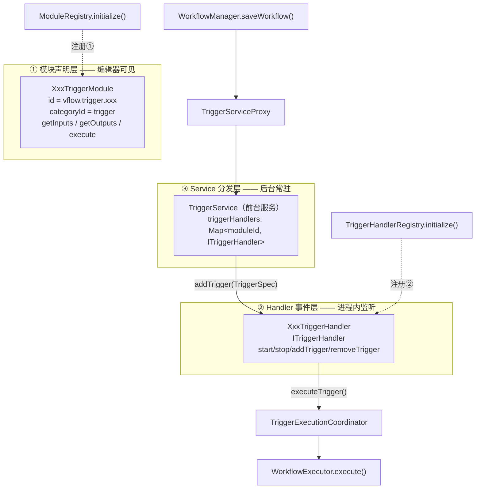

# vFlow 触发器体系梳理（fork 参考文档）

> 版本：v1.0
> 状态：代码走查定稿（对应 `session-0915-01` 分支，2026-09-15）
> 目录归属：**fork 独有**（冲突归我方），上游无此文件
> 用途：改动触发器相关代码前的**现状地图**。回答「现在是怎么实现的、扩展要动哪几处、有哪些现成的坑」。
> 与相邻文档的区别：本文件是**现状梳理**，不写需求与改造方案；单个触发器的功能设计文档见 `../do-not-disturb-trigger.md`。

> **口径声明**：本文数字为**人工走查代码后统计**得出，仓库内**无**配套自动统计脚本，数字与行号会随代码漂移；
> **引用前请以代码为准**。统计口径见 §7。

---

## 0. 为什么写这份文档

触发器是 vFlow 里**数量最多的一类能力**（24 个模块、22 个 Handler 类），也是**注册链路最分散**的一类：

- 一个触发器要注册**两次**（模块表 + Handler 表），漏一个就是**静默失效**；
- 触发路径跨越 4 个组件（Service → Registry → Handler → Coordinator），排障时容易只看到一段；
- 编辑器侧、后台侧、AI 侧对「什么算触发器」有**三套独立判定**，改一处不影响另外两处。

本文件把这些固定成文，目的是下次新增触发器或排查「触发器没响应」时，不必重读一遍注册链路。

---

## 1. 总览：三层架构



**这是本文最重要的一条：注册分两处，职责不同，缺一不可。**

| 注册点 | 位置 | 管什么 | 漏掉的后果 |
|---|---|---|---|
| `ModuleRegistry.initialize()` | `core/workflow/module/ModuleRegistry.kt:61` | 模块在**编辑器/AI**里可见可选 | 用户选不到该触发器 |
| `TriggerHandlerRegistry.initialize()` | `triggers/handlers/TriggerHandlerRegistry.kt:24` | Handler 在**后台**被实例化 | **能选能配、后台永不触发**（静默失效，最难查） |

---

## 2. 数据模型

| 类 | 文件 | 用途 | 是否 Parcelable |
|---|---|---|---|
| `TriggerSpec` | `core/workflow/model/TriggerSpec.kt` | 进程内传递的触发器单元 | ❌ |
| `WorkflowTriggerRef` | `services/WorkflowTriggerDelta.kt` | 跨 Intent 的轻量引用 | ✅ |
| `WorkflowTriggerDelta` | `services/WorkflowTriggerDelta.kt` | 变更通知载荷 | ✅ |
| `ElementTriggerState` / `GKDTriggerState` | `triggers/` | 有状态触发器的运行态 | ❌ |

`TriggerSpec`（`TriggerSpec.kt:9`）的派生字段：

```
triggerId = "$workflowId:$stepId"   ← 含 stepId，同一工作流可挂多个同类触发器
type      = step.moduleId
parameters = step.parameters
```

`triggerId` 含 `stepId` 这点很关键：`removeTrigger` 用的是旧引用里的 `triggerId`，
**改了 step id 会导致解绑失败**（旧触发器残留、新触发器叠加）。

---

## 3. 两条链路

### 3.1 配置链路（工作流变更 → Handler 增删）

```
WorkflowManager.saveWorkflow(id, oldWorkflow)          WorkflowManager.kt:112
  └→ TriggerServiceProxy.notifyWorkflowChanged()       TriggerServiceProxy.kt:21
       └→ Intent(ACTION_WORKFLOW_CHANGED) + WorkflowTriggerDelta(workflowId, oldTriggerRefs)
            └→ TriggerService.onStartCommand
                 └→ handleWorkflowChanged()            TriggerService.kt:168
                      ├ 1. 旧 handler removeTrigger(oldTriggerRefs)
                      ├ 2. getHandlersForWorkflow()    TriggerService.kt:259
                      │      = workflow.toAutoTriggerSpecs()
                      │          .mapNotNull { triggerHandlers[trigger.type] }  ← 无 handler 直接丢弃
                      ├ 3. PermissionManager.getMissingPermissions() 有缺失？
                      │      → 后台 recoverWorkflowPermissionsAndApplyState()
                      │      → 仍失败则 saveWorkflow(isEnabled=false, wasEnabledBeforeLost=true)
                      └ 4. handler.addTrigger(context, TriggerSpec)
```

`getHandlersForWorkflow` 里的 `mapNotNull` 是第 1 节「静默失效」的落点：
`triggerHandlers` 里没有该 `type` 时**直接跳过、不报错、不记日志**。

### 3.2 事件链路（系统事件 → 执行工作流）

```
系统事件（广播 / 传感器 / SharedFlow / AlarmManager / 原生进程 / 音频）
  └→ Handler 遍历 listeningTriggers，按 trigger.parameters 过滤
       └→ executeTrigger(context, trigger, triggerData)     BaseTriggerHandler.kt:29
            └→ TriggerExecutionCoordinator.executeTrigger()  TriggerExecutionCoordinator.kt:28
                 ├ 权限恢复（autoGrantPermission），仍缺 → 记 CANCELLED 日志，return false
                 └ WorkflowExecutor.execute(
                       workflow, ctx,
                       triggerData,      ← 事件数据
                       triggerStepId     ← 决定给哪些触发器 id 填 outputs
                   )                                          WorkflowExecutor.kt:132
```

**权限检查在两处**，不是一处：`TriggerService.handleWorkflowChanged`（注册前）和
`TriggerExecutionCoordinator.executeTrigger`（每次触发时）。触发器命中但权限已失效时，
会走第二条并记 `LogStatus.CANCELLED`。

---

## 4. Handler 实现范式

`ITriggerHandler`（`handlers/ITriggerHandler.kt`）只有四个方法：`start` / `stop` / `addTrigger` / `removeTrigger`。
`BaseTriggerHandler` 提供 `triggerScope` 与 `executeTrigger` 辅助，并在 `start` 里建 `WorkflowManager`。

### 4.1 两个抽象基类

| 基类 | 子类数 | 特点 |
|---|---|---|
| `ListeningTriggerHandler` | 16 | **引用计数**管理监听生命周期：第一个 `addTrigger` → `startListening`，最后一个 `removeTrigger` → `stopListening`。四个方法都是 `final`，子类只能实现 `startListening` / `stopListening` |
| `BaseTriggerHandler`（直接继承） | 6 | 自行管理 add/remove 与监听启停 |

`ListeningTriggerHandler` 的 16 个子类：AppPackage、AppStart、AppSwitch、Battery、Bluetooth、Call、
Clipboard、DoNotDisturb、Element、GKD、Location、Notification、Power、Screen、Sms、Wifi。

直接继承 `BaseTriggerHandler` 的 6 个：BackTap、Interval、KeyEvent、Pose、Time、Voice。

### 4.2 按事件源分类（22 个 Handler 全覆盖）

| 事件源 | 数量 | Handler |
|---|---|---|
| 系统广播 | 9 | AppPackage、Battery、Bluetooth、Call、**DoNotDisturb**、Power、Screen、Sms、Wifi |
| 无障碍事件流 | 4 | AppStart、AppSwitch、Element、GKD |
| 传感器 | 2 | BackTap（加速度计）、Pose（ROTATION_VECTOR） |
| AlarmManager | 2 | Interval、Time |
| 剪贴板 | 1 | Clipboard |
| 定位 | 1 | Location |
| 通知回调 | 1 | Notification |
| 音频 | 1 | Voice |
| 外部 Intent（无自身监听） | 1 | KeyEvent |

> `**DoNotDisturb**` 为 fork 新增，见 `../do-not-disturb-trigger.md`。

### 4.3 三种特殊范式

**A. 定时调度型（Time / Interval）—— 不常驻监听**

```
addTrigger → AlarmTriggerScheduler.schedule()           handlers/AlarmTriggerScheduler.kt
               ├ 计算 nextTriggerTime（Time 按 HH:mm + days 星期掩码；Interval 按 interval+unit）
               ├ Time → setAlarmClock；其它 → setExactAndAllowWhileIdle
               └ PendingIntent.getBroadcast(TimeTriggerReceiver, requestCode = triggerId.hashCode())

到点 → TimeTriggerReceiver.onReceive()（goAsync + IO 协程）  services/TimeTriggerReceiver.kt
        ├ 从 WorkflowManager 重新读 Workflow + triggerStep（跨进程重建，不用内存 spec）
        ├ TriggerExecutionCoordinator.executeTrigger()
        └ Handler.rescheduleAlarm()  ← 自己排下一次
```

这条路径**天然抗进程重启**（不依赖内存状态），但也因此**改了 step id 会解绑失败**。
`AlarmTriggerScheduler.calculateNextTriggerTime` 对未知 `trigger.type` 返回 `null` → 会主动 `cancel`，
**新增调度型触发器必须在此 `when` 里加分支**。

**B. 外部进程型（KeyEvent）**

把 `assets/key_event_trigger_handler/<abi>/key_event_trigger_handler` 部署到 `/data/local/tmp/vflow/`，
经 Shizuku/Root shell 拉起 C++ 守护进程读 `/dev/input`，事件经 Intent
（`ACTION_KEY_EVENT_RECEIVED`）回到 `TriggerService.onStartCommand` 直通分发。
是唯一一个**事件源不在 Handler 内部**的触发器。

**C. 独立 Service（Voice）**

`VoiceTriggerService`（`foregroundServiceType="microphone"`）不进 `TriggerService`，
`TriggerServiceProxy` 对 `vflow.trigger.voice_template` 特判转发。
**需要特殊 fgs 类型或独立常驻的触发器应照此路径。**

### 4.4 状态基线：广播型触发器的一个陷阱

`PowerTriggerHandler` 这类只需读 `intent.action` 就知道事件**方向**。
但若广播只告知「值变了」而不告知方向（如 DoNotDisturb 的 interruption filter），
必须自行缓存上一次状态：

```
注册监听时：lastKnownEnabled = 读当前状态    ← 建立基线（留 null 会误触发一次）
收到广播时：current = 读当前状态
            if (previous == current) return  ← 去抖（等值比较，非时间窗口）
            lastKnownEnabled = current       ← 判断之后再更新
```

基线必须是**实例变量**（Handler 是 Service 持久成员，跨 add/remove 存活），
且在 `stopListening` 里清空。参见 `handlers/DoNotDisturbTriggerHandler.kt`。

---

## 5. triggerData：事件数据如何变成下游变量（两条路）

### 5.1 事件数据路

`executeTrigger(triggerData = ...)` → `ExecutionContext.triggerData` → 模块 `execute()` 里
`context.triggerData as? VDictionary` 取出 → 包装成 `ExecutionResult.Success(outputs)`
→ 下游用 `` 引用。

自定义 Parcelable 载荷（非 VDictionary）：

| 类型 | 用于 |
|---|---|
| `ElementTriggerData(VScreenElement)` | Element |
| `GKDTriggerData` | GKD |
| `VoiceTriggerData` | Voice |
| `PoseTriggerData` | Pose |

其余（Sms / Notification / AppSwitch / Clipboard 等）用 `VDictionary` + `VString` / `VImage`。

### 5.2 seed 路（`WorkflowExecutor.seedTriggerOutputs`，`:374`）

跑 steps 之前，用 `triggerStepId` 找到 trigger 步骤，把它的 **parameters 当作 variables**
调一次 `module.execute()`，把 outputs 写进 `stepOutputs` —— 且写到**「所有同 moduleId 且 output schema 相同」**
的 `trigger.id` 上。

作用：手动启动（无事件数据）时下游变量仍有结构、不报错。

> ⚠️ **多触发器的直接后果**：`seedTriggerOutputs` 只认「命中那个」`triggerStepId`，
> 因此从触发器 A 触发时，`{{<触发器B的id>.sender}}` 是**空的**——不报错，但拿不到值。

---

## 6. 触发器身份判定：三套独立路径

| 位置 | 依据 |
|---|---|
| `WorkflowNormalizer.isTriggerStep()`（`WorkflowNormalizer.kt:57`） | `moduleId.startsWith("vflow.trigger.")` |
| `ChatAgentToolRegistry.isTriggerModule()`（`ui/chat/ChatAgentToolRegistry.kt:202`） | `startsWith` **或** `metadata.getResolvedCategoryId() == ModuleCategories.TRIGGER` |
| `ActionPickerSheet(isTriggerPicker=true)` | `ModuleRegistry.getModulesByCategory()` 只取 `TRIGGER` 分类 |
| `Workflow.autoTriggerSteps()`（`Workflow.kt:51`） | `triggers.filter { it.moduleId != "vflow.trigger.manual" }` |

**结论：新触发器的 `id` 必须带 `vflow.trigger.` 前缀，且 `metadata.categoryId = "trigger"`，两者缺一不可。**

`WorkflowNormalizer`（`WorkflowNormalizer.kt`）负责历史形态兼容，三条来源按优先级取其一：
显式 `triggers` → `steps` 里前置的 trigger 步骤 → 更老的 `legacyTriggerConfigs`；
`ensureTrigger = true` 时自动补 `vflow.trigger.manual`（`Workflow.kt:7` 定义该 id）。

---

## 7. 全量清单

### 7.1 24 个触发器模块

| # | 模块 id | Handler | 事件源 | 所需权限 |
|---|---|---|---|---|
| 1 | `vflow.trigger.manual` | ❌ 无 | 用户主动 | — |
| 2 | `vflow.trigger.share` | ❌ 无 | 用户主动（分享） | — |
| 3 | `vflow.trigger.voice_template` | ⚠️ 独立 Service | 音频 | `MICROPHONE` |
| 4 | `vflow.trigger.app_package` | ✅ | 广播 | — |
| 5 | `vflow.trigger.app_start` | ✅ | 无障碍流 | `ACCESSIBILITY` |
| 6 | `vflow.trigger.app_switch` | ✅ | 无障碍流 | `ACCESSIBILITY` |
| 7 | `vflow.trigger.backtap` | ✅ | 传感器 | — |
| 8 | `vflow.trigger.battery` | ✅ | 广播 | — |
| 9 | `vflow.trigger.bluetooth` | ✅ | 广播 | `BLUETOOTH` |
| 10 | `vflow.trigger.call` | ✅ | 广播 | `READ_PHONE_STATE` |
| 11 | `vflow.trigger.clipboard` | ✅ | 剪贴板 | — |
| 12 | `vflow.trigger.do_not_disturb` | ✅ | 广播 | `NOTIFICATION_POLICY` |
| 13 | `vflow.trigger.element` | ✅ | 无障碍流 | — |
| 14 | `vflow.trigger.gkd` | ✅ | 无障碍流 | — |
| 15 | `vflow.trigger.interval` | ✅ | Alarm | `EXACT_ALARM` |
| 16 | `vflow.trigger.key_event` | ✅ | 外部 Intent | **动态**（`ShellManager.getRequiredPermissions()`，Shizuku 或 root） |
| 17 | `vflow.trigger.location` | ✅ | 定位 | `LOCATION` |
| 18 | `vflow.trigger.notification` | ✅ | 通知回调 | `NOTIFICATION_LISTENER_SERVICE` |
| 19 | `vflow.trigger.pose` | ✅ | 传感器 | — |
| 20 | `vflow.trigger.power` | ✅ | 广播 | — |
| 21 | `vflow.trigger.screen` | ✅ | 广播 | — |
| 22 | `vflow.trigger.sms` | ✅ | 广播 | `SMS` |
| 23 | `vflow.trigger.time` | ✅ | Alarm | `EXACT_ALARM` |
| 24 | `vflow.trigger.wifi` | ✅ | 广播 | `LOCATION` |

**统计口径**：模块全集 = `triggers/*Module.kt` 文件数（24）；
「Handler」列以 `TriggerHandlerRegistry.kt` 的注册为准（21 个已注册）；
`voice_template` 有 Handler 类但**不注册**于 TriggerHandlerRegistry（由 `VoiceTriggerService` 承载）；
`manual` / `share` 无 Handler（用户主动触发，不参与后台监听）。

> **完全无权限声明的 11 个**：`manual`、`share`、`app_package`、`backtap`、`battery`、`clipboard`、
> `element`、`gkd`、`pose`、`power`、`screen`。
> 其余 13 个各声明一项（见上表）。
>
> ⚠️ **`key_event` 是特例**：它的 `requiredPermissions` 是**计算属性**——
> `get() = ShellManager.getRequiredPermissions(...)`（`KeyEventTriggerModule.kt:82`），
> 运行时才求值（Shizuku **或** root，取决于环境）。
> 因此静态 `grep` 会把它误判为「无声明」。**统计触发器权限时不能直接用 grep 计数**——
> 本表 11/13 的划分是逐模块读 `requiredPermissions` 实现体得出的。
>
> ⚠️ 另一处不一致：`RequiredPermissions` 只覆盖「执行所需」，**不含触发器本身的监听前提**。
> 如 `do_not_disturb` 的勿扰访问权限同时也是广播投递前提（Android 10+ 只投递给已授权包），
> 这类「监听前提」不体现在清单里。

### 7.2 图片资源

`rounded_do_not_disturb_on_24.xml`（fork 新增）。上游无勿扰图标，`DoNotDisturbModule`（动作模块）
借用的是 `rounded_notifications_unread_24`。

---

## 8. 能力与现状评估

> 本节是**评估**（主观判断），与前面的**事实描述**区分开。事实部分均有代码位置支撑。

### 8.1 强项

1. **注册表解耦干净**。`TriggerHandlerRegistry` 让 `TriggerService` 不硬编码 Handler，
   新增触发器只需追加一行。
2. **权限模型统一**。所有触发器走 `PermissionManager` + `requiredPermissions`，
   并在注册前/触发时双重校验，还带自动恢复与「缺权限停用 + 记 `wasEnabledBeforePermissionsLost`」。
3. **`ListeningTriggerHandler` 的引用计数**省掉大量重复的启停代码。

### 8.2 短板

1. **两处注册无一致性校验**。漏注册 Handler 时没有任何警告——
   `getHandlersForWorkflow` 用 `mapNotNull` 静默丢弃。**这是本子系统最大的坑。**
2. **`triggerId` 含 `stepId`，改 id 即解绑失败**。编辑器侧没有保护。
3. **多触发器共用一条 steps 链，无分支**。任何触发器命中都执行同一套 `workflow.steps`；
   想在 A 触发走这条路、B 触发走那条路，只能用 `If` 判 `{{<triggerId>.xxx}}` 或拆工作流。
4. **`seedTriggerOutputs` 只填命中那个触发器**，其它同类触发器的输出为空（见 §5.2）。
5. **高频触发器无全局去抖**。多个同类触发器各自独立计数（如 3 个 Element 触发器各有一份
   `ElementTriggerState`），同一事件可连续触发多次工作流。
6. **重入策略是工作流级**（`WorkflowReentryBehavior`，默认 `BLOCK_NEW`）。
   多触发器场景下，A 在跑时 B 命中会被直接忽略并记 `REENTRY_BLOCKED_NEW_EXECUTION`。
7. **触发器一律不设 `aiMetadata`**（走查确认），即 AI 无法创建带自动触发器的工作流——
   `save_workflow` 的 `triggers` 参数只能填手动触发器。
8. **`manual` 是「保底」而非「之外」**：`autoTriggerSteps()` 排除它，但 `manualTrigger()`
   用 `firstOrNull`，导入外部 JSON 造出多个手动触发器时只认第一个。

---

## 9. 扩展落点

### 9.1 新增一个触发器的完整清单

| 步骤 | 文件 | 必须 |
|---|---|---|
| 1 | `triggers/XxxTriggerModule.kt`（`BaseModule`，定 `id`/`metadata`/`getInputs`/`getOutputs`/`execute`/`validate`/`getSummary`） | ✅ |
| 2 | `triggers/XxxTriggerUIProvider.kt` + `res/layout/partial_xxx_editor.xml`（参数界面特殊时才需要） | ⭕ |
| 3 | `triggers/handlers/XxxTriggerHandler.kt` | ✅ |
| 4 | **`ModuleRegistry.initialize()` 追加注册** | ✅ |
| 5 | **`TriggerHandlerRegistry.initialize()` 追加注册** | ✅ |
| 6 | `res/values{,-en,-ja}/strings_module.xml` 文案（模块名/描述/每个 `nameStringRes`/枚举 `optionsStringRes`/摘要/错误） | ✅ |
| 7 | 图标 drawable | ⭕ |
| 8 | `requiredPermissions` | ⭕ |
| 9 | `AndroidManifest.xml`（仅独立 Service/Receiver 需要） | ⭕ |
| 10 | `test/.../triggers/` 单测（现有 4 个测试文件） | ⭕ |
| 11 | **`FORK.md` 登记**（AGENTS.md 第 6 条要求「触发器联动同步补齐」） | ✅ |

### 9.2 现成的坑

1. **两处注册不同步** → 静默失效，最难查（§8.2 短板 1）。
2. **枚举参数必须走 `normalizeEnumValue()`**。`InputDefinition` 带 `legacyValueMap` 做历史别名兼容，
   直接 `params["x"] as? String` 字符串比较会漏掉旧数据。
   已有测试 `TriggerHandlerEnumNormalizationTest` 锁定这一点。
3. **`BaseTriggerHandler.stop()` 会 `triggerScope.cancel()`**，子类 `stop` 里不能再用它起协程。
   需异步清理时要先 `triggerScope.launch { ... }` 再 `super.stop()`（参见 `KeyEventTriggerHandler`）。
4. **Handler 是 Service 持久成员**，跨 add/remove 存活 →
   `lastForegroundPackage` / `lastBatteryPercentage` / `lastKnownEnabled` 这类状态要自己在
   remove 和 stop 里清理，否则下次启动拿到陈旧状态。
5. **`ListeningTriggerHandler` 四方法 `final`**，只能实现 `startListening` / `stopListening`。
6. **新调度型触发器要改 `AlarmTriggerScheduler.calculateNextTriggerTime` 的 `when`**，否则返回 `null` 会被主动 cancel。
7. **`triggerId.hashCode()` 作 PendingIntent requestCode**，理论上存在 hashCode 碰撞风险（未观测到）。

### 9.3 排障顺序（「触发器没响应」）

1. 编辑器里触发器是否存在且工作流**已启用** → 否则 `handleWorkflowChanged` 不会 addTrigger；
2. 日志里有无 `TriggerServiceManager` 的「已创建并启动了 N 个触发器处理器」→ 确认 Service 起来了；
3. 有无「权限正常，正在向处理器添加/更新」→ 确认走的是注册成功分支；
4. 有无该 Handler 自己的启动日志（各 Handler 的 `startListening` 都打了 `DebugLogger.d`）；
5. 若 1-4 都正常但事件来了没反应 → 查该 Handler 的过滤条件（`trigger.parameters`）

---

## 10. 引用前须知

- **行号会漂移**。本文行号基于 `session-0915-01`（2026-09-15）实测，上游合并后需重新核对。
- **数字为人工走查**。口径见 §7.1 与各节括注；引用前以代码为准。
- **本文未覆盖**：各触发器的参数细节（见各自 `XxxTriggerModule.getInputs()`）、
  UIProvider 契约、触发器在工作流编辑器里的增删交互。

### 复核命令（重新走查时用）

```bash
T=app/src/main/java/com/chaomixian/vflow/core/workflow/module/triggers

# 模块总数（应为 24）
ls $T/*Module.kt | wc -l

# 已注册 Handler 数（应为 21）
grep -c "register(.*Module().id)" $T/handlers/TriggerHandlerRegistry.kt

# 逐模块核对「是否注册 Handler」——注意 KeyEvent 等特例需人工比对
for f in $T/*Module.kt; do
  cls=$(basename $f .kt)
  grep -q "register($cls" $T/handlers/TriggerHandlerRegistry.kt && echo "✅ $cls" || echo "❌ $cls"
done

# 继承关系统计
grep -h "^class.*:.*ListeningTriggerHandler" $T/handlers/*Handler.kt | wc -l   # 16
grep -h "^class.*: BaseTriggerHandler"       $T/handlers/*Handler.kt | wc -l   # 6

# 权限矩阵（⚠️ 不可直接 grep -L 计数，KeyEvent 是计算属性，见 §7.1）
grep -n "requiredPermissions" -A 3 $T/*Module.kt
```
