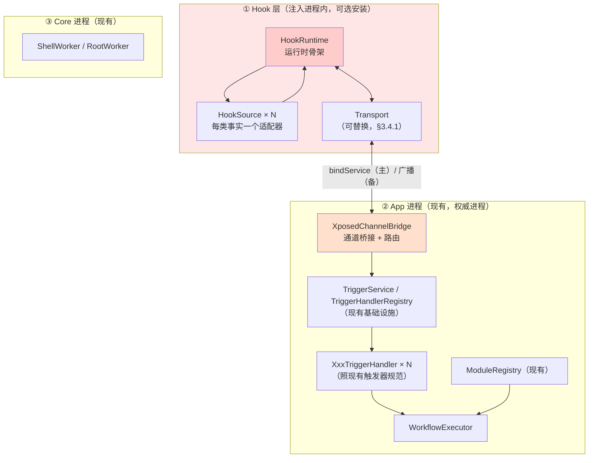

# Xposed 通道架构设计 —— 第四条通道（事件源 + MethodHook）

> **版本**：v2.2 · 2026-09-26（**设计定稿，未实现**）
> **对应分支**：`dev`（基于 `versionName 1.5.4` / `versionCode 50`）
> **目录归属**：fork 独有文档 → 冲突归**我方**（上游无此文件）
> **目标设备**：小米 MIX Fold 3（Android 17 / API 37 / 澎湃 OS4.0，LSPosed 1.0 + Zygisk 已运行）
> **状态**：📐 **设计阶段**，尚无任何代码改动
>
> **本文的定位**：这是 vFlow **唯一会引入「在别人的进程里运行代码」**的通道，风险性质与前三条通道不同。
> 因此本文的重点不是「怎么做」，而是**「边界划在哪、为什么」**。
>
> **证据标注纪律**：每条结论标注证据类型——
> **【文档】**官方逐字 · **【源码】**AOSP/ShortX 源码逐字 · **【实测】**本机可复现 · **【推断】**未验证。
> （不标注 = 设计判断，非事实断言）
>
> **当前进度**：设计阶段，无代码改动。通信链路已实测定案（§4.2）；
> 探针代码与结论见 `scripts/probe/xposed-channel/FINDINGS.md`。
> 剩余待验 5 条**均需注入 system_server**（§8）。
>
> **修订历史不入本文**（属 git history）。以下仅记**被推翻的结论**，以免重蹈：
>
> | 旧结论 | 现状 | 教训 |
> |---|---|---|
> | 「无界 hook 会让 AI 契约失效，故不做 `MethodHook`」 | 撤回（§1.1） | `shell_command`/`js` 已是反例——**没先查已有实现** |
> | 「共享文件可作下行通道」 | 证否（§4.2.7） | 「hook 层读得到」未验证即采用 |
> | 「hook 层受包可见性限制 ⇒ `bindService` 出局」 | 仅对 5a 成立（§4.2.1） | **把 5a 的结论套到 5b** |
> | 「`MethodHook` 无热更新」 | 推翻（§4.6） | 依据仅「ShortX 没做」——**反编译一家实现 ≠ 平台做不到** |
>
> **共同教训**：**平台行为先查文档/源码，再用实验验细节**。
> 实验只回答「此条件下发生什么」，不是普适规律。
>
> **v2.2 修订（P0 探针实测，见 §4.2.9）**：**通道的核心能力已实证。**
> ① ⭐ **能拿到 Activity 的 Intent（含 extras）** —— 这是本通道存在的理由，前三条通道做不到。
>    hook 点：`com.android.server.wm.ActivityRecord.activityResumedLocked(IBinder, boolean)`，
>    经 `ActivityRecord.forToken(IBinder)` 反查实例后读 `intent`。
> ② **两条实现级坑**（都靠实测才发现）：**类名**必须是 `com.android.server.wm.*`（不是 `android.app.*`）；
>    该方法**是 `static``、没有 `this`**，**不能用 `getThisObject()` 取值**。
> ③ ⚠️ **新硬约束**：`onSystemServerStarting` 时**系统服务尚未就绪**
>    （`PackageManager` / `IActivityManager` 均为 null），**约 11 秒后**才可用
>    ⇒ **启动期做 IPC 要带「等服务就绪」的等待**（是「要等时机」，**不是「禁止 IPC」**）。
> ④ ⚠️ **调试方法**（能省大量时间）：**`adb logcat` 读不到启动期日志**，
>    因**开机洪流把 2 MiB 环形缓冲填满**、启动日志第一个被挤掉。
>    抓启动期日志**必须重启后立刻抓**，或用 LSPosed 管理器导出的 verbose 日志。
>    ⚠️ **不要为了绕过它而改探针代码**（见 ⑤）。
> ⑤ ⚠️ **三次「模块不加载」**（P0 期间探针改三次、每次都不加载）。
>    ⚠️ **此前我把它写成铁律「启动期整条路径不要新增 IPC / I/O」——
>    该结论【已被反证】，现降级为「现象记录」**：当前已实测可用的探针版本，
>    启动期路径上就有**四处跨进程调用**（含 `isUserUnlocked()`），运行正常。
>    **真因未查明**（三次都只做整体回退，**从未二分定位**）——详见 §4.2.9 六。
> ⑥ §4.4.1 补齐**两个必需依赖**（`api` + **`service`**）与 `module.prop` 的写法坑。
> **§8 中 #1 / #18 转为已答**。
>
> **v2.7（2026-09-26 深夜）：查清 `getRemotePreferences` —— 它是配置下行，**不能**用于事件上行。**
> ① ❌ **方向相反**（官方源码逐字）：`XposedInterface.getRemotePreferences` 的 javadoc 写明
>    「**read-only in hooked apps**」；**只有模块 App 能写**（`XposedService` 侧）。
>    ⇒ 数据流是「**App 写 → hook 读**」，与事件上行需要的方向正好相反。**新增 §4.2.2.1。**
> ② ⚠️ **新增 §4.6.1「热更新 ≠ 配置通道」**（官方明文）：
>    「Hot reload is intended for loading a new module generation after the module app is updated.
>    **It should not be used to propagate configuration changes.** For configuration updates, use
>    `getRemotePreferences(String)` and `OnSharedPreferenceChangeListener`.」
>    ⇒ **两条链路必须分开**：hook **定义**变了走热更新（低频）；hook **规则**变了走通信通道（高频）。
>    本方案架构天然避开此坑（§3.4.1 硬约束「Hook 层不知道工作流的存在」，判定全在 App 侧）。
> ③ ✅ **独立印证了 §4.2.2 的选型**：`bindService` 仍是 Xposed 通道里**唯一的双向通道**。
> ④ ⚠️ **一处未能判定**（两份来源冲突）：system_server 里 `RemotePreferences` 的变更回调是否投递 ——
>    项目方实测断言「不投递」vs 源码分析「会投递」。**仅影响配置下行的实时性，不影响事件上行。**
>
> **v2.6（2026-09-26 深夜）：#17 热更新实测通过 —— system_server 热更新可用。**
> ① ✅✅ **`autoHotReload=true` + 重装 APK ⇒ 在 system_server 里触发热更新，无需重启手机**；
>    `HookHandle.replaceHook()` **原子替换成功**，之后 hook 立刻恢复命中（§4.6）。
>    **这推翻了 §4.6 旧的「推断」**（曾怀疑框架对 system_server 策略不同）。
> ② ⚠️ **两条实现要点**（都靠实测才发现）：
>    **`HotReloadedParam` 没有 `getClassLoader()`**（全 API 只有 `PackageReadyParam` /
>    `SystemServerStartingParam` 有）；**且不能用静态字段传跨代际状态** ——
>    热更新是**新 classloader 加载新代码，静态字段在新代际是全新的**
>    （我实测缓存 ClassLoader 到静态字段 ⇒ 在新代际读到 `null`）。
>    **正解：`replaceHook()`，不需要 ClassLoader；回调需的类从 `chain.getExecutable()` 推。**
> ③ ✅ **P0 的 5 条验证项全部有结论**：**#1/#18/#14/#17 通过**、**#15 方法无效**。
>
> **v2.5（2026-09-26 深夜）：⚠️ 推翻 v2.3/v2.4 的两处过头结论 —— 主通道已实证通过。**
> ① ✅✅ **`bindService` 主通道成立** —— 实测拿到 `BinderProxy@1adc174`。
>    **此前 v2.3 写的「实测推翻了核心论据」、v2.4 的「选型进入重评」【都是错的，已撤回】**。
>    **真因：探针跑得比设备解锁早**（约早 47 秒），而目标 Service
>    `directBootAware=false` ⇒ 未解锁时组件在解析阶段就被排除，
>    **表现与「包不可见」一模一样**（`getServiceInfo` 抛 `NameNotFoundException`、
>    `resolveService` 返 `null`、`bindService` 返 `false`）。
> ② ⚠️ **必须写进正式实现**：hook 层要等 **`UserManager.isUserUnlocked()`** 再通信，
>    否则会得到一堆**假的「连不上」**。
> ③ ❌❌ **归因反面教材（连错两次，方向还相反）**：先据一次无对照的 `null` 写成
>    「推翻核心论据」并改了选型；后又怀疑「组件没装」。**两次都没排除时序变量。**
>    **教训：`null`/`false`/异常 ⇒ 先做对照项框范围；优先怀疑时序/状态类变量
>    （解锁、stopped、进程存活），再谈能力/权限，最后才是平台行为。**
> ④ 本轮「能查清」的关键是**用户提出的方向**（「能不能延迟一下/加个按钮」），
>    而非我的源码推理。**用户对系统的直觉多次比我的推理准。**
>
> **v2.3（2026-09-26 晚，#14/#15 结论取得，经 LSPosed verbose 日志）**：
> **两条结论都是负面，且第 1 条动摇了本方案的通道选型依据。**
> ① ~~⚠️⚠️ **#14 `bindService` 失败**……~~
>    **❌ 本条已于 v2.5 撤回** —— 真因是**探针跑得比设备解锁早**，
>    加 `isUserUnlocked()` 后 **`bindService` 成功拿到 `BinderProxy`**。
>    **v2.3 曾据此写成「推翻核心论据、选型重评」，是过头结论**（§4.2.1 / §4.2.2）。
> ② ❌ **#15 取不到有效结论** —— 目标权限 + **两个无关第三方 signature 权限全 GRANTED**
>    ⇒ 「自己查自己一律放行」，`checkPermission(自己pid, 自己uid)` 这个方法本身无效（§5.2）。
> ③ ✅ **读取途径定案**：`adb logcat` **拿不到**（实测 `main` 缓冲仅覆盖约 **50 秒**，
>    开机高峰 1220 条/秒）；`logcat -G 16M` **重启即失效**
>    ⇒ **唯一正路是 LSPosed 管理器导出的 verbose 日志**（持久化、不丢）。
>    **⚠️ 文档 §4.1 早就写着这个方法，我却绕了三轮（改代码/调缓冲/抢时间）才用上。**
> ④ **归因过程的反面教材**（#14 我错了三次，两次把自己的问题归因到外部）见 §8 下方。
>
**证据来源**：

- **ShortX 反编译源码**：`D:/develop/references/shortx/decompiled/`（APK rev `95a632b6`，git 索引见该目录 `notes/`）
  —— 本轮调研**逐个动作**判定了它的执行机制，结论见 §2.2
- **vFlow 侧现状**：直读本仓库代码，**行号均已核对**
- **真机实测**：本机 Android 17 上的 LSPosed 状态、权限矩阵、进程模型（§3.3）

---

## 0. 一句话方案

**分两层交付：先做「事件源」，`MethodHook` 作为独立的第二层。**

- **第一层（先做）**：用 Xposed 采集**前三条通道原理上拿不到的信息**——进程内对象、方法调用、Activity Intent。
  Hook 层只做「采集 + 上报」，不承担业务逻辑；业务一律回 App 侧，沿用现有模块系统与权限模型。
- **第二层（后做，允许对 AI 开放）**：`MethodHook`（用户/AI 指定类名 + 方法名 + before/after + 表达式）。
  **它可以有完整契约**（见 §1.1 的纠正）——描述写清「hook 任意方法」、`riskLevel = HIGH`，与 `shell_command` 同等待遇。
  但要按 §1.2 的差异做形态选择：**优先 hook 目标 App 进程**（权限可退档、崩溃半径小），
  **hook system_server 作为独立的高危选项**（无档位、崩溃即软重启，需全套防御设计）。

**核心约束：Hook 层不承担业务逻辑、不读工作流配置。** 它只上报事实或执行被明确指定的 hook 指令，
判断一律在 App 侧——这样 hook 层代码量最小、崩溃面最小。

### 0.1 ⚠️ 前置决策：Hook 层与主 App 是否同一 APK

**这条必须先定，因为它决定后面多个设计点的形态。** 两条路线：

| | 路线 1：**同一 APK**（推荐） | 路线 2：独立旁挂 APK |
|---|---|---|
| 用户操作 | 装一个 vFlow，在 LSPosed 里勾选 **vFlow 自身** | 装 vFlow + 装一个 hook 模块 APK，勾选后者 |
| 代码位置 | `app/src/main/java/.../xposed/`（`XposedModule` 子类，§4.4.1） | 独立 module |
| **签名级权限加固（§4.2.3）** | ✅ **成立**——hook 层与 vFlow 同签，可验签放过 | ❌ **失效**——无法用签名区分，加固要整个重设计 |
| 版本一致性 | ✅ 同包同版本，不会「hook 层与 App 不匹配」 | ⚠️ 两个 APK 各自升级，协议可能错配 |
| 非 LSPosed 用户体验 | ✅ **完全无变化**——无框架时 hook 层是死代码 | ⚠️ 多一个「装了但没用的 APK」 |
| R8 / 混淆 | ⚠️ hook 入口类要 keep（§4.4） | 独立模块可单独配 |

**本方案按路线 1（同一 APK）撰写。** 理由：它是**唯一能让签名级加固生效**的形态，
而 `TriggerService` 的加固是本通道落地的硬前提（§4.2.3 / §5.3）——路线 2 会让这条加固失去依据。
若日后改用路线 2，§4.2.3 的两个加固选项都要重新评估。

> **⚠️ `MethodHook` 是允许做的**：曾一度列为「不做」（理由是「AI 契约会被绕过」），
> 但该论证不成立（§1.1）。限制条件只有 §1.2 的**形态选择**，不是「不做」。

---

## 1. 为什么不照抄 ShortX

> **先说结论**：ShortX 不是「把 hook 当工具用的 App」，而是**「注入进 system_server 的一个内核，外面套了个 App 当 UI」**。
> 它的**权威进程是 system_server**——规则数据、规则引擎、动作执行、JS 引擎全在那里。
> 因此「抄它的架构」= **把 vFlow 的权威进程从 App 搬到 system_server**，那是重写运行时，不是加通道。

### 1.0 ShortX 的权威进程在哪（实测证据）

**① 规则数据：protobuf 文件，位于 `/data/system/` 下**

```java
// kaa/tjo/ufanjca/AbstractC4747jA.java:9-13  —— 数据根目录
public static File OooO00o() {
    return new File(OooO0O0(), "shortx_" + 随机16位字符);
}
public static File OooO0O0() {
    return new File(Environment.getDataDirectory(), "system");   // → /data/system
}

// kaa/tjo/ufanjca/AbstractC10412xA.java:22-28  —— 各类 store 路径
public static File OooO0Oo(String name) {
    return new File(new File(OooO0o0(), "data/u/0"), "data_store/" + name + ".pb");
}
```

实际布局：

```
/data/system/shortx_<16位随机>/
├── data/u/0/data_store/
│   ├── rules.pb          ← 用户规则正本
│   ├── rulesets.pb       ├── das.pb（DirectAction）
│   ├── toggles.pb        ├── functions.pb
│   └── globalVars.pb     └── pkgsets.pb
├── flags/<name>          ← hook 开关（文件存在即开启）
└── log/                  ← 含 crash/SYSTEM_SERVER_CRASH_*.log
```

**没有 SQLite、没有 SharedPreferences、没有 ContentProvider、不在外部存储。**
（`assets/lcrules/rules.db` 是在线「规则包」的 Room 库，**不是用户数据正本**。）
写盘用自定义 `AtomicFile`（`.new`/`.bak` 三段式），目录权限 **0755** —— 刻意做成跨 UID 可读。

> ⚠️ **`/data/system` 是 `system:system 0771`，普通应用无法进入**（本机实测：
> `adb shell ls /data/system/` → `Permission denied`；`adb shell touch /data/system/x` → `Permission denied`）。
> **这正是 hook（在 system_server 内）能读、普通 App 读不到的原因。**

**② 谁读写：system_server 自己**

**`ShortXService` 根本不是 Android Service 组件**——manifest 里查不到，没有 `<service>` 声明。
它是一个**在 system_server 进程内被实例化的普通单例对象**（`C7546oY1`），由 hook 初始化：

```java
// AMSHook.java:35-42  —— hook ActivityManagerService.start 之后
Context context = (Context) AbstractC9649tz1.OooOO0(thisObject, "mContext");  // AMS.mContext
C7546oY1 c7546oY1 = C7546oY1.OooOO0o;
if (!c7546oY1.OooO0oO) {
    c7546oY1.OooO0oo(context);      // ← 用 AMS 的 Context 初始化规则引擎与全部 store
}
```

**③ App 进程的角色：纯 UI 客户端**

App 编辑规则时做的事只有一件：**构造 `Rule` protobuf → `IShortX.addRule(rule)`**。
落盘、校验（含签名 SHA1/MD5 比对）、写 `.pb`、通知 observer，**全部在 system_server 内完成**。
App **连数据文件都碰不到**，它靠 `registerRuleObs` 回调刷新 UI。

### 1.0.1 两者对照

| | ShortX | vFlow |
|---|---|---|
| **权威进程** | **system_server**（uid 1000） | **App 进程** |
| 数据存储位置 | `/data/system/shortx_*/data_store/*.pb` | **App 私有 SharedPreferences**（`WorkflowManager.kt:69`） |
| 谁读盘 | system_server | App |
| 规则引擎 | system_server（`BH1` RuleService） | App（`WorkflowExecutor`） |
| 动作 handler（208 个 / 168 个） | **system_server** | **App** |
| JS 引擎 | **system_server**（`MP.java:86` 同线程求值） | App（`JsExecutor`，`Dispatchers.Default`） |
| Core 的角色 | — | 特权助手（shell / root） |
| App 的角色 | **UI 客户端**（远程控制台） | **权威进程** |
| App 与 hook 层 | **同一份 dex**，直接持对象引用，零 IPC | 独立进程，必须 IPC |
| 权限模型 | 无（`NoSecurityController` 全局关闭） | **有**（`PermissionManager` 分档：Shizuku / Root / Core） |
| AI 可寻址性 | 不需要 | **必需** |

### 1.0.2 为什么 vFlow 搬不过去

**搬走权威进程，会丢掉 vFlow 的核心资产**：

| vFlow 的资产 | 搬进 system_server 后 |
|---|---|
| **权限分档**（`SHIZUKU` / `ROOT` / `CORE`） | ❌ **失效**——所有模块都自动是 uid 1000，无从分级 |
| **崩溃隔离**（Core 崩了 App 还在） | ❌ **丢失**——system_server 崩 = 整机软重启 |
| AI 工具契约 | ⚠️ 逻辑上还在，但每次调用变成 Binder 往返 |
| 调试 / 日志 / 热重载 | ⚠️ 难度大幅上升 |

**第 1、2 条是本质的**：vFlow 的权限模型建立在「**能力可选不同身份执行**」这个前提上
（`ShellCommandModule.kt:56-62` 的 `when (mode)` 就是例证）。全部搬进 uid 1000 后，这个前提消失。

**ShortX 没有这个损失**——它本来就没有权限分级（全局关闭安全检查），也没有崩溃隔离的诉求。
所以它的选择对它自己是最优的，对 vFlow 不是。

> **「同一份 dex / 零 IPC」是结果，不是原因。**
> 因为权威进程在 system_server，注入的代码与它同进程，所以能直接持对象引用——
> **不是「因为能持对象引用，所以搬过去」。这个因果不能倒置。**

### 1.1 ⚠️ 先纠正一个误判：「无界能力」并不导致契约失效

> **一条想当然的判断**：「任意 hook 不可枚举，写不进 schema，会让 AI 的审批与风险分级失效。」
> **该论证不成立**，理由是本仓库已有反例。

**反例就在现有代码里**——`vflow.shizuku.shell_command` 与 `vflow.system.js` 都已是**对 AI 开放的无界执行**：

```kotlin
// ShellCommandModule.kt:42 —— shell_command
directToolDescription = "Run an arbitrary shell command through auto, Shizuku, root, Core, or Core Root mode."
inputHints = { "command" to "Exact shell command string to run." },

// JsModule.kt:35 —— js
workflowStepDescription = "Execute a JavaScript snippet with optional inputs and return a dictionary result."
inputHints = { "script" to "Full JavaScript source code." },
```

**两者的做法是：把「无界」本身作为契约声明出来。**
描述里明说 arbitrary / Full source code，`riskLevel = HIGH`，用户与 AI 都能据此判断。

**所以「无界 = 无法声明」是错的——它可以被声明。** 同理，一个 `vflow.xposed.method_hook`
（参数：`package` / `class` / `method` / `before_after` / `expression`）**也能写进 schema**：
描述写清「hook 任意方法」，`riskLevel = HIGH`，与 `shell_command` 同等待遇。

**结论：AI 契约不构成「不做 MethodHook」的理由。**

### 1.2 真正的差异：影响半径与权限档位

撤回 §1.1 后，vFlow 与 ShortX 的真实差异收缩为**两条**，其中第 1 条是本质的。

#### 差异 1（本质）：**失败时崩溃的是谁的进程**

| 通道 | 执行位置 | 最坏情况 |
|---|---|---|
| Shizuku / Root / Core | 自己的进程 | 命令失败、权限不足 |
| `shell_command`（即使 root） | 自己的进程 | **命令失败，App 不受影响** |
| **Xposed in system_server** | **别人的进程（uid 1000）** | **system_server 崩 → 整机软重启** |

**这是唯一真正的性质差异。** 前面三条通道的错误半径是**自己的进程**，而注入 system_server 的错误半径是**整个系统**。

ShortX 在这上面写了大量防御（实证见 §5.1，共 6 条：180ms 拦截上限、1200ms 去重窗口、
连按熔断、全局 `UncaughtExceptionHandler` 等）——**这些不是过度设计，是这条通道的固有成本。**

> ⚠️ **但要注意范围**：这条差异**只对「hook system_server」成立**。
> 若 hook 的是**目标 App 进程**（ShortX 的 `CustomHookApp` 那种），崩溃半径与「那个 App 崩了」同量级，
> **并不比 shell 命令更特殊**。§1 后续的克制建议**不适用于这种形态**。

#### 差异 2：**hook 没有权限档位可选**

`shell_command` 有明确的档位，用户可主动收窄：

```kotlin
// ShellCommandModule.kt:56-62
override fun getRequiredPermissions(step: ActionStep?): List<Permission> {
    return when (step?.parameters?.get("mode") as? String) {
        MODE_ROOT -> listOf(PermissionManager.ROOT)
        MODE_SHIZUKU -> listOf(PermissionManager.SHIZUKU)      // ← uid 2000，权限更小
        MODE_CORE -> listOf(PermissionManager.CORE)
        MODE_CORE_ROOT -> listOf(PermissionManager.CORE_ROOT)
    }
}
```

用户可以在「Shizuku / Root / Core / Core Root」之间选，**风险可控**。

而注入 system_server 的 hook **没有档位**——它就是 uid 1000，一律最高，用户无法选「低权限模式」。

> **这一条是设计约束，不是拒绝理由**：如果要让 hook 有档位，答案就是**优先做「hook 目标 App 进程」的形态**
> （权限可退到该 App 自身的 uid），把 system_server 形态作为独立、明确标注的高危选项。

#### 附：「规则分享面变大」不构成拒绝理由

vFlow 有 `WorkflowJsonImportParser` / 会话导出，威胁面比 ShortX 大——但**这不构成额外理由**：
`shell_command` 与 `js` 已是**经同一导入通道传播的无界能力**，规则分享面**现在就存在**，
引入 hook **不改变已有威胁模型**，只是多一个同类条目。

### 1.3 前三条通道已经覆盖了 ShortX 那批「看着最重」的能力

这是本轮调研最有价值的发现（§2.2）。ShortX 大量动作用 Xposed 实现，**但离开 Xposed 并非做不到**：

| 动作 | 看起来 | 实际等价物 |
|---|---|---|
| `SetAppEnabled` / `Suspend` / `Inactive` | 需要系统权限 | `pm disable-user` / `pm suspend` / `am set-inactive` |
| `SetDataEnabled` | 需要特权 | `svc data enable` |
| `SetLocationEnabled` | 需要特权 | `settings put secure location_mode` |
| `InjectKeyCode` / `Tap` / `Swipe` | 需要特权 | `input keyevent/tap/swipe`（shell uid 自带 `INJECT_EVENTS`） |
| `SleepScreen` / `Wakeup` | 需要特权 | `input keyevent 26/223` |

**vFlow 的 Shell / Root / Core 三条通道本来就能做这些**——ShortX 走 hook 是**设计选择**（省掉 shell 往返、不切进程），不是技术不可能。

---

## 2. 关键事实（已核实）

### 2.1 Xposed 真正独占的能力：只有四类

本轮对 ShortX 208 个动作**逐个判定执行机制**，结论如下。

#### ① 进程内输入注入

`InjectKeyCode` / `InjectCombineKeyCode` / `InputTap` / `InputSwipe` / `MediaPlayback`

机制不是 `su -c input`，而是**在 system_server 内直接调 `InputManager.injectInputEvent`**：

```java
// shortx/services34/input/InputShellCommandV34.java:157-159
InputManagerGlobal.getInstance().injectInputEvent(...)
```

`INJECT_EVENTS` 是 signature 权限，仅 uid 1000 直接持有。
**但 shell uid 2000 也持有**（Android 自带 `input` 工具即依赖它）——所以**这一条 vFlow 已有等价物**。

#### ② 系统输入 / IME 内部状态读写 ⭐

- `InputText`：反射取 `InputMethodManagerService.mCurInputConnection` 直接塞文本
- `InjectGestureRecording`：`InputManagerService.mInputFilterHost` / `nativeInjectInputEvent`
- `ContinuousGesturePointer`：`InputManagerHook` 装入 InputManagerService 的 **input filter 回调**

**这一类的特殊之处**：它不只是「执行动作」，同时是 ShortX **全部手势/按键类触发器的来源**
（`EdgeGesture` / `CombineKeyEvent` / `BackNavStart` / `BackNavDone`）。

这些对象**只活在 system_server 内**，反射拿不到（反射也需要先有对象引用）——**只有 hook 能拿**。

#### ③ 系统栏 / 窗口管理的内部方法

| 动作 | 依赖的对象 | 该对象来源 |
|---|---|---|
| `RemoveStatusBarIcon` | `StatusBarManagerService.mInternalService` | `StatusBarManagerServiceHook.java:57` |
| `ShowRecentApps` | `StatusBarManagerService.mBar` | 同上 |
| `ShowGlobalActionsMenu` | 同上 | 同上 |
| `ShowHideInsets` | `DisplayPolicy.mFocusedWindow` | `DisplayPolicyHook.java:90` |
| `LockDeviceNow` | `WindowManagerService.lockDeviceNow` | `WMServiceHook.java:172` |
| `CloseActivity` | AMS `finishActivity(token, ...)` | 需 ActivityRecord 内部 token |

**无任何 shell 命令等价物。** 注意 `CloseActivity` 的特殊性：它能**只关一个 Activity**，而 `am force-stop` 会杀掉整个应用。

#### ④ system uid 专属窗口

`EnableUniversalCopy` / `EnableViewIdViewer` / PPN 的 SystemUI 变体：

```java
// shortx 反编译
window.setType(2020);                  // TYPE_STATUS_BAR_ADDITIONAL
window.addPrivateFlags(536870912);
```

**连 root 都开不出来**——这不是权限问题，是窗口类型本身要求 system uid 身份。

> **注**：这一类是 ShortX **自家 UI 功能**的依赖（复制增强、悬浮面板），**不是「自动化能力」**。
> vFlow 已有自己的超级岛 / 悬浮窗体系（`services/island/`），不需要这一条。

### 2.2 Xposed 独占能力 → 与 vFlow 需求的映射

| Xposed 独占 | vFlow 有需求吗 | 结论 |
|---|---|---|
| ① 输入注入 | ✅ **已有等价物**（`CorePressKeyModule` / `InputModule`） | **不构成理由** |
| ② IME / 输入内部状态 | ✅ **有**——是手势/按键**触发器**的来源 | ⭐ **值得做** |
| ③ 系统栏 / 窗口内部方法 | ⚠️ 部分（如 `CloseActivity` 单 Activity 关闭） | ⭐ **值得做，但要逐个评估** |
| ④ system uid 窗口 | ❌ 不需要（vFlow 有自己的 UI 体系） | **不做** |

**所以 Xposed 通道的价值集中在 ② 和 ③，且 ② 是重头戏——因为它是事件源，不是执行器。**

### 2.3 ShortX 的通信设计（不可照抄，但有借鉴）

> **前提回顾（§1.0）**：ShortX 的权威进程就是 system_server。所以它的「通信」本质是
> **「同一个进程内的两个模块怎么互相找到」**，不是通常意义的跨进程 IPC。

**主链路 = 完全零 IPC**。因为 `ShortXService` 这个规则引擎**就住在 system_server 里**，
hook 代码只需把它的单例引用存进自己的静态字段：

```java
// HookStub2.java:34-39  —— 在 systemServerLoaded 路径里执行
ShortXService$serviceBinder$1 svc = C7546oY1.OooOOOO;
tornaco.apps.shortx.core.OooO0O0.OooO00o = svc;   // ← 直接持对象引用
```

**跨进程链路 = 「Binder 走私」**。只用于**目标 App 进程**（它们不在 system_server 里）。
ShortX 借用了 `AppWidgetServiceImpl.startListening` 这个「目标进程会主动调用、且返回值可被篡改」的接口：

```java
// AppWidgetServiceHook.java:40-49 —— hook 系统服务，篡改返回值
if (((String) obj2).equals("shortx")) {          // 约定暗号
    bundle.putBinder("shortX-Binder", svc);      // 把 IShortX 塞进 Bundle
    shortXHookParam.returnAndSkip(...);
}
```

备用通道是 `ClipboardService.getPrimaryClip`（暗号 `pkg.shortx.binder`），三级降级 + 缓存
（`core/OooO0O0.java:72-87`）。

**⚠️ vFlow 不能照抄这套**，原因有三条，第 1 条是根本：

1. **vFlow 的权威进程不在 system_server**（§1.0.2）——
   所以既没有「同进程直接持引用」这个前提，也就**必须真的跨进程通信**。
   ShortX 的零 IPC 主链路对 vFlow **完全不适用**。
2. **「Binder 走私」需要 hook 系统服务**（AppWidget / Clipboard）并**篡改其返回值**。
   这会让 vFlow 的 hook 面从「采集」扩大到「篡改系统服务行为」，风险等级上升。
3. 它是**被逼出来的**设计——ShortX 也不得不解决「目标 App 进程怎么拿到服务」这个问题，
   而它选择的手法代价很高。**这不是优雅方案，是因它自己的架构而必须付的成本。**

**vFlow 必须自己设计通信链路**——这是本方案最需要投入的部分（§4.2）。

> ⚠️ **一个容易搞错的地方**：
> 「Hook 层不读工作流配置」**不等于「不需要下行通信」**。
> Hook 层读不到 App 私有目录（§4.2.0 实测），所以**必须由 App 主动下发过滤条件**——
> 否则它要么 hook 所有进程（灾难），要么全量上报（洪泛）。
>
> **准确的差别是「下行传什么」**：
> - **ShortX 下行「完整规则」**（含动作、条件、变量绑定）——因为它的**执行也在 hook 进程**
> - **vFlow 下行「过滤条件」**（监听哪个包的哪个 hook 点）——因为**执行在 App 侧**
>
> 所以 vFlow 的通信**不是「更简单」，而是「下行的数据量与语义复杂度低得多」**。

---

## 3. 架构设计

### 3.1 总体结构



**关键设计：Hook 层是「可选且可缺席」的。**

- 未安装 LSPosed → Hook 层不存在 → 相关触发器**不可用（而非报错）**
- 能力探测失败 → 工作流正常运行，该触发器静默不触发（需有明确的状态提示，见 §4.4）

**⚠️ 这张图对应 §3.4 的目标结构**：**运行时骨架 + N 个适配器 + 可替换传输层**。
（别退回成「入口 + 一个 Collector」——那是为单个触发器画的，扩展不了。）

### 3.2 分层职责

| 层 | 职责 | **不做什么** |
|---|---|---|
| **Hook 层** | ① **接收下发的过滤条件**（存内存）<br/>② 按条件挂/卸 hook<br/>③ 采集事件、序列化、上报 | ❌ 不执行业务动作<br/>❌ **不读任何配置文件**（读不到，见 §4.2.0）<br/>❌ 不做「该不该触发哪个工作流」的判断 |
| **App 侧 Handler** | ① **下发过滤条件**（触发器增删时）<br/>② 接收上报、按 `TriggerSpec.parameters` 过滤<br/>③ `executeTrigger` | ❌ 不直接用 hook 能力 |
| **App 侧模块** | 作为普通模块暴露 hook 采集到的数据 | 同现有模块规范 |
| **Core** | （可选）承载条件/事件的中转 | 不参与语义 |

> **这条分工是硬约束**：Hook 层**不知道工作流的存在**，也不知道用户在配什么。
> 它只知道「**在哪个包的哪个 hook 点上报**」——这只是**过滤条件**，不是业务规则。
> 判断全部在 App 侧。这样 hook 层代码量极小、逻辑极简，崩溃面也最小（§5.1）。

> **⚠️ Hook 层内部还要再分三层**（§3.4.1）——
> 上表是「Hook 层 vs App 侧」的**大分工**；Hook 层**内部**还要分成
> **适配器（HookSource）/ 语义层（信封）/ 传输层（Transport）**。
> 否则加第 N 个触发器时，通信代码会被复写 N 遍。

> **注意「三件事」的区分**（容易混为一谈）：
> - **下发过滤条件**（App → Hook）：✅ **必需**，否则 hook 层无从知道该监听什么
> - **读工作流配置**（Hook 读盘）：❌ **做不到且不该做**（权限不够 + 破坏分层）
> - **判定触发**（谁来决策）：✅ **App 侧**，Hook 层不参与

### 3.3 能力探测与降级

**实测的 LSPosed 环境**（本机）：

```
lspd 进程在跑（root 4360）
zn-zygisk-companion64 zygisk_lsposed      ← Zygisk + LSPosed
已装 6 个 Xposed 模块（框架工作正常）
Android 17 / SDK 37
```

**但 ShortX 已经顶到天花板**（反编译发现）：

```java
// LetsUpgradeKt.java:9-11
public static boolean isSupportedAndroidVersion() {
    return Build.VERSION.SDK_INT <= 37;
}
```

**ShortX 把支持上限设为 SDK 37，正是本机版本。** 这意味着：

- ✅ hook 在 Android 17 上**确实可用**（否则 ShortX 不会把它设为上限）
- ⚠️ **再新的系统它自己也得改**——vFlow 必须预期**同样的维护负担**

**降级设计**：⚠️ **必须是两组独立状态位，不能压成一个三态枚举。**

**容易犯的错**：把它写成单一的 `UNAVAILABLE / DEGRADED / ACTIVE`，这会把**两个不同的事实**压成一个：
「框架活性」（hook 层能不能跑）与「hook 是否已挂载」（**已配置的 hook 点是否真的挂上了**）是两件事。

**为什么不能合并**（这是本仓库反复记录的静默失效形态）：

```
用户配好触发器 → 条件下发成功 → 心跳正常（框架活性 ✅）
              → 但 hook 还没重新挂上（配了新 hook 点，尚未走到热更新/重挂）
              → hook 根本没挂上 → 事件永不产生
```

此时单一三态会判成 `ACTIVE`，而**实际什么都不会触发**——正是「能选能配、后台永不触发」那类缺陷。

> ⚠️ **注意窗口期的性质变了，但窗口仍在**：
> 102 支持热更新后（§4.6），从「必须重启目标进程」缩短为「触发一次热更新」——
> **配置了新 hook 点到热更新生效之间仍有间隙**，所以两个状态位仍然必要。

**状态位 A：框架活性**（hook 层是否在运行）

| 值 | 判据 | 表现 |
|---|---|---|
| `UNAVAILABLE` | 未装 LSPosed / 未勾选作用域 | 触发器在编辑器中**置灰 + 提示安装步骤** |
| `DEGRADED` | 框架在但**心跳超时**（hook 层未注入/已死） | 触发器**可显示但标警告**，执行时明确报错 |
| `ACTIVE` | 收到 hook 心跳 | 框架正常 |

**状态位 B：hook 挂载态**（针对每个已配置的 hook 点）

| 值 | 判据 | 表现 |
|---|---|---|
| `PENDING_APPLY` | 条件下发成功，但**尚未收到该 hook 点的首条「已挂载」确认** | ⚠️ **提示「需要应用变更（触发一次热更新）」**（§4.6）<br/>（原名 `PENDING_RESTART`——102 支持热更新后不再必须重启） |
| `MOUNTED` | 收到该 hook 点的挂载确认 | 正常 |
| `MISSING` | 目标进程已重启、但仍未确认（hook 点在当前系统上不存在） | 标警告 + 引导排查（§5.2 / §4.5） |

**因此要求 hook 层上报一条「hook 点已挂载」事件**（不只是心跳）——否则状态位 B 无从判定。
这条是 §3.2「Hook 层只上报事实」的合规上报，不违反分层。

> ⚠️ **若走广播通道，这条上报不能走「下行广播的回包」**：
> 广播接收器 `onReceive` 必须快速返回（约 10s 上限，超时会被 AM 杀进程），
> **所以下行接收器只能「收下即返回」**，不能在里面做耗时操作、也不能回发确认广播。
> **挂载确认必须走独立的上行通道**（§4.2.6）。
>
> ✅ **而主通道 `bindService` 没有这个问题**——
> **连接建立/断开本身就是挂载态的判据**（`onServiceConnected` / `onServiceDisconnected`），
> 不需要 hook 层额外上报。**这正是选它做主通道的理由之一**（§4.2.2）。

⚠️ **ShortX 完全没有活性探测**（调研确认：无 `isActive` / `isModuleEnabled` / heartbeat）。
它的唯一失败信号是 `getServiceOrNull()` 返回 null。
**vFlow 必须做心跳**——否则用户完全无法区分「没人触发」和「hook 没生效」，这与本仓库反复记录的「静默失效」同类。

---

### 3.4 ⭐ 可扩展性架构（回答「第 N 个触发器怎么接进来」）

> **为什么单列一节**：`activity_changed` 只是**引子**。Xposed 通道的长期价值在于
> **持续拓宽能力边界**——后面会加很多触发器与模块（ShortX 有 208 个动作 / 107 个触发器）。
> 因此评价这套设计的标准**不是「能不能拿到 Activity Intent」，而是「加到第 30 个时还站不站得住」**。

#### 3.4.1 三个正交的分层（决策：双层 + 统一信封 + 适配器）

```
┌─────────────────────────────────────────────────────────────┐
│ ① HookSource（适配器层）—— 每个 hook 点写一个               │
│    · 声明：监听什么、怎么取值、怎么序列化                    │
│    · 不碰通信、不碰注册、不碰心跳                            │
├─────────────────────────────────────────────────────────────┤
│ ② 语义层（统一信封 + 主题路由）—— 全通道共用一套             │
│    · EventEnvelope { topic, seq, ts, payload }              │
│    · 新增触发器 = 加一个 topic + schema（**不动通信层**）    │
├─────────────────────────────────────────────────────────────┤
│ ③ Transport（可替换传输层）—— 一次实现，长期不变            │
│    · BinderTransport（主）/ BroadcastTransport（备选降级）    │
│    · 上层只认「发一条信封」，不关心背后是谁                  │
└─────────────────────────────────────────────────────────────┘
```

**三层各自的变化频率完全不同**——这正是分层的意义：

| 层 | 加新触发器时 | 说明 |
|---|---|---|
| HookSource | **+1 个文件** | 唯一需要动的业务代码 |
| 语义层 | **+1 个 topic 定义** | 加一行注册，不动框架 |
| Transport | **不动** | 与「采什么」正交 |

> **⚠️ 这条设计的直接依据来自本仓库的教训**：
> `logcat` 那条链路把「条件下发」的 wire 格式独立成 `LogcatConditionWire`（纯函数 + round-trip 测试），
> 而**触发器本身只负责「采什么」**。这个分工是对的，**hook 通道照抄这个模式**。

#### 3.4.2 事件信封（EventEnvelope）—— 统一契约

**所有事件共用一个信封**（决策：统一信封 + 主题路由）：

```
EventEnvelope {
    topic      : String    // 如 "hook.activity.changed"
    seq        : Long      // 单调递增 —— 用于**丢包检测**（见 §3.4.4）
    timestamp  : Long
    payload    : JSON      // 按 topic 定义 schema
}
```

**为什么用统一信封而不是每个触发器自定义格式**：

| 理由 | 说明 |
|---|---|
| **通信层不用改** | 加触发器只加 topic，传输层永远只搬一个信封 |
| **丢包可检测** | `seq` 单调递增，App 侧一比对就知道断没断 |
| **AI 可理解** | 统一结构便于 AI 处理（与本仓库 `OutputDefinition.dictionaryKeys` 的机制一致） |
| **降级统一** | 心跳、错误、状态全部走同一个信封（topic 不同即可），**不必为每种消息造一条通道** |

**信封里必须有的、容易漏的字段**：

| 字段 | 为什么必须 |
|---|---|
| `topic` | 路由依据（App 侧按它找 Handler） |
| `seq` | ⚠️ **没有它就分不清「没事件」与「丢了事件」**——本仓库反复记录的静默失效形态 |
| `timestamp` | 事件发生时刻（不是上报时刻），下游判断时效性要用 |

**payload 的 schema 由 topic 定义，不强制统一**——「Activity 变化」与「组合键」的字段本就不同。
但**字段命名要遵循仓库既有约定**（`snake_case`，见 `AGENTS.md` 代码风格约定）。

#### 3.4.3 新增一个 hook 触发器的完整清单（决策：框架 + 适配器）

**目标：新触发器不碰通信、注册、心跳**。要动的地方：

| # | 动什么 | 在哪 | 必须吗 |
|---|---|---|---|
| 1 | 写 `HookSource` 适配器 | `xposed/sources/XxxSource.kt`（新文件） | ✅ |
| 2 | 定义 topic + payload schema | 同上（常量） | ✅ |
| 3 | 在 `HookRuntime` 注册该 source | **追加一行**（不重排） | ✅ |
| 4 | 新增触发器模块 | `core/workflow/module/triggers/XxxTriggerModule.kt`（新文件） | ✅ |
| 5 | 新增 Handler | `triggers/handlers/XxxTriggerHandler.kt`（新文件） | ✅ |
| 6 | 两处注册 | `ModuleRegistry` / `TriggerHandlerRegistry` **各追加一行** | ✅ |
| 7 | 文案 | `strings_module.xml` ×3 语言 | ✅ |
| 8 | 测试 | `test/.../XxxSourceTest.kt`（新文件） | ✅ |
| 9 | FORK.md 登记 | — | ✅ |

**⚠️ 注意 4–9 与「非 Xposed 触发器」的清单完全一致**——
这是刻意的：**hook 触发器必须是一等公民，走 `TriggerHandlerRegistry` 的完整流程**，
不另立一套平行的注册机制。**否则将来会有两个触发器体系。**

**唯一 Xposed 特有的只有 1–3**（写适配器 + 注册 source）。

#### 3.4.4 背压与丢弃策略（**必须在框架层统一，不能让每个适配器自己决定**）

**为什么必须在框架层**：每个 source 都手写「满了怎么办」，
必然出现「有的阻塞（拖垮 system_server）、有的无限缓冲（OOM）、有的静默丢（用户不知道）」。
**这三种都是本仓库记录过的失效形态。**

**统一策略**：

| 环节 | 策略 | 理由 |
|---|---|---|
| **hook 回调内** | **只做「取值 + 入队」**，绝不做耗时操作 | **system_server 主线程，阻塞即整机卡顿**（§5.1）——这条依据充分 |
| **队列** | **有界**（容量是常量，不随触发器数量增长） | 无界 = OOM 风险 |
| **满了** | ⚠️ **丢弃并计数**（**不阻塞**） | 阻塞会拖垮宿主进程 |
| **计数的去处** | 随下一个信封上报（`dropped_count`），**或独立 topic** | ⚠️ **丢弃必须让用户知道**——这是本仓库 `LogcatEventQueue` 的既有设计（`drainDropped()`） |
| **上报线程** | 独立于采集（采集不让出控制权） | 同上 |

> **⚠️ 这是「改错了不报错」的那一类地方**：丢弃策略写错的表现是
> 「平时正常，高峰时静默丢事件」——用户只知道「有时候没触发」。
> **必须按 `LogcatEventQueue` 的既有语义做**（丢事件但**不清丢弃计数**，留到上报为止），并有单测锁住。

> ### ❌ 本表此前有过一行「启动期整条路径不新增 IPC / I/O」——**已删除**
>
> **它是我的推断，且已被反证**：当前**已实测可用**的探针版本，
> 启动期路径上就有**四处跨进程调用**（含我新加的 `isUserUnlocked()`），**运行正常**。
> **详见 §4.2.9 六**（该节已降级为「现象记录」，真因未查明）。

#### 3.4.5 协议版本与兼容（**第 N 个触发器会踩的坑**）

**问题**：hook 层（注入在目标进程里）与 App 侧**是两个独立的生命周期**——
App 升级了，但注入的 hook 层可能还是**旧版本代码**。

> ⚠️ 102 的**热更新**（§4.6）让这件事**可解**——
> 但**不是自动的**：`onHotReloading` 需要模块**主动触发**（或 `autoHotReload=true` 时 App 更新触发），
> 且**新代码必须在 `onHotReloaded` 里自己重挂 hook**（官方明确「package lifecycle callbacks
> are **not** automatically replayed after hot reload」）。
> **所以「版本错配」从「必然发生」变成「会发生，但可主动收敛」**——协议层仍需处理。

**因此协议必须能协商版本**：

| 机制 | 做法 |
|---|---|
| **协议版本号** | 信封里带（或连接建立阶段交换） |
| **未知 topic** | ⚠️ **App 侧必须忽略而非崩溃**——旧 App + 新 hook 层时会出现 |
| **payload 加字段** | **只加不改不删**（向后兼容）；删改要走版本号 |
| **不匹配时** | 走 §3.3 的降级状态（明确提示），**不是静默** |

> **这条不是过度设计**：App 与 hook 层的版本错配**依然会发生**
> ——热更新解决了「能不能更新」，**没解决「用户不触发就一直是旧版本」**。
> **不处理的话，用户升级 vFlow 后 hook 层行为会莫名其妙。**

#### 3.4.6 本节的设计原则（一句话）

> **通信层只为「搬信封」负责；采什么由适配器决定；两者之间用统一信封解耦。**
> **这样加第 30 个触发器时，改动面积与加第 1 个时相同。**

## 4. 关键设计点

### 4.1 模块与触发器的对外契约

**新增触发器必须是标准模块**，走 `TriggerHandlerRegistry` 的完整注册流程（两处注册 + 文案 + 测试 + FORK.md 登记）。

首批候选（按价值排序）：

| 模块 id | 采集什么 | 输出 | 依赖 |
|---|---|---|---|
| `vflow.trigger.activity_changed` | Activity 生命周期（含 Intent） | `package_name` / `class_name` / `intent_uri` / `extras` | ⭐ ② 类 —— **hook 点与取值方式已实测确证**（§4.2.9） |
| `vflow.trigger.key_combination` | 组合键（如音量上下同按） | `keys` / `timestamp` | ② 类 |
| `vflow.trigger.edge_gesture` | 边缘手势 | `gesture_type` / `edge` / `distance` | ② 类 |

> ⭐ **`activity_changed` 的数据来源已确认可用**（§4.2.9 实测）：
> hook `com.android.server.wm.ActivityRecord.activityResumedLocked(IBinder, boolean)`，
> 用 `ActivityRecord.forToken(IBinder)` 反查实例，读 `packageName` / `mActivityComponent` / `intent`。
> **能拿到完整 Intent（含 extras）** —— 这正是前三条通道拿不到的东西。

**`activity_changed` 是首要目标**——它同时解决了：

1. 本仓库已有的具体需求（阅读 App 双页模式跟随折叠状态，需要拿到 `ActivityRecord.intent`）
2. vFlow 现有触发器的**真实空白**：目前只有 `app_switch`（**包级**）和 `element`（元素级），
   **没有 Activity 级触发器**。其中 **`AppSwitchTriggerHandler.kt:47`** 确实按包名去重
   （`if (packageName == previousPackage) return`），**同包内 Activity 切换被直接丢弃**。

> ⚠️ **别把这条推广到另一个触发器**：`AppStartTriggerHandler` **不是**同类问题。
> 它的 `handleAppChangeEvent`（`:189`）收了 `newClassName` 并传给 `handleAppOpenFromLauncher`（`:205`），
> 语义是「**从桌面打开某 App**」——同包内 Activity 切换**本就该丢弃**，这是正确行为而非缺陷。
> 所以「真实空白」的论据只建立在 `AppSwitch` 上。

> **注意**：`AccessibilityService.kt:131` 的 `resolveConfirmedActivityClassName` 已经用
> `PackageManager.GET_ACTIVITIES` 校验过 Activity 类名，并作为第三个参数传给了
> `ServiceStateBus.postWindowChangeEvent`（`ServiceStateBus.kt:90`）。
>
> ⚠️ **一处容易搞混的事实**（「这个字段没有触发器在用」的说法不准确）：
> 实际是：这个参数**只被写进静态字段 `lastActivityClassName`，根本没有进事件流**——
> `postWindowChangeEvent` 只 `emit(packageName to className)`，而 `windowChangeEventFlow` 的类型是
> `Flow<Pair<String, String>>`（`ServiceStateBus.kt:21`），第三个参数**无处安放**。
> 所以不是「没人用」，是「**没被发出去**」。
> （另需澄清：`lastActivityClassName` 这个静态字段**有消费者**——`GetCurrentActivityModule.kt:98`、
> `UiInspectorService.kt:517`、`ChatAgentNativeTooling.kt:1729` 都在读。它们读的是静态字段，不是事件流。）
>
> 所以「Activity 级触发器」即使不依赖 Xposed，也有一半基础（但**拿不到 Intent**，见 §4.3）——
> 且**光是改事件流就能通**，不必等 Xposed。

### 4.2 通信链路（v2.0：**已实测，主通道 = `bindService`**）

#### 4.2.0 通信必须是**双向**的（一个容易漏掉的前提）

**先说一个反直觉的结论**：Hook 层**读不到 vFlow 的工作流配置**，所以**必须由 App 主动下发**。

实测（shell 身份，等同普通 App 的隔离级别）：

```
$ ls /data/data/com.chaomixian.vflow
Permission denied
$ cat /data/data/com.chaomixian.vflow/shared_prefs/vflow_workflows.xml
Permission denied
```

而配置就在那里：

```kotlin
// WorkflowManager.kt:69
private val prefs = context.getSharedPreferences("vflow_workflows", Context.MODE_PRIVATE)
// WorkflowManager.kt:112
prefs.edit().putString("workflow_list", gson.toJson(workflows)).apply()
```

**`MODE_PRIVATE` = 只有 vFlow 自己的 uid 可读**（`0700` 目录 + SELinux `untrusted_app` 域）。
而 hook 代码运行在**别人的进程**里（目标 App 的 uid，或 system_server 的 uid 1000）——**都读不到**。

> ⚠️ **但要区分 5a / 5b**（这两者在这一点上不同——与 §4.2.1 同一个盲区）：
> - **5a（目标 App 的 uid）**：确实读不到，`untrusted_app` 域被 SELinux 隔离 ⇒ **必须下发**
> - **5b（system_server，uid 1000）**：⚠️ **情况可能不同**——uid 1000 是 SELinux `system` 域，
>   理论上能读更多位置。**但这不改变设计**：即便读得到，也**不该**让 hook 层去读工作流配置——
>   那会破坏 §3.2 的分层（hook 层不该知道工作流的存在）。**下发是设计选择，不只是权限所迫。**

> **这正是 ShortX 把数据搬到 `/data/system/shortx_*/` 的根本原因**（§1.0）。
> 不是设计偏好，是**因为它的 hook 层读不到 App 私有目录**。
> ⚠️ 而 `/data/system` 是 `system:system 0771`——**本机实测 shell 都进不去**（`ls /data/system/` → `Permission denied`）。
> ShortX 能写是因为它的权威进程在 system_server（uid 1000）。
> **vFlow 的权威进程在 App 侧，没有这个条件**，所以**不能照抄搬家**。

**因此通信是两个方向，缺一不可**：

```
下行（App → Hook）：过滤条件
  —— 「在哪个包的哪个 hook 点上报告事件」
  —— 必需。否则 hook 层要么 hook 所有进程（灾难），要么全量上报（洪泛）

上行（Hook → App）：事件
  —— 单向、异步、有界队列、满时丢弃并计数（§5.1）
```

**Hook 层只持有「过滤条件」，不持有任何业务语义**——它不知道有几个工作流、不知道触发后做什么。
**这正是「Hook 层不读工作流配置」（§3.2）的落实方式**：它不读盘，只接收。

**现成范式**：`LogcatTriggerHandler` 已经跑通了这个模式：

```kotlin
// LogcatTriggerHandler.kt:148 —— 触发器增删时同步条件到 Core
private fun syncToCore() {
    val conditions = listeningTriggers.mapNotNull { toCondition(it) }
    triggerScope.launch { pushConditionsToCore(conditions) }
}

private suspend fun pushConditionsToCore(conditions: List<LogcatTriggerCondition>) {
    val ok = VFlowCoreBridge.updateLogcatTriggers(LogcatConditionWire.encodeConditions(conditions))
    if (!ok) {
        // 不静默：下不去意味着触发器不会工作，而用户只会看到"没反应"
        DebugLogger.w(TAG, "条件下发失败（Core 未连接？），当前 ${conditions.size} 条")
    }
}
```

注意两个细节，**hook 通道应照抄**：

1. **`addTrigger` / `removeTrigger` 每次都要同步**（源码注释：`★ 每次都要同步`）
2. **空列表也要下发**——Core 据此停掉 logcat 进程。
   **hook 层同理且更迫切**：无触发器时继续挂着 hook = 白白承担开销与崩溃风险（§5.1）

#### 4.2.1 5a 与 5b 的可见性规则**完全不同**（不得混用结论）

**一个曾犯的错误**：把「hook 目标 App」的结论当成普适结论，套到了「hook system_server」上。

**AOSP 源码**（`AppsFilterBase.shouldFilterApplication()` **首行**）：

```java
int callingAppId = UserHandle.getAppId(callingUid);
if (callingAppId < Process.FIRST_APPLICATION_UID      // FIRST_APPLICATION_UID = 10000
        || targetPkgSetting.getAppId() < Process.FIRST_APPLICATION_UID
        || callingAppId == targetPkgSetting.getAppId()) {
    return false;                                     // false = 不过滤
}
```

`system_server` 是 **uid 1000 < 10000** ⇒ 按此源码，**第一个分支就豁免**，后续逻辑都不走。

> ## ✅ 2026-09-26 实测：**本条论据成立，且 `bindService` 已实证通过**
>
> **实测数据（本机 Android 17 / 小米 MIX Fold 3，system_server uid 1000 内查询）**：
> ```
> --- 包级（getPackageInfo）---
> getPackageInfo(com.vflow.hookprobe.vflow) = ✅可见 (targetSdk=36)   ← 第三方包
> getPackageInfo(bin.mt.plus)               = ✅可见 (targetSdk=30)   ← 第三方普通应用
> getPackageInfo(com.android.settings)      = ✅可见 (targetSdk=37)
> --- 组件级 ---
> resolveService(显式组件)  = null ❌
> getServiceInfo(显式组件)  = ❌ NameNotFoundException
> --- bindService ---
> bindService() 返回 false ⇒ 被拒 ❌
> ```
>
> ## ✅✅ 2026-09-26 晚【已查清】：**`bindService` 通道成立，主通道选型不变**
>
> **真因：探针跑得太早 —— 设备尚未解锁。**
>
> ### 实测数据（成功版本）
>
> ```
> 21:35:20   等待用户解锁…（已等 20500ms）      ← 旧版在这时就已经跑了（解锁前）
> 21:35:59   #14/#15 系统服务已就绪【且已解锁】（等待 59500ms）
> 21:35:59   #14 resolveService(...) = com.vflow.hookprobe.FakeVFlowService  ✅
> 21:35:59   #14 bindService() 返回 true ⇒ 已提交 ✅
> 21:36:00   ★★★ #14 bindService 成功，拿到 binder=android.os.BinderProxy@1adc174  ✅✅
> ```
>
> ### 机制：**未解锁时，`directBootAware=false` 的组件在 package 解析阶段就被排除**
>
> 目标 Service 是 `directBootAware=false`（实测 `query-services` 输出）。
> 设备未解锁时，这类组件**不可见**，表现与「包不可见」**一模一样**：
>
> | 现象 | 未解锁时 | 解锁后 |
> |---|---|---|
> | `getServiceInfo` | ❌ `NameNotFoundException` | ✅ 命中 |
> | `resolveService` | ❌ `null` | ✅ 命中 |
> | `bindService` | ❌ `false` | ✅ `true` + 拿到 `BinderProxy` |
>
> ### ✅ 因此本文档 §4.2.1 的论据【成立】，不需要改
>
> - **「uid 1000 豁免包可见性」** —— 包级实测成立（system_server 能看见 `bin.mt.plus` 等第三方包）
> - **组件级**：解锁后**三组对照全部 ✅**（系统应用 / 第三方普通应用 / 我们的包）
> - **主通道 `bindService`** —— 实证可用，且拿到 binder
>
> ### ⚠️ 但这条**必须写进正式实现**：hook 层要等「用户已解锁」再通信
>
> 未解锁时去连 vFlow、或去解析 vFlow 的组件，会得到**一堆假的「连不上」**。
> **判据**：`UserManager.isUserUnlocked()`。
> **这不是探针的临时措施，是正式实现的必需环节。**
>
> ### ❌❌ 归因反面教材（我在这里连错两次，方向还相反）
>
> | 我当时的结论 | 真相 |
> |---|---|
> | 「**实测推翻了文档核心论据**（包可见性）」 | ❌ **过头结论** —— 一次实验、**零对照项**，次日被对照矩阵反转 |
> | 「组件可能没装 / 装错版本」 | ❌ **又错** —— 组件一直在（APK manifest 里就有） |
> | 「是未解锁」 | ✅ **实测确证** |
>
> **教训（本仓库反复出现，务必记住）**：
> ① **拿到 `null`/`false`/异常时，先做【对照项】把范围框住，再谈结论**；
> ② **优先怀疑「时序 / 状态类变量」**（解锁、stopped、进程存活），
>    它们最容易被误判成「能力/权限」问题；
> ③ **要推翻一条有源码支撑的论据时，门槛必须更高** ——
>    推翻它意味着文档、选型、后续设计全要改。
>
> **⚠️ 另一个具体教训**：`getServiceInfo` 抛的 `NameNotFoundException`
> **不代表「组件不存在」** —— 组件**被过滤**（含未解锁）时也抛它。**别被异常名误导。**

| | 5a：hook 目标 App | **5b：hook system_server** ← 我们要做的 |
|---|---|---|
| 执行位置 | 那个 App 的进程 | **system_server** |
| uid | 目标 App | **1000** |
| 包可见性 | ⚠️ **受限**（用目标 App 的 manifest，改不了） | ✅ **豁免**（AOSP 源码 + **实测**：包级可见第三方应用） |
| `bindService` 到 vFlow | ❌ **不可用**（需可见性） | ✅✅ **可用** —— **实测拿到 `BinderProxy@1adc174`** |
| 广播 | ✅ 可用（不受可见性影响） | ✅ 可用 |

> **我们的 `activity_changed` 是 5b**：`ActivityRecordHook` 走 `systemServerLoaded` 路径、
> 加载 `com.android.server.wm.ActivityTaskManagerService`（ShortX `HookStub2.java:99` 实证）。

##### 可见性的实测证据

| 组 | 条件 | `bindService` 结果 |
|---|---|---|
| **A** | 无 `<queries>`、无 `<uses-permission>` | ❌ `false`（AMS: `U=0: not found`） |
| **C** | 有 `<queries>` | ✅ `true`，拿到 `BinderProxy` |
| **A（广播）** | 同上，但发**广播** | ✅ **vFlow 收到了** |

**结论**：包可见性拦的是**查询类 API 与显式组件调用**，**不拦广播投递**。

【文档】[package-visibility](https://developer.android.com/training/package-visibility)：
> "The limited visibility also affects **explicit interactions** with other apps, such as **starting another app's service**."

【文档】[use-cases](https://developer.android.com/training/package-visibility/use-cases)：
> "Because the `startActivity()` method **doesn't require package visibility**..."

> ⚠️ 官方文档**没有**明确写过「广播是否受可见性影响」——结论 1 是【实测】得来的。

#### 4.2.2 通道选型（**v2.5：主通道 = `bindService` —— 已实证通过**）

| 排序 | 方案 | 5b 可用性 | 理由 |
|---|---|---|---|
| **1** | **`bindService`（AIDL）** | ✅ **已实证** | ⭐ **主通道**：① 5b 不受可见性限制 —— **包级实测豁免**；② **连接状态天然就是 §3.3 要的「hook 挂载态」判据**（`onServiceConnected`/`onServiceDisconnected`）；③ 双向，无广播的频率/大小限制。**实测拿到 `BinderProxy`（§4.2.1）** |
| **2** | 广播 | ✅ | 备选：不需连接管理，App 被杀时靠静态接收器；但**拿不到连接状态**，且 §3.3 状态位 B 需另想办法 |
| ❌ | **`getRemotePreferences`**（libxposed 自带） | ❌ **不可用于上行** | ⚠️ **方向相反**：它是「模块 App 写 → hook 层**只读**」的**单向下行**配置通道。hook 侧 `edit()` 抛 `UnsupportedOperationException`（官方 javadoc：「read-only in hooked apps」）。**详见 §4.2.2.1** |
| ~~3~~ | ~~共享文件~~ | ❌ | **实测读不到**（`EACCES`，见 §4.2.7） |
| ~~4~~ | ~~LocalSocket → Core~~ | ⚠️ | 强依赖 Core 在运行；且鉴权面更差（§5.3.1） |
| ~~5~~ | ~~`startService`~~ | ⚠️ | 撞后台启动限制（§4.2.3）；且 `bindService` 已覆盖其用途 |

> ### ✅ 选型状态：**不变，且已由实测支撑**
>
> `bindService` 此前是**唯一没实测过、只凭 AOSP 源码推断**的环节。
> 现已实测通过（拿到 `BinderProxy@1adc174`），**三条理由全部落地**。
>
> **⚠️ 一次失败插曲（已查清）**：曾出现 `resolveService=null` + `bindService=false`，
> 真因是**探针跑得比设备解锁早**（目标 Service `directBootAware=false`）。
> **修法是加 `isUserUnlocked()` 判据** —— 这条**同时是正式实现的必需环节**（§4.2.1）。
>
> **⚠️ 归因教训**：我在此处连错两次（先写成「推翻了核心论据」、后又怀疑「组件没装」），
> **两次都是没有对照、没有排除时序变量就下结论**。详见 §4.2.1 的「归因反面教材」。

#### 4.2.2.1 ⭐ `getRemotePreferences` 为什么**不能**用于事件上行（已核实）

libxposed 自带一条**跨进程配置通道** `getRemotePreferences(String group)`，
看起来像是「现成的通信方案」。**核实结论：它是单向的配置下行，方向与我们相反。**

**证据（全部来自 Maven Central 的 sources jar，逐字）**：

| # | 事实 | 原文 |
|---|---|---|
| ① | **hook 层只读** | `XposedInterface.getRemotePreferences` 的 javadoc：<br/>「Gets remote preferences stored in Xposed framework. **Note that those are read-only in hooked apps.**」 |
| ② | **只有模块 App 能写** | 两个**同名不同类**的 API：hook 侧的 `XposedInterface.getRemotePreferences`（只读）vs 模块 App 侧的 `XposedService.getRemotePreferences`（可写，走 AIDL 上送） |
| ③ | **官方明确它的用途不是热更新** | `XposedService.hotReloadModule` 的 javadoc：<br/>「Hot reload is intended for loading a new module generation after the module app is updated.<br/>**It should not be used to propagate configuration changes.** For configuration updates, use `getRemotePreferences(String)` and `SharedPreferences.OnSharedPreferenceChangeListener`.」 |

**⇒ 数据方向是 `模块 App（唯一写者）→ hook 层（只读）`。**
**事件上行需要的是反方向 + 推送语义，它两条都不满足。**

**另外几条警告**（来自其它真实项目 / 源码，非我实测，**引用时须标注**）：

| 警告 | 来源 | 等级 |
|---|---|---|
| ⚠️ **system_server 里 `registerOnSharedPreferenceChangeListener` 可能不投递回调** | `thetvplus/customiuizer-a14` 的 `SystemServerPreferenceInvalidation.kt` 文件头注释（**自建广播兜底**，注明 "Confirmed device evidence 2026-08-19"） | 【项目方实测断言】 |
| ⚠️ **但另有源码分析认为会投递** | 读 LSPosed 源码得到的完整调用链（`updateRemotePreferences` → `ConfigManager.updateModulePrefs` → `onUpdateRemotePreferences` → `callback.onUpdate`） | 【源码推断】 |
| **listener 是弱引用持有**（`WeakHashMap`），不自己强引用会被 GC 静默回收 | libxposed `service` 源码逐字；多个项目专门注释了这条 | 【源码逐字】 |
| **`remove(key)` 疑似不生效**，需用空串覆盖 | `TakotsuboChen/ala-mobile-tool` 文档（未复现） | 【第三方声明】 |
| **`PROP_CAP_REMOTE` 能力判据** | 见下 | 【源码】 |

> **⚠️ 上面第一条与第二条【互相冲突】，我无法判定。**
> 两者的影响面相同：**只影响「配置下行 + 实时更新」**——
> **对「事件上行」没有影响**（那个方向根本不成立）。
> **⇒ 若将来真要用它做配置下行，必须先真机实测这一条。**

**能力判据**：`PROP_CAP_REMOTE`（值 `1L << 1` = `2L`），与 `PROP_CAP_SYSTEM`（`1L`）相或后由框架暴露。
**⚠️ 不要只靠 API 版本号判能力** —— 旧版框架可能报 API 101 却没有该能力，
**应按 `getFrameworkProperties()` 的位标志判，或按实际调用成败降级。**

**⇒ 结论：`bindService` 仍是 Xposed 通道里唯一的双向通道。**
`RemotePreferences` 的**正确用途**是「App 动态下发采集规则/开关给 hook 层」（如果将来需要），
**不是事件上行**。这条调查**独立印证了 §4.2.2 的选型**。

> ⚠️ **顺带捡到一条对 #17 热更新有用的官方原文**（同一个 javadoc）：
> 「The optional data should contain only **classloader-neutral** values...
> **Do not put module-defined `Parcelable` or `Serializable` objects in this bundle.**」
> ——这与我们在热更新里踩的「静态字段在新代际为 null」**是同一件事的两种表述**（§4.6）。

> **为什么 `bindService` 优于广播**：
> - **§3.3 的挂载态判定**：广播接收器「收下即返回、不能回包确认」，判不出挂载态；
>   `bindService` 的**连接本身**就是状态——连上 = hook 层活着，断开 = 挂了。**不需要额外心跳。**
> - **无频率/大小限制**：广播 extras 有上限、高频会打爆 Binder；边缘手势这类每秒数十次的事件不适合广播。
> - **双向**：Binder callback 可反向调用，下行条件与上行事件走同一条连接。

#### 4.2.3 ⚠️ 硬约束：5a 形态不能直接 `startService`

**Android 12+ 后台启动前台服务限制**：第三方身份调 `startService()` / `startForegroundService()`
启动 vFlow 的 `TriggerService`，会抛 `ForegroundServiceStartNotAllowedException`。
而 `TriggerService.onStartCommand` 必须 `startForeground` 以满足契约 —— **这条限制必然触发**。

**KeyEvent 为什么能跑通？** 因为它**不是直接 startService**：

```cpp
// core/src/cpp/key_event_trigger_handler.cpp:179-180, 189
string command = "am start-service -n " + package_name + "/com.chaomixian.vflow.services.TriggerService "
                "-a com.chaomixian.vflow.KEY_EVENT_RECEIVED "
...
int result = system(command.c_str());   // ← 借 am（shell uid）越权，绕过后台启动限制
```

**「有现成范式可照抄」这个论据站不住**——复制它就要复制「借 shell 越权」。

> ⚠️ **但这条主要影响 5a**。**5b（我们要做的）在 system_server 内**，
> 它本身就持有 `START_ACTIVITIES_FROM_BACKGROUND` 等特权，且不受后台启动限制约束——
> 更何况 5b 用 `bindService`，**根本不涉及 `startService`**。

#### 4.2.4 鉴权：token 机制（已实测证实）

**核心结构**（`bindService` 版本）：

```
        ┌──────────── vFlow App（权威进程）────────────┐
        │ ① 生成随机 token                             │
        │ ② 提供 AIDL Service                          │
        │    —— Service 用 signature 权限保护           │
        └───────────────────┬──────────────────────────┘
                            │ 下行：bindService 成功 ⇒ 连接建立
                            │      通过 AIDL 下发条件 + token
                            ▼
        ┌──────── system_server（hook 层，uid 1000）───┐
        │ ③ ⑤ 连接建立即证明「对方是我方」              │
        │ ④ 拿 token，按条件挂 hook、采集事件           │
        └───────────────────┬──────────────────────────┘
                            │ 上行：AIDL callback，事件 + token
                            ▼
        ┌──────────────────────────────────────────────┐
        │ ⑥ App 校验 token ⇒ 接受 / 丢弃                │
        └──────────────────────────────────────────────┘
```

**鉴权为什么成立**（实测证实；此前存疑的是 `broadcastPermission` 的方向）：

| 结论 | 证据 |
|---|---|
| `registerReceiver(..., broadcastPermission, ...)` 语义 = **「发送方需持有」** | 【实测】对照矩阵 |
| `signature` 级权限**能挡住异签发送方** | 【实测】 |

**对照矩阵**（fake-hook 声明并申请两个权限，构成分离）：

| 广播 | receiver 要求 | fake-hook 持有 | 结果 |
|---|---|---|---|
| ① `PUSH_CONDITIONS` | `HOOK_CONTROL`（**signature**） | `-1` **DENIED** | ❌ 没收到 |
| ② `PUSH_OPEN`（阳性对照） | `OPEN_CONTROL`（**normal**） | `0` **GRANTED** | ✅ **收到** |

**② 收到证明投递正常 ⇒ ① 没收到只能是权限拦的。** 干净的因果分离。

> ⚠️ **`bindService` 版本更强**：Service 的 `android:permission` 同样检查**调用方**是否持有该权限。
> 而 5b 在 system_server 内——**它能否持有 vFlow 的 signature 权限？**
> **这是一个尚未验证的关键问题**（见 §8）：system_server 不是 vFlow 签名的，理论上拿不到该权限。
> **若拿不到，5b 的 `bindService` 鉴权就要改用 token 单独承担**（与广播版本相同）。

#### 4.2.5 冷启动时序

**问题**：Xposed 注入发生在进程启动时，此时 App 可能尚未运行。

| 阶段 | hook 层行为 |
|---|---|
| 进程启动（App 未运行） | 只**挂候选 hook 点**，不上报 —— 不依赖任何配置 |
| 连接建立（App 起来后 bind） | 拿到条件 + token，**开始按条件上报** |
| App 未运行期间 | hook 已挂但不上报 → **事件在窗口期内丢失**（固有代价） |

⚠️ **窗口期通常为零**：hook 在**目标进程启动时**注入，而**用户配置动作发生在 App 已运行时**。
只有「目标进程比 vFlow 先启动」且从未连接过时才出现。

**决定：不缓存条件**
**宁可丢事件（用户看得出来「没触发」），也不要用过期条件误触发（用户看不出来）。**

#### 4.2.6 遗留限制（不粉饰）

| 限制 | 说明 |
|---|---|
| **token 在内存** | hook 层进程被杀后需重新下发。`bindService` 断开可被 App 感知（`onServiceDisconnected`），能主动重连 —— **这是 `bindService` 相对广播的又一优势** |
| **单向鉴权** | 证明的是「下行来自 vFlow」；上行靠 token 间接证明 |
| **5b 的签名权限问题** | ⚠️ **未验证**：system_server 能否持有 vFlow 的 signature 权限（见 §8） |
| **system_server 主线程约束** | ⚠️ **未验证**：在 system_server 内 `bindService` 的重入/阻塞风险。它是 Binder 主线程模型，**不能阻塞** |
| **`HOOK_CONTROL` 权限声明** | 需在 `AndroidManifest.xml` 用 `<permission android:protectionLevel="signature">` 声明（§4.4） |

#### 4.2.7 已证否的通道（实测）

**共享文件 —— 读不到**：

| 操作 | 结果 |
|---|---|
| `list()` 目录名 | ✅ 返回 5 项 |
| **读文件内容** | ❌ **`EACCES`**（4/4 失败） |
| 写文件 | ❌ `EPERM` |

⚠️ **关键**：**能列出目录名 ≠ 能读文件内容**。`/sdcard/vFlow/logs/*` 是 `-rw-rw---- u0_a262`，
第三方应用**读内容**被拒。

> 附带澄清一个**不是**问题的现象：`/sdcard/vFlow/` 实测是 **`drwxrws---`（0770）**，
> 且属主（10262）与当前 vFlow 进程 uid（10684）不同——那是**旧安装残留**，
> vFlow 现在靠 `MANAGE_EXTERNAL_STORAGE`（`appops: allow`）访问。**

#### 4.2.8 ⚠️ 一处官方未记载的行为（记下来，别当规则用）

实测发现：**声明某权限 ⇒ 该权限的「定义方」对你可见**。

| 组 | 声明的权限 | 结果 |
|---|---|---|
| v2 | `com.xiaomi.smarthome.permission.PUSH_WRITE_PROVIDER` | smarthome ✅ 可见 |
| v3 | 同前缀但**不存在**的权限 | ❌ 不可见 |
| v4/v5 | `com.miui.misight.permission.BIND_SERVICE`（定义方实为 **misightservice**） | **misightservice ✅ / misight ❌** |

**v4/v5 是决定性证据**：名字前缀不算，**`sourcePackage`（定义方）才算**。

⚠️ **三点限定**：

1. **官方文档完全没有记载**（我查了 `uses-permission` 元素页与 `package-visibility` 全系列，**零提及**）
2. **对 vFlow 场景没用**——受益的必须是**发起查询的那个 uid 的 manifest**；
   5a 的 hook 层用目标 App 的 manifest，**改不了**
3. **不要**当作 `<queries>` 的替代品

#### 4.2.9 ⭐ P0 探针实测结果（注入 system_server）

> **探针代码**：`scripts/probe/xposed-channel/hookprobe/`
> **完整记录**：`scripts/probe/xposed-channel/P0-FINDINGS.md`
> **环境**：小米 MIX Fold 3 / Android 17 / **LSPosed 2.2.0** / libxposed API 102

##### 一、⭐ 核心能力已确证：能拿到 Activity + Intent

**这是 Xposed 通道存在的理由**（前三条通道原理上做不到），**已实证**：

```
★ activityResumedLocked | arg0=ActivityRecord$Token arg1=false
   反查路径 ①: ActivityRecord.forToken(IBinder) 命中
   ✅ 反查到 ActivityRecord
      pkg=com.miui.home    component={com.miui.home/com.miui.home.launcher.Launcher}
      intent=Intent { act=android.intent.action.MAIN cat=[android.intent.category.HOME]
                      flg=0x10000100 cmp=com.miui.home/.launcher.Launcher (has extras) }

      pkg=bin.mt.plus      component={bin.mt.plus/bin.mt.plus.Main}
      intent=Intent { act=android.intent.action.VIEW dat=file:///... xflg=0x4 cmp=... }
```

**拿到了 `pkg` + `component` + 完整 `intent`（含 `dat` URI、extras）**。

##### 二、实现要点（**正式实现必须按这个来**）

| 项 | 值 |
|---|---|
| 类名 | **`com.android.server.wm.ActivityRecord`**（API 12+；9~11 是 `com.android.server.am.ActivityRecord`） |
| 方法签名 | `static void activityResumedLocked(`**`android.os.IBinder`**`, `**`boolean`**`)` |
| ⚠️ **关键** | **它是 `static`** ⇒ **没有 `this`**，**不能用 `chain.getThisObject()`** |
| **取值路径** | 第 0 个参数是 **`ActivityRecord$Token`**（`IBinder` 子类）<br/>用 **`ActivityRecord.forToken(IBinder)`** 反查实例，再读 `packageName` / `mActivityComponent` / `intent` |

> ⚠️ **两个曾写错、都靠实测才发现的点**（**修改本节前先读**）：
> 1. **类名写成 `android.app.ActivityRecord`** ⇒ `ClassNotFoundException`
>    （那是个**不存在的包名**，想当然写错了）
> 2. **用 `getThisObject()` 取值** ⇒ **恒为 null**（因为方法是 static）
>    —— 当时误以为「hook 失败」，实际是取值方式错
>
> `forToken(IBinder)` 是**唯一需要的反查路径**（另一条「遍历活动列表」的兜底不必用）。

##### 三、`onSystemServerStarting` 触发 ✅（5b 入口可用）

```
框架 API 版本 = 102
框架名/版本   = LSPosed / 2.2.0
进程名        = system
isSystemServer = true
```

##### 四、⚠️ 一条新发现的硬约束：`onSystemServerStarting` 时系统服务**尚未就绪**

```
#15 探测失败  NullPointerException: PackageManager.getPackagesForUid(...)
              on a null object reference
#14 bindService 抛异常  NullPointerException: IActivityManager.bindServiceInstance(...)
              on a null object reference
```

**`onSystemServerStarting` 是「即将启动」，不是「已启动」** —— 那一刻
`ContextImpl.mPackageManager` 与 `IActivityManager` **都还是 null**。

**实测需等待约 11 秒**系统服务才就绪：

```
#14/#15 系统服务已就绪（等待 11000ms）
```

> **对设计的直接影响**：**启动期做 IPC 必须带「等服务就绪」的等待/重试**。
> §4.2.5 的「冷启动时序」讨论的是「App 未启动时怎么办」，
> 而这条是**另一个**问题：**时机太早** —— 服务还没注册好，调用会拿到 `null`/失败。
>
> ⚠️ **注意措辞**：是「**要等就绪**」，**不是「禁止 IPC」**。
> 探针实测：启动期路径上做 IPC（`getPackageManager` / `getSystemService` /
> `isUserUnlocked`）**完全可行**，只要**带等待**。
> **另有一条独立的必需等待**：**`UserManager.isUserUnlocked()`** ——
> 目标组件 `directBootAware=false`，**未解锁时解析不到**（§4.2.1）。
> **这两条是同一个模式：不是「不能做」，是「要等对时机」。**

##### 五、⚠️ 调试方法（**这一段能省下大量时间**）

**`adb logcat` 读不到启动期日志** —— 但原因**不是**「模块没加载」，而是：

| 现象 | 真因 |
|---|---|
| 开机后头 10 分钟看不到 | **系统日志洪流把 2 MiB 环形缓冲填满**，而启动日志（开机第 1 秒打的）**第一个被挤出去** |
| 之后能看到事件日志 | 系统安静下来，缓冲留得住 |

**实测证据**：设备启动 18:43、查询时刻 18:57（仅 14 分钟），
**18:54 之后的事件日志都在，而启动期的 `════` 标记日志一条不剩**（`grep -c "════"` → 0）。

**因此**：
- 抓启动期日志 ⇒ **必须重启后立刻抓**，或用 **LSPosed 管理器导出的 verbose 日志**（持久化、不丢）
- 读日志用 `adb logcat | grep "E HookProbe"`（**不要**用 `-s` 过滤，也别指望 `-b all` 能救）

**探针曾尝试的技巧**（⚠️ **已废弃，不要用**）：
「启动期把结果缓存到静态字段，等首个事件回调（`activityResumedLocked`）时再打」。

> **⚠️ 这条技巧是第 2 轮失败的一部分**（新增静态缓存 + 在 hook 回调里
> 调 `flushProbeResultIfReady()` ⇒ **模块不加载**）。**同批次一起回退的**。
> **注意**：那一轮我一次改了三处（改签名 + 静态缓存 + 加对照组），回退时也是**一起回退**，
> 因此**无法断定是静态缓存单独导致的**——只知它在失败批次里。
> **在没有做二分定位前，不要把它当可用技巧。**

##### 六、⚠️ 现象记录：三次「模块不加载」（**真因未查明**，勿当规则用）

> ## ❌❌ **本节此前写成了「铁律」，但那条结论已被实证反证，现降级为「现象记录」**
>
> **此前写法**：「**启动期整条路径上不要新增 IPC / I/O**」，
> 并声称「**这是可推广的规则**」。
>
> **⚠️ 它已被反证**：**当前【已实测可用】的探针版本**（就是拿到
> `BinderProxy@1adc174` 的那一版），**启动期路径上就有四处跨进程调用**：
> ```
> getSystemContext()                   ← 反射
> ctx.getPackageManager()              ← 跨进程
> ctx.getSystemService(USER_SERVICE)   ← 跨进程
> um.isUserUnlocked()                  ← 跨进程   ← 还是我为了解决解锁问题【新加的】
> ```
> **模块加载正常、hook 正常、bindService 正常。**
> **⇒「启动期不能有 IPC」不成立。**

### 6.1 我实际观察到的事实（**这部分是可靠的**）

P0 期间探针**三次在改动后完全不加载**（连 `onModuleLoaded` 都不触发）：

| 轮次 | 改动内容 | 结果 |
|---|---|---|
| 1 | 往 `say()` 里加**写文件** | ❌ 不加载 |
| 2 | `probeCommunication` 改签名 + 新增**静态缓存** + 在 hook 回调里调 `flushProbeResultIfReady()` | ❌ 不加载 |
| 3 | 新增 `report()` —— 在 `probeCommunication` 里**写 `Settings.Global`** | ❌ 不加载 |

**「能跑的版本 ↔ 不能跑的版本」对照是有效的** —— 每次都是回退后立刻恢复，
且设备、LSPosed、重启流程都没变。**⇒ 这三次确实与我的改动有关。**

### 6.2 ⚠️ 但「启动期 IPC/I/O 是元凶」**只是我的假设，不是结论**

**我的推断链**：观察到三次不加载 → 找共性 → 都落在启动期 → **写成规则**。

**错在第 3 步**：那是**假设**，需要二分定位才能确认，**而我直接写成了结论**。

**而且我连二分定位都没做过**：
- 第 2 轮**一次改了三处**（签名 + 静态缓存 + hook 回调 flush），
  回退时**三处一起退** ⇒ **无法知道是哪一处**
- 三次都是**整体回退**，**从未逐处验证**

**⇒ 真因至今未知。** 可能的候选（**均未验证**）：
- 静态字段缓存（轮次 2）
- hook 回调里新增调用（轮次 2）——**这条与 §3.4.4 的「回调内只做取值+入队」一致，嫌疑最大**
- 具体某个 API 在这台设备/这个 LSPosed 版本上有问题
- 与启动期无关的其它因素

### 6.3 保留唯一一条**有依据**的纪律

> **改 hook 路径时：一次只改一处，且始终保留一个「确认可用的版本」可回退。**

**理由**：这不是从平台行为推出的规则，而是**从上表三次失败的直接教训**得到的
——**一次性改多处会让失败无法归因**（我自己就因此连真因都没查出来）。
**它约束的是「我的改动方式」，不是「平台能做什么」。**

### 6.4 归因纪律（改成非绝对表述）

> 遇到「模块不加载」：**先自查代码改动**（回退 → **逐处二分**），
> 但**不要预设「一定是我的代码」** —— 也可能是环境。
> **关键是：不要凭一次观察就断定是谁的问题，要做对照实验。**
>
> ⚠️ **我在此处的实际教训是「归因太快」，不是「归因方向错」**：
> 三次我先怀疑框架、三次都错 —— 但更本质的问题是
> **我三次都没有做二分定位**，所以既没证明自己、也没排除环境。

### 4.3 数据契约：Intent 与 extras 的表达

**这是 vFlow 特有的难点。** 参考实测数据（legado 阅读页的真实 intent URI）：

```
intent:#Intent;launchFlags=0x10000000;extendedLaunchFlags=0x4;
component=io.legado.app.release/io.legado.app.ui.book.read.ReadBookActivity;
S.bookUrl=https%3A%2F%2Faabook.net%2Fbook-3237.html;
end
```

**关键事实**：

1. **`intent.toUri(1)`（`URI_INTENT_SCHEME`）是 canonic 表达**——ShortX 用的就是这个
   （反编译 `ActivityRecordHook.java:56`，常量 `1` 被编译器内联，所以 grep 找不到符号名）
2. **extras 在 dumpsys 里拿不到**——实测：
   ```
   文本版：Intent { flg=0x10000000 xflg=0x4 cmp=.../ReadBookActivity (has extras) }
   proto 版：grep bookUrl → 0 命中
   ```
   **所以不做 hook 就看不到 extras**——这正是 Xposed 通道不可替代的地方。
3. **恢复页面只需 `component` + extras**——本案例只需要 `S.bookUrl` 一个键。

**输出契约设计**：

```
intent_uri       : String   —— 完整 URI（可直接喂给 am start）
component        : String   —— pkg/cls
extras_json      : String   —— extras 的 JSON 表达（供下游按 key 取用）
extras.<key>     : String   —— 常用键提升为独立输出？（需评估，见下）
```

⚠️ **不要为每个 extras 键建独立输出**——那是不可枚举的。
**建议**：`extras_json` + 让下游用现有 JSON 模块解析。这与 vFlow 的 `astDictionary` /
`OutputDefinition.dictionaryKeys` 机制一致，AI 也能处理。

### 4.4 与现有系统的集成点

按本仓库「控制 diff 面积」原则，**优先新增文件**：

| 要改的 | 位置 | 性质 |
|---|---|---|
| 新增 Hook 层 | `app/src/main/java/.../xposed/`（新目录） | **纯新增** |
| 模块入口类 | `xposed/VFlowHookEntry.kt`（继承 `XposedModule`） | 纯新增（§4.4.1） |
| Rhino/API 依赖 | `app/build.gradle.kts` 加 **两个**依赖（**缺一不可**，见 §4.4.1） | ⚠️ **改上游文件**（敏感点） |
| 框架声明（meta-data + Provider） | `AndroidManifest.xml` 追加 `xposedmodule` 等 meta-data + `io.github.libxposed.service.XposedProvider` | 追加（§4.4.1） |
| keep 规则 | `proguard-rules.pro` 追加 | 追加 |
| 新增触发器 | `triggers/` + `handlers/`（新文件） | **纯新增** |
| 两处注册 | `ModuleRegistry` / `TriggerHandlerRegistry` **各追加一行** | 追加（不重排） |
| 文案 | `strings_module.xml` ×3 语言 | 追加条目 |
| 降级状态提示 | 设置页 / 编辑器 | 追加 |
| ⚠️ **自定义权限 `HOOK_CONTROL`** | `AndroidManifest.xml` 声明 `<permission android:protectionLevel="signature">` | 追加（**鉴权基础**，§4.2.4） |
| ⚠️ **可 bind 的 AIDL Service** | 新增 Service + `.aidl`（**v2.0 主通道**） | 纯新增（§4.2.2） |
| ⚠️ **静态广播接收器** | `AndroidManifest.xml` 追加（**仅备选通道需要**，§4.2.2） | 追加 |
| ~~共享条件文件目录~~ | — | ❌ **实测证否，不再需要**（§4.2.7） |

> ⚠️ **keep 规则的边界（澄清一个常见误解）**：
> **只需 keep 框架要反射加载的那一个入口类**（`XposedModule` 子类，如 `VFlowHookEntry`）。
> 因为「hook 别人的方法」用的是**目标进程的类名/方法名字符串**，R8 碰不到它们。
> 这与「Shizuku keep 规则写错包名」是**完全不同**的问题（那是自己与别的进程约定的 AIDL 接口名）。
> 所以混淆**不是持续脆弱性，只是一次性成本**。
>
> ⚠️ **但入口类的 keep 是必需的**：框架按类名加载它，
> **被混淆掉的表现是「模块装了但完全不生效」**——又一个静默失效形态。

> ⚠️ **`compileOnly` 的运行期兜底**：
> `compileOnly` 意味着 Xposed API **不打包进 APK，由框架在运行期提供**。
> 若用户的 LSPosed 版本与编译期 API 版本签名不符，会在**运行期**抛 `NoSuchMethodError` / `NoClassDefFoundError`——
> 而不是编译期报错。**这类错误无法靠编译发现**，且在这个通道里后果是 hook 层直接不可用。
>
> **要求**：所有对 Xposed API 的调用**集中在一处**（`HookTargets` 同一层），
> 并在入口整体 `try/catch(Throwable)`——**捕获失败时上报「框架 API 不匹配」这一类状态**，
> 落进 §3.3 状态位 A 的 `UNAVAILABLE`（或单列一个值）。
> 理由与本仓库 `CoreLauncher.kt` 那条教训同源：**编译期全绿不代表运行期会跑到那条分支**。

#### 4.4.1 ⭐ Xposed API 选型（**已定：`io.github.libxposed:api:102.0.0`**）

**决策：用新 libxposed API，版本 `102.0.0`。**

**版本核实**（Maven Central `maven-metadata.xml`）：
可用版本 `101.0.0` / `101.0.1` / **`102.0.0`**，`<latest>` 与 `<release>` 均为 **102.0.0**。

```kotlin
// app/build.gradle.kts
// ⚠️⚠️ 两个 artifact 缺一不可（对照能跑的 islandSupport 的 build.gradle.kts）
compileOnly("io.github.libxposed:api:102.0.0")        // 模块基类等【编译期】依赖
implementation("io.github.libxposed:service:102.0.0")  // ⚠️ 【必须打进 APK】
```

##### ⚠️ 关于 `service` 依赖（本仓库实际踩过的坑）

| artifact | 作用 | 打包方式 |
|---|---|---|
| `api` | 提供 `XposedModule` 等**编译期**依赖 | `compileOnly`（运行时由框架给） |
| **`service`** | ⭐ 提供 **`XposedProvider` 的实现类** + `XposedService`（含热更新回调） | **`implementation`（必须打进 dex）** |

**只依赖 `api`、手工往 manifest 写 `<provider>` 声明会怎样**：
声明了名字却**没有实现类** ⇒ 框架加载失败 ⇒ **模块静默不加载、零报错**。
（表现：LSPosed 里勾选了、重启了，`adb logcat` 一条日志都没有。）

> `service` 的 aar 自带一份 manifest，里面有：
> ```xml
> <provider android:name="io.github.libxposed.service.XposedProvider"
>           android:authorities="${applicationId}.XposedService"
>           android:exported="true" />
> ```
> **手写打包时要把这段抄进自己的 manifest**（`${applicationId}` 换成实际包名），
> 并把 `service` 的 `classes.jar` **一起交给 d8** 打进 dex。

##### ⚠️ `module.prop` 的写法（另一个坑）

```properties
minApiVersion=101      # ⚠️ 写 101，不是 102
targetApiVersion=102
staticScope=true
exceptionMode=protective
```

**`minApiVersion` 是「兼容下限」，不是「我要用哪个版本」** ——
写成 102 会让模块在 API 等级 101 的框架上**被拒载**。
设备上三个能跑的模块（HyperCeiler / InxLocker / CorePatch）**全部是 `minApiVersion=101`**。

**⚠️ 且这三个文件（`module.prop` / `scope.list` / `java_init.list`）不要写注释。**
对照能跑的模块，它们**全是纯内容、零注释**。
（注：本仓库实测中**注释与「不加载」无相关性** —— 带注释的版本也跑通过；
但既然对标实现都不写，就不写，减少变量。）


**✅ 102 在目标设备上已被验证可用**（【实测】反编译设备上已装模块）：

| 模块 | 102 独有符号（`HotReloadedParam` / `getOldHookHandles` / `replaceHook`） |
|---|---|
| **HyperCeiler** | ✅ 三者齐全 → **在用 102，且在设备上正常运行** |
| **InxLocker** | ✅ 三者齐全 → 同上 |
| CorePatch | ❌ 无（用 101 或更早） |

> **这些符号是 102 独有的**（`@SinceApi(API_102)`，见 102 源码）。
> 它们能在设备上正常工作，**即证明框架支持 API 102**。
>
> ⚠️ 对比：ShortX 用 **101**（`IXposedService.LIB_API = 101`，入口类名 `ShortXLSPosedHook101Entry`）
> —— **它不是设备上唯一的选择，102 也已就绪**。

##### ⭐ 选 102 的额外理由：原生支持热更新

102 新增 `onHotReloading` / `onHotReloaded` 两个回调，**允许模块热更新而不重启目标进程**。
这**直接推翻了旧版 §4.6 的「hook 无热更新」结论**（详见 §4.6）。

| 能力 | 101 | **102** |
|---|---|---|
| 热更新 | ❌（须重启进程） | ✅ **`onHotReloading`/`onHotReloaded`** |
| hook 原子替换 | ❌ | ✅ `replaceHook()` / hook id |
| 停止接收回调 | ❌ | ✅ `detach()` |

**对本方案的价值**：`MethodHook`（第二层）**不再需要「改规则→重启目标 App」**，
这对「AI 动态生成 hook 规则」这类场景是决定性的（§4.6、§9）。

> ⚠️ **但有个行为变更要注意**：
> 「**Modules targeting 102 or higher can not call legacy `de.robv.android.xposed` APIs**」——
> 选了 102 就**不能混用传统 API**。我们本来就只用新 API，无影响，但**要写进约束**。

##### 为什么选它（反编译 ShortX 实证）

ShortX **两套都声明了**，但**主路径是新 API**（`ShortXLSPosedHook101Entry extends XposedModule`）：

```xml
<!-- ShortX 的 manifest：两套并存 -->
<meta-data android:name="xposedmodule" android:value="true"/>
<meta-data android:name="xposeddescription" android:value="ShortX"/>
<provider android:name="io.github.libxposed.service.XposedProvider"
          android:exported="true"
          android:authorities="tornaco.apps.shortx.XposedService"/>
```

| | 传统 `de.robv.android.xposed` | **新 `io.github.libxposed`** ← 选它 |
|---|---|---|
| 入口声明 | `assets/xposed_init`（纯文本类名） | **`io.github.libxposed.api.XposedModule` 子类** |
| system_server 支持 | 手判进程名 | ✅ **`onSystemServerStarting(param)` 一等公民** |
| Android 17 | ⚠️ 支持度下降 | ✅ 新框架主推 |

##### ⭐ 关键发现：它的入口分工与我们 §3.4 要的架构**天然吻合**

ShortX 的 101 入口（`ShortXLSPosedHook101Entry`）实测的回调分工：

| 回调 | 时机 | 对应我们 §3.4 的哪一层 |
|---|---|---|
| `onModuleLoaded(param)` | 模块加载（`param.isSystemServer()` 可判进程） | **HookRuntime 初始化** |
| `onPackageLoaded` / `onPackageReady` | 目标包加载 | **HookSource 挂点**（5a 形态） |
| **`onSystemServerStarting(param)`** | **system_server 启动** | ⭐ **我们要做的 5b 的入口** |

而 ShortX 在 `onModuleLoaded` 里做的事，**正是我们在 §3.4.1 设计的三层骨架**：

```java
// ShortXLSPosedHook101Entry.onModuleLoaded() —— 反编译实证
XposedRuntime.INSTANCE.init(new Api101XposedAdapter(this), param.isSystemServer());
```

> **`XposedRuntime` + `Api101XposedAdapter` = 「运行时骨架 + 可替换传输适配器」**——
> **这和我们 §3.4.1 独立推出的分层是同一个形状。** 这是个有利的外部佐证：
> **不是我们想多了，而是这类模块本来就该这么分。**
>
> ⚠️ **注意**：ShortX 用的是 **101**，其回调名与我们选用的 102 **形态一致**
> （`onModuleLoaded` / `onPackageLoaded` / `onPackageReady` / `onSystemServerStarting` 在 102 里同名）。
> 所以它的**入口分工结论可平移**，但**新增的 102 回调（`onHotReloading`/`onHotReloaded`）它没有**。

##### ⚠️ 仍需实测的（写进 §6 探针）

【推断→待验】以下几点文档未明确、需实测：

1. ~~**LSPosed 1.0 支持的 API 等级**是否 ≥ 102~~ → ✅ **已验**：设备上 HyperCeiler / InxLocker
   均使用 102 独有符号且正常运行（见上表）
2. `onSystemServerStarting` 在 **Android 17** 上的实际行为
3. ⚠️ **hot reload 对 system_server 是否适用**（§4.6 注①）——官方未区分进程，
   但 system_server 的重启成本远高于普通 App，框架策略可能不同
3. 该 API 的 `XposedInterface` 在 system_server 内**可否安全调用**（§8-14 的同类问题）

### 4.5 版本适配策略

ShortX 的做法是**按 API 分级写多套实现**：

```
API 12+  → ActivityRecord.activityResumedLocked
API 10/11 → ActivityTaskManagerService.activityResumed
API ≤9   → ActivityManagerService.activityResumed
```

**vFlow 应照此模式**：hook 点全部收敛在一个 `HookTargets` 对象里，按 `Build.VERSION.SDK_INT` 分派。
**绝不把 hook 点散落各处**——否则升级时无法定位。

### 4.6 热更新（API 102 支持 —— **旧结论「无热更新」已推翻**）

> ⚠️ **本节被推翻重写过**。旧版标题是「`MethodHook` **无**热更新（设计约束）」，
> 依据是 ShortX 的 `MethodHookLifecycle` 只有两个值、全仓无 reload API。
> **那个依据只对 ShortX 成立**——它用的是旧 API 等级。
> **我们选用的 libxposed API 102 原生支持热更新。**

##### 102 的官方说明（源码逐字）

```java
// io/github/libxposed/api/XposedInterface.java  —— 102 源码
 * API version 102.
 * <p>New features</p>
 * <ul>
 * <li>Hot reload allows modules to be updated without restarting the process.</li>
 * <li>Module entries can stop receiving subsequent lifecycle callbacks.</li>
 * <li>Hooks can be atomically replaced by api or same id.</li>
 * </ul>
 * <p>Behavior changes: Modules targeting 102 or higher</p>
 * <ul>
 * <li>Libxposed modules can not call legacy {@code de.robv.android.xposed} APIs.</li>
 * </ul>
```

##### 机制（含**必须遵守的约束**）

热更新由**模块 App 主动触发**（或 App 更新时，若 `module.prop` 里 `autoHotReload=true`）：

```java
// XposedModuleInterface.java —— 两个新回调，均 @SinceApi(API_102)
default boolean onHotReloading(HotReloadingParam param)  // 运行在【旧】代码
default void   onHotReloaded(HotReloadedParam param)     // 运行在【新】代码
```

| 回调 | 时机 | 可做什么 |
|---|---|---|
| `onHotReloading` | 旧代码即将退休 | 返回 `true` 放行、`false` 拒绝；**须先停掉自己的线程/回调、释放 JNI 引用** |
| `onHotReloaded` | 新代码接管 | 用 `getOldHookHandles()` + `replaceHook()` **原子替换**旧 hook；默认实现会 unhook 全部旧 hook |

**⚠️ 官方明确的几条约束（必须遵守，否则是模块 bug）**：

| 约束 | 原文要点 |
|---|---|
| **不自动重放回调** | 「Hot reload **does not automatically replay** this callback or package lifecycle callbacks」——**新代码必须自己重新挂 hook**（`onHotReloaded` 里做） |
| **状态传递必须与 classloader 无关** | `setSavedInstanceState` 的「The saved state must not contain objects created under the old module classloader」 |
| **旧代际不保证卸载** | 「Classloader collection and unloading of native libraries … **are not guaranteed** to happen immediately」 |
| **框架不做 JNI 清理** | 「does not call `UnregisterNatives` / `JNI_OnUnload` / `dlclose`」——**模块自己负责** |
| **需显式开启** | `module.prop` 里 `autoHotReload`（**API 102+ 专属**），否则 App 更新不触发 |

##### 对 vFlow 的影响（旧结论已不成立）

| 场景 | 旧结论（误） | **v2.0 实际** |
|---|---|---|
| **采集类（第一层）** | ✅ 能实时 | ✅ 能（本来就不依赖） |
| `MethodHook` 的判定逻辑 | ⚠️ 需回查内存 | ✅ 能（本来就走内存规则） |
| **`MethodHook` 的挂载/卸载** | ❌ **须重启目标进程** | ✅ **可热更新**（`onHotReloaded` + `replaceHook`） |

**设计结论随之改变**：

- ❌ 旧版要求「UI 必须明确告知『此改动需重启目标应用生效』」
- ✅ **改为**：hook 变更可即时生效，但**需要走「触发热更新」这个动作**
  ——UI 上应提供/提示该动作，而**不是让用户去重启 App**

> ## ✅ 2026-09-26 **两点都已实测** —— **system_server 热更新可用**
>
> 实测（`autoHotReload=true` + 重装 APK，**未重启手机**）：
>
> ```
> 22:41:30  ════ onHotReloading（旧代码 · 热更新即将发生）════
> 22:41:30  ════ onHotReloaded（新代码 · 已接管）════
> 22:41:30    旧 hook 句柄数 = 1 个
> 22:41:30    替换旧 hook: static void ...ActivityRecord.activityResumedLocked(...)
> 22:41:30    ✅ replaceHook 成功
>           ─────────── 分界线 ───────────
> 22:41:36    ★ activityResumedLocked 命中 ✅   ← 热更新后 hook 立刻恢复
> 22:41:59    ★ 命中 ✅ …（此后持续命中）
> ```
>
> | # | 结论 |
> |---|---|
> | ① | ✅ **hot reload 对 system_server（5b）适用** —— 该结论推翻了本节的旧「推断」（曾怀疑框架对 system_server 策略不同） |
> | ② | ✅ **`autoHotReload` 在 LSPosed 2.2.0 上生效** —— 重装 APK 即触发，**无需重启手机** |
> | ③ | ✅ **hook 不会自动重挂**（官方约束实测印证）—— 必须自己在 `onHotReloaded` 里做 |
>
> ### ⚠️ 实现要点（**正式实现必须遵守**）
>
> | 要点 | 说明 |
> |---|---|
> | **用 `HookHandle.replaceHook()`** | `getOldHookHandles()` 拿旧句柄 → `replaceHook(新 Hooker)` **原子替换**。**不需要 ClassLoader。** |
> | ⚠️ **不要用静态字段传跨代际状态** | **实测踩坑**：曾用静态字段缓存 `ClassLoader`，`onHotReloaded` 里读到 **`null`** —— 因为热更新是**新 classloader 加载新代码，静态字段在新代际是全新的**。这正印证官方那条「saved state must **not** contain objects created under the old module classloader」 |
> | **hook 回调需要的类怎么拿** | 从 **`chain.getExecutable().getDeclaringClass()`** 推（探针实测可行），**不要缓存** |
> | **回调必须 `proceed()`** | 否则被 hook 的原方法不执行 ⇒ **破坏整机行为** |
>
> ⚠️ **另注**：ShortX 的那套「每次命中时回查」**仍有参考价值**——
> 热更新解决的是「hook 定义变了」，而**「规则/条件变了」本来就该走回查**（本方案是 App 侧判定）。
> 两者不冲突。

#### 4.6.1 ⚠️ **热更新 ≠ 配置通道**（官方明文，别想歪）

**一句话**：**热更新是给「模块代码换代」用的，不能拿来传配置。**

**官方原文（`service-102.0.0` 源码逐字，`XposedService.hotReloadModule` 的 javadoc）**：

> Hot reload is intended for loading a new module generation after the module app is updated.
> **It should not be used to propagate configuration changes.** For configuration updates, use
> `getRemotePreferences(String)` and `SharedPreferences.OnSharedPreferenceChangeListener`.

**机制上也说不通**：用户改个配置，**代码没变** ⇒ **根本不会触发热更新**
（触发条件只有 `autoHotReload` + App 更新，或主动调 `hotReloadModule`）。

**同一条 javadoc 里还有一句，正好解释了我们踩的坑**：

> The optional data should contain only **classloader-neutral** values...
> **Do not put module-defined `Parcelable` or `Serializable` objects in this bundle.**

⇒ 与「**不能用静态字段传跨代际状态**」（上面的实测坑）**是同一件事的两种表述**。

##### 两条链路的分工（**必须分开，不要混用**）

| 变化的东西 | 频率 | 走哪条 |
|---|---|---|
| **hook 定义**（代码：hook 哪些方法、怎么取值） | **低**（发版才变） | **热更新**（§4.6） |
| **hook 规则/条件**（用户配的：哪个 App、什么条件、做什么） | **高**（用户随时改） | **通信通道**（`bindService`，§4.2.2）**或** `getRemotePreferences`（§4.2.2.1） |

**本方案的架构天然避开了这个坑**：§3.4.1 定的是
**「Hook 层不知道工作流的存在」**（第 499 行的硬约束）——
**判定逻辑全在 App 侧** ⇒ **改规则根本不需要碰 hook 层**。

---

## 5. 风险与缓解

### 5.1 宿主进程崩溃（**本通道独有的风险**）

| 通道 | 最坏情况 | 影响半径 |
|---|---|---|
| Shizuku / Root / Core | 命令失败、权限不足 | **自己的进程** |
| **Xposed** | 宿主进程崩溃 | **system_server 崩 → 整机软重启** |

**这是性质上的跃变，是这条通道的真正代价。**

ShortX 在这上面写了大量防御（反编译证据）：

- 每个 hook 安装**整体 `try/catch(Throwable)` + 日志**，绝不外抛（`AppWidgetServiceHook.java:57-72` 等，模板遍布）
- 日志本身防炸，失败降级到 `android.util.Log`（`XposedLog.java:19-31`）
- 输入事件路径**硬限制 180ms** 拦截窗口（`InputManagerHook.java:574-595`）
- 进程事件 **1200ms 去重窗口**，map 超 128 条老化清理（`ProcessListHook.java:76-99`）
- 连按 26 键 12 次触发**熔断**（`InputManagerHook.java:225-245`）
- 全局 `UncaughtExceptionHandler`（`C7546oY1.java:41-60`）

**vFlow 必须做同等甚至更强的防御**，且要点是：

1. **hook 点内只做「取值 + 入队」**，绝不做耗时操作
2. **每个 hook 回调整体 try/catch(Throwable)**，异常只记日志
3. **上报走异步队列 + 有界缓冲**，队列满时**丢弃并计数**（不是阻塞）
4. **不 hook 输入事件管道**（除非确有必要）——那是延迟最敏感、影响最广的路径

### 5.2 静默失效

| 失败点 | 表现 | 缓解 |
|---|---|---|
| hook 点在新系统上不存在 | 功能不触发，无报错 | **心跳机制**（§3.3）<br/>`HookTargets` 集中管理便于排查 |
| LSPosed 未勾选作用域 | 同上 | 设置页显示探测状态 |
| 用户卸载/更新 LSPosed | 同上 | 心跳超时 → `DEGRADED` |
| 目标 App 未安装 | 相关 hook 不加载 | 上报时标注 |

### 5.3 安全边界（**必须同步更新威胁分级**）

`surveys/script-system-overview.md` §9 已做过威胁分级。**本通道会把它再抬一档**——但**要按形态分别评估**，
不能一概而论（这是 §1.1 纠正的直接推论）：

| 形态 | 最坏能做什么 | 崩溃半径 | 相对现有能力 |
|---|---|---|---|
| **采集类 hook**（只读上报） | 读取进程内信息 | 自己的进程 | **新增信息面**，但无写能力 |
| **hook 目标 App 进程** | ⚠️ **读该 App 全部内存 + 改其行为**（见下） | 那个 App | ⚠️ **信息面高于 root**（见下） |
| **hook system_server** | 改系统服务行为 | **整机软重启** | ⚠️ **唯一的质变** |

⚠️ **v1.4 修正 5a 档的定位（初稿说得偏轻）**：初稿写「与 `shell_command`（root）**同量级**」——
**这只算了「写能力」，漏了「读能力」。**

hook 进目标 App 就能**读它的全部内存**：登录态、token、API 密钥、聊天内容、解密后的数据。
**`shell_command` 即使以 root 运行也读不到别的 App 的堆**（那是同一进程内的对象，跨进程读不了）。
所以 5a 档的信息面是**高于** root 的，不只是「同量级 + 写能力」。

**这会让 5a / 5b 的分档失真**——5a 看着「崩溃半径小 = 安全」，实际它拿到的是**凭据级资产**。
**结论**：5a 的准入门槛不应只看崩溃半径，**还要看信息敏感度**。
若首个用例是「采集 Activity Intent」这类**只读、且数据面窄**的场景，风险可控；
但若开放成「hook 任意目标 App 的任意方法」，**用户实际是在授权读取该 App 的全部凭据**——
这句必须写进模块描述与审批文案，否则用户签的是「不知道自己在签什么」的同意书。

**注意两点**（避免夸大）：

- **「恶意规则导入」不是新增威胁**——`shell_command` 与 `js` 已是**经同一导入通道传播的无界能力**
  （§1.2 附注）。引入 hook 不改变已有威胁模型，只是多一个同类条目。
- **可审计性不是本质障碍**——hook 的类名/方法名同样是**字符串**，
  写进模块参数后可被记录、可被 AI 读取、用户可在审批弹窗里看到目标。
  真正弱的是「表达式内部逻辑」——这点与 `js` 模块相同，非 hook 独有。

**必须配套**：

1. **`exported` 通道加固**（§4.2）——`TriggerService` 当前无访问控制，这是**现有代码就存在的问题**
2. **hook 能力默认关闭**——需用户在 LSPosed 显式勾选作用域
3. **形态分级**：`hook system_server` 必须独立成模块/独立开关，**不与「hook 目标 App」混用同一 id**，
   否则用户无法通过描述判断自己在用哪种（这才是真正的契约问题——**两种风险量级不能共用一个声明**）
4. **规则导入校验**——`WorkflowJsonImportParser` 需识别并警告 `hook system_server` 类模块

#### 5.3.1 ⚠️ Core Master 无鉴权且绑 `0.0.0.0`（v1.4 新增，**建议独立先修**）

初稿只记了 `TriggerService` 的 `exported` 问题，**漏了同级且更强的一条**：

```kotlin
// VFlowCore.kt:189 —— 无任何鉴权
val serverSocket = ServerSocket(Config.PORT_MASTER, 50, InetAddress.getByName(Config.BIND_ADDRESS))

// Config.kt:44
const val BIND_ADDRESS = "0.0.0.0"  // 绑定所有网卡，允许远程连接
```

`handleMasterClientLoop`（`VFlowCore.kt:255`）读一行 JSON 就直接 `routeRequest`，
**没有 token、没有调用方校验**。而 `ROUTING_TABLE` 里有 `system_root` → `ROOT`、
`hotspot` / `uinput` → `ROOT`（`Config.kt:79-81`）。

**这意味着**：若走 TCP 分支连 Core，等于把**无鉴权的 root/shell 命令执行**
暴露到局域网（`0.0.0.0` + `reuseAddress`）。

**为什么这条比 `TriggerService` 更强**：`TriggerService` 的 `exported` 只在本机进程间暴露，
**这条有网络面**（同一 Wi-Fi 下任意设备可连）。

**对本方案的直接影响（选型约束）**：

> ⚠️ **§4.2.1 的方案 B 只能走 Abstract Namespace 的 `LocalSocket`，
> 绝不能使用 Core 的 TCP 分支。**

Abstract Namespace socket 无文件系统节点、无网络面，只能本机 `bind`/`connect`（`VFlowCore.kt:211`），
这也是为什么 §2.3 说「ShortX 的 Binder 走私不可照抄」时，vFlow 自己的 Core 通道**不是同等危险**——
**但这个结论只在 Unix socket 路径下成立。**

**独立于本方案的建议**：`BIND_ADDRESS = "0.0.0.0"` 是否必要？
若远程 API 场景不需要 Core 直连，**改为 `127.0.0.1` 是零成本加固**。
这条属既有代码问题，**建议单独修**，不必等本方案落地。
（注：远程 Web 服务走的是 `:8080` 的 `api/` 层，有 `AuthManager`；Core 的 `:19999` 是另一条，两者别混。）

---

## 6. 实施分期

**原则：每期都可独立验证，且失败可回退。**

### 第一步：可行性探针 —— ✅ **大部分已完成**（v2.0）

**已完成部分（`scripts/probe/xposed-channel/`，不进 vFlow 代码）**：

| 已验证 | 结论 | 证据位置 |
|---|---|---|
| 包可见性是否拦广播 | ✅ **不拦**（A 组不可见仍送达） | §4.2.1 |
| `broadcastPermission` 方向 | ✅ 「发送方需持有」 | §4.2.4 |
| `signature` 权限能否挡异签方 | ✅ **能** | §4.2.4 |
| `bindService` 是否需要可见性（**5a**） | ⚠️ **需要**（A 组失败 / C 组成功） | §4.2.1 |
| 5b 是否受可见性限制 | ✅ **不受**（AOSP 源码 + **实测**：包级豁免成立） | §4.2.1 |
| **5b 内 `bindService` 到第三方 App** | ✅✅ **可用** —— 拿到 `BinderProxy@1adc174`（**主通道已实证**） | §4.2.1 |
| 共享文件可读性 | ❌ **读不到**（`EACCES`） | §4.2.7 |
| `<uses-permission>` 与可见性 | ⚠️ 有，但**官方未记载**且绑定定义方 | §4.2.8 |

**已推进到 1b/1c 并取得结果（2026-09-26）**：

| 阶段 | 结果 | 详情 |
|---|---|---|
| **1a** | ✅ **通过** | 注入 system_server 成功、系统稳定、`activityResumedLocked` 正常命中 |
| **1b** | ✅ **通过**（**修正**） | `bindService` 到第三方 App ⇒ **拿到 `BinderProxy@1adc174`**。<br/>⚠️ 曾一度报 `false`，真因是**探针跑得比设备解锁早**（目标 Service `directBootAware=false`）；加 `isUserUnlocked()` 判据后通过（§4.2.1） |
| **1c** | ❌ **取不到有效结论** | `checkPermission(自己pid, 自己uid)` **三查三 GRANTED**（含两个无关第三方权限）⇒ **「自检放行」，方法本身无效**，需换方法（P0-FINDINGS §5.2） |

> ### ⚠️ 1b 的插曲暴露了两个问题（都值得记住）
>
> **① 一条从未实测的论据，撑起了整个通道选型。**
> `bindService` 此前是**唯一没实测过、只凭 AOSP 源码推断**的环节
> —— 而它恰好是主通道。**推断出来的论据必须优先实测。**
>
> **② 我把「时序变量」误判成了「能力/权限」问题**（连错两次，方向还相反）。
> 真因是**设备还没解锁**，一个和可见性毫无关系的变量。
> **⇒ 排查顺序应是：先时序/状态（解锁、stopped、进程存活），再能力/权限，最后平台行为。**
>
> **③ 一个必须写进正式实现的结论**：
> **hook 层要等「用户已解锁」再开始通信**（`UserManager.isUserUnlocked()`）。
> 未解锁时去解析 vFlow 的组件会得到**假的「连不上」**。

**⚠️ 剩余部分：必须真注入（部分有整机软重启风险）**

**建议的推进方式（渐进，不要一次做全）**：

| 阶段 | 做什么 | 风险 | 风险控制 |
|---|---|---|---|
| **0** | 写最小 `XposedModule` 子类，**只注入一个普通 App**（如 legado）：① `onModuleLoaded` 打日志；② 试 `onSystemServerStarting` 的注册形态；③ 试触发一次 **hot reload**（§4.6） | **无**（不碰 system_server） | 验「入口形态 + 102 加载 + hot reload 实际行为」 |
| **1a** | 注入 system_server：只 hook 一个**极无害**的点（如 `ActivityTaskManagerService.start` 后打印一行），**只往 logcat 打日志**，不通信 | ⚠️ 软重启 | 先确认「注入成功、系统不崩」 |
| **1b** | 在 1a 基础上**加通信**：试 `bindService` 到 vFlow（§8-14） | ⚠️ 软重启 | 万一卡住，去掉通信即回退 |
| **1c** | 在 1b 基础上，试 `signature` 权限能否生效（§8-15） | ⚠️ 软重启 | 不通则改用纯 token 鉴权 |
| **1d** | 全通后，才换到真正的 hook 点（`activityResumedLocked`）验 §8-1/§8-2 | ⚠️ 软重启 | — |

> **阶段 0 的定位**：**「API 版本可加载」已不必验**（§4.4.1，设备上已有 102 模块在跑）。
> **剩下要验的两条都是「形态类」的**：
> ① `onSystemServerStarting` 的注册形态（虽然不注入 system_server，但**可以先写出代码确认能编译/注册**）；
> ② **hot reload 的实际行为**（§4.6）——这条**只在普通 App 上验即可**，而它决定
> 「用户改 hook 规则要不要重启 App」这个体验设计，**低风险高价值**。

> **为什么 1a→1b→1c 要分开**：`bindService` 在 system_server 内涉及**主线程重入/阻塞**风险——
> 这是【推断】而非【实测】的风险点。分开做，出问题能立刻定位是哪一步。

**用户配置成本**（§8-3）可随时用现有 LSPosed 走一遍，无风险。

### 第二步：通信链路验证

**✅ 已基本完成**（v2.0）。剩余的是 §8-14/15（system_server 侧），已并入第一步 1b/1c。

### 第三步：首个触发器 + 闭环

- 新增 `vflow.trigger.activity_changed`（§4.1）
- 完整走一遍注册流程（两处注册 + 文案 + 测试 + FORK.md 登记）
- 用它实现本仓库已有的具体需求（阅读 App 双页模式跟随折叠状态）
  → **有真实场景验证，不是空跑**

### 第四步：能力扩展（按需）

- 手势 / 组合键触发器（② 类）
- 系统栏类动作（③ 类，**逐个评估用户需求**）

### 第五步：`MethodHook`（第二层，形态分级）

**`MethodHook` 允许做**（§1.1 纠正），但**按形态分两档交付**：

| 档 | 目标 | 权限档位 | 崩溃半径 | 优先级 |
|---|---|---|---|---|
| **5a** | hook **目标 App 进程** | 可退到该 App 的 uid | 那个 App | **先做** |
| **5b** | hook **system_server** | 无档位（uid 1000） | **整机软重启** | 后做，独立模块 |

**5b 的前置条件**（缺一不可，全部对齐 ShortX 的防御实证 §5.1）：

- 每个 hook 回调整体 `try/catch(Throwable)`，异常只记日志
- hook 点内只做「取值 + 入队」，绝不做耗时操作
- 上报走**有界队列 + 异步**，满时丢弃并计数（不阻塞）
- 全局 `UncaughtExceptionHandler`
- **独立模块 id + 独立开关**（不与 5a 混用，理由见 §5.3 第 3 条）

### ❌ 明确不做

- **不做 system uid 专属窗口**（④ 类）——vFlow 有自己的 UI 体系
- **不做输入注入**——已有等价物（§2.2）
- **不做「单一入口的万能 hook」**——5a / 5b 必须分成两个模块（§5.3 第 3 条）

---

## 7. 决策台账

| # | 决策 | 理由 | 可逆性 |
|---|---|---|---|
| 1 | **先做事件源，`MethodHook` 作为独立的第二层** | 采集类能力是前三条通道原理上做不到的（§1.3）<br/>`MethodHook` 的契约问题已撤回（§1.1） | 高 |
| 1b | `MethodHook` **允许对 AI 开放** | 「无界=无法声明」不成立，`shell_command`/`js` 已是先例（§1.1） | 高 |
| 1c | **两种 hook 形态必须分开成独立模块** | 「hook 目标 App」与「hook system_server」风险量级不同，共用一个 id 会使用户无法判断（§5.3 第 3 条） | 中 |
| 2 | Hook 层**不执行业务逻辑**，只采集上报 | 崩溃面最小化（§5.1） | 高 |
| 3 | Hook 层**不读工作流配置**，不做过滤判断 | 同上 | 高 |
| 4 | 不照抄 ShortX 的 Binder 走私方案 | 需篡改系统服务行为，风险升级（§2.3） | — |
| 5 | ⭐ **主通道 = `bindService`（AIDL）**，广播为备选 | ① 5b 不受可见性限制（AOSP 源码）；② **连接状态天然就是 §3.3 要的挂载态判据**；③ 双向、无频率/大小限制（§4.2.2） | 中（换方案要改协议） |
| 6 | 必须做**心跳 / 活性探测**，且**活性与挂载态分开成两个状态位** | ShortX 没有，导致用户无法区分「没触发」与「没生效」（§3.3）。**`bindService` 的连接状态可直接充当挂载态** | 高 |
| 7 | 能力默认**关闭**，需 LSPosed 显式勾选 | 降低误用面 | 高 |
| 8 | `MethodHook` **允许做**，但**优先 hook 目标 App 进程**而非 system_server | 前者崩溃半径 = 那个 App；后者 = 整机（§1.2 差异 1） | 中 |
| 9 | Intent 的 extras 用 **JSON 表达**，不为每个键建输出 | 键不可枚举（§4.3） | 高 |
| 10 | hook 点全部收敛在 `HookTargets`，按 API 分级 | 版本适配可维护（§4.5） | 高 |
| 11 | `TriggerService` 的 `exported` 通道**必须加固** | 现有代码就存在的问题（§4.2） | — |
| **12** | **Hook 层与主 App 用同一 APK**（§0.1） | ⭐ **它是鉴权基础**：`signature` 级 `HOOK_CONTROL` 只有在同签下才成立，**这是整条信道的根** | **低**（改路线 2 则鉴权方案整个失效） |
| **13** | **不上「无鉴权的公开入口」**——用 `HOOK_CONTROL` 保护下行，token 保护上行 | 让伪造事件不可能；但**注意危害定性**：攻击者只能误触发**用户已配好的**触发器，不是获得 hook（§4.2.4） | 中 |
| **14** | ~~共享条件文件：App 单写、Hook 只读~~ → **改为「hook 层不落盘，条件只在内存」** | ❌ 共享文件证否（**实测** `EACCES`，§4.2.7）；现方案不需要文件 | 高 |
| **15** | **`MethodHook` 的 5a 档必须向用户说明「可读取目标 App 全部凭据」**（§5.3） | 信息面高于 root，不能只按崩溃半径定档 | 高 |
| **16** | **Core 的 `BIND_ADDRESS` 应改 `127.0.0.1`**（§5.3.1） | 零成本加固；属既有代码问题，可独立先修 | 高 |
| **17** | **hook 层不缓存过期条件**（宁可丢事件，不用过期条件误触发） | 与「静默失效」教训一致（§4.2.5） | 高 |
| **18** | **能用真机 adb 直接验的假设，不留到「探针阶段」** | 一条 `ls -nd` 就能推翻的假设在文档里活了三个版本 | — |
| **19** | ⭐ **必须区分 5a / 5b 的可见性处境，不得混用结论**（v2.0 核心教训） | v1.4–v1.6 把 5a 的结论（`bindService` 出局）套到 5b 上，**导致方案排序整体错了一轮**。源码：uid < 10000 豁免过滤（§4.2.1） | — |
| **20** | ⭐ **平台行为结论必须先查文档，再用实验验细节**（v2.0 方法论） | 前几轮用「实验 + 推理」替代查文档 ⇒ 每被追问一次就翻一次结论。**实验只回答「此条件下发生什么」，不是普适规律** | — |
| **21** | **结论必须标注证据类型**【文档】/【源码】/【实测】/【推断】 | 同上；避免把「实测观察」写成「平台规则」 | — |
| **22** | ⭐ **Hook 层内部再分三层：适配器 / 统一信封 / 可替换传输层**（§3.4.1） | `activity_changed` 只是**引子**；长期要加很多触发器/模块。**加第 30 个时改动面积必须与加第 1 个相同** | 中（重构分层成本高） |
| **23** | **事件用统一信封 + 主题路由**（`topic`/`seq`/`ts`/`payload`） | 通信层不用改；`seq` 使丢包可检测（没有它分不清「没事件」与「丢了事件」，§3.4.2） | 中（改契约要动两端） |
| **24** | **新增 hook 触发器 = 框架 + 适配器**，不碰通信/注册/心跳 | 复用现有触发器规范（**不另立平行体系**），唯一 Xposed 特有代码是适配器（§3.4.3） | 高 |
| **25** | **背压/丢弃策略必须在框架层统一**，适配器不得自己决定 | 各写各的必然出现「有的阻塞（拖垮 system_server）/ 有的无界（OOM）/ 有的静默丢」（§3.4.4）。按 `LogcatEventQueue` 既有语义做 | 高 |
| **26** | **协议必须能协商版本**，未知 topic 必须忽略而非崩溃 | App 与 hook 层**生命周期独立**——102 的热更新解决了「能不能更新」，**没解决「用户不触发就一直是旧版本」**，所以版本错配仍会发生（§4.6） | 高 |
| **27** | ⭐ **Xposed API 选用 `io.github.libxposed:api:102.0.0`**（新 libxposed，非传统 `xposed_init`） | 【实测】Maven Central 最新即 102.0.0；**且设备上 HyperCeiler / InxLocker 已在用 102 独有符号并正常运行**；反编译 ShortX 证实新 API 是主路径，**其入口分工与 §3.4 三层架构天然吻合**（§4.4.1） | 中（入口形态变了要重写） |
| **28** | ⭐ **用 102 的热更新能力**（`onHotReloading`/`onHotReloaded` + `replaceHook`） | **推翻旧版 §4.6「hook 无热更新」的结论**——那是 ShortX（101）的限制，不是平台限制。**用户改 hook 规则不再需要重启目标 App**（§4.6） | 中 |
| **29** | **不混用传统 `de.robv.android.xposed` API** | 102 的官方行为变更：「Modules targeting 102 or higher **can not** call legacy `de.robv.android.xposed` APIs」（§4.4.1） | 高 |

---

## 8. 未决问题

> **v2.0 重排**：地基项由 3 条收敛为 **2 条**（v1.6 的三条已被本轮实测答掉）。
> **标 🧱 的不答完不应动 vFlow 代码。**

**✅ 已答（本轮实测，不再阻塞）**：

| 原 # | 问题 | 结论 |
|---|---|---|
| ~~7~~ | ~~hook 层能否读 `/sdcard/vFlow/`~~ | ✅ **不能**（`EACCES`）。共享文件方案证否（§4.2.7） |
| ~~9~~ | ~~能否建立秘密信道~~ | ✅ **已解**：不需要「读秘密」，改「**收秘密**」——有权限保护的通道（§4.2.4） |
| ~~11~~ | ~~`broadcastPermission` 方向是否成立~~ | ✅ **实测证实**：「发送方需持有」（v1.6 曾标「未逐字核实」） |
| ~~12~~ | ~~`signature` 权限能否挡住异签方~~ | ✅ **能**（对照矩阵，§4.2.4） |
| ~~4b~~ | ~~冷启动时序~~ | ✅ **方案层面已解**（挂点不上报 + 连上后下发，§4.2.5） |
| — | 包可见性对 5b 是否构成障碍 | ✅ **不构成**（AOSP 源码：`callingAppId < FIRST_APPLICATION_UID ⇒ 不过滤`，§4.2.1） |
| ~~1~~ | ~~`ActivityRecord.activityResumedLocked` 是否仍存在~~ | ✅ **存在、已挂上、真的被调用**（§4.2.9） |
| ~~18~~ | ~~`onSystemServerStarting` 是否触发~~ | ✅ **触发**（§4.2.9） |
| ⭐ | **能否拿到 Activity 的 Intent**（通道存在的理由） | ✅ **能拿到 `pkg`/`component`/`intent`（含 extras）**（§4.2.9） |
| ~~**14**~~ | ~~system_server 内的 hook 层能否 `bindService` 到 vFlow~~ | ✅✅ **可以** —— 拿到 `BinderProxy`（§4.2.1）。⚠️ 曾两次误判，真因是**没解锁** |
| ~~**17**~~ | ~~hot reload 对 system_server 是否适用~~ | ✅✅ **适用** —— `autoHotReload` + 重装 APK 即触发，**`replaceHook()` 原子替换成功、无需重启手机**（§4.6） |

**🧱 仍需回答**：

| # | 问题 | 影响 | 状态 |
|---|---|---|---|
| **15** | 🧱 **system_server 能否持有 vFlow 的 `signature` 权限** | **决定鉴权形态** | ❌ **方法无效**：`checkPermission(自己pid,自己uid)` 恒 GRANTED（含无关对照）⇒ **需换方法**（§5.2 of P0-FINDINGS） |
| 16 | LSPosed 注入时序 vs 连接建立时序 | 决定实际窗口期长短（§4.2.5） | 未测 |
| 2 | hook 进程能否连 Core 的 unix socket（SELinux） | 备选方案可行性 | 低优先 |
| 3 | LSPosed 的 scope 配置对用户的实际操作成本 | 产品设计 | 未测 |
| — | **system_server 里 `RemotePreferences` 的变更回调是否投递**（§4.2.2.1） | **仅影响「配置下行 + 实时更新」**，不影响事件上行 | ⚠️ **两份来源冲突，未实测**<br/>（项目方实测断言「不投递」vs 源码分析「会投递」） |
| 5 | `MethodHook` 的表达式能力边界（是否允许写副作用，还是只读求值） | 能力上限 | 第五步设计时 |
| 6 | `MethodHook` 是否需要「目标类白名单」来降低误用面 | 安全 / 易用性 | 第五步设计时 |
| 10 | **5a 档如何向用户表达「可读目标 App 全部凭据」**（§5.3） | 产品 / 合规 | 第五步设计时 |

> ### ✅ #14/#15 的结论已取得（2026-09-26 晚，经 LSPosed verbose 日志）
>
> **读取途径**：**`adb logcat` 拿不到**（实测 `main` 缓冲仅覆盖约 **50 秒**，
> 开机高峰期 1220 条/秒）⇒ 改用 **LSPosed 管理器导出的 verbose 日志**（持久化、不丢）。
> **这是唯一可靠的途径**（详见 `scripts/probe/xposed-channel/P0-FINDINGS.md` §5.0）。
>
> | # | 结论 | 说明 |
> |---|---|---|
> | **#14** | ❌ **失败** | `resolveService(...)` 返 **`null`**、`bindService()` 返 **`false`**。目标 Service **确实存在**（`query-services` 验证）⇒ **是 system_server 看不见它** |
> | **#15** | ❌ **「不可信」** | 目标权限 GRANTED，但**两个无关的第三方 signature 权限也全 GRANTED** ⇒ 「自己查自己一律放行」，**该方法取不到有效结论** |
>
> ### ⚠️⚠️ #14 的结果与本文档 §4.2 的核心论据**直接冲突**
>
> §4.2 的论据是「**uid 1000 完全豁免包可见性**」，依据 AOSP
> `AppsFilterBase.shouldFilterApplication` 首行
> `callingAppId < Process.FIRST_APPLICATION_UID ⇒ return false`。
>
> **但实测：system_server 看不到第三方 App 的 Service。**
>
> **必须查清原因，在此之前【不得再把「5b 不受可见性限制」当作前提】。**
> 候选解释（**均未验证，不得臆断**）：
> 1. AOSP 基线行为在 Android 17 有变；
> 2. 小米/MIUI 定制改动了过滤逻辑；
> 3. 拦截发生在**别的环节**（`ContextImpl.bindService` → `ActivityManager` 可能另有一条校验，
>    未必经过 `AppsFilter`）。
>
> ### 归因过程的反面教材（我在此处错了三次）
>
> | 尝试 | 我当时的归因 | 真相 |
> |---|---|---|
> | 第一次（17:28） | 「目标没装」 | ✅ 对（当时装的确实是不含 Service 的旧版） |
> | 第二次（18:08 起） | 「日志被冲」 | ❌ **是包可见性**，与日志无关 |
> | 第三次（20:06） | 「LSPosed 勾选被重置」 | ❌ **是我改坏了代码**（在启动期路径加了 `Settings.Global` 写入） |
>
> **教训**：拿到 `false` / `null` 这类结果时，**先穷尽「我自己这边有什么问题」**（代码、目标组件、
> 观测方法），**再谈平台行为**。三次里我有两次是把**自己的问题**归因到了外部。

> **编号说明**：上表的 `#` 是**历史编号**（正文多处按它交叉引用，重编号会断链），**因此不连续**。
> **引用时请按号找，不要按顺序数。**

> ⚠️ **#14/#15 的特别提示**：这两条**必须真注入 system_server** 才能验证，
> 而注入 system_server **有整机软重启风险**。建议做法：
> **先只 hook 一个极无害的点**（例如在 `ActivityTaskManagerService.start` 后打印一行日志），
> 确认「注入 → 通信 → 上报」链路通了，再谈别的。**不要一上来就做完整 hook。**

---

## 9. 与相邻文档的关系

| 文档 | 关系 |
|---|---|
| `surveys/trigger-system-overview.md` | **触发器现状地图**。本方案新增触发器必须遵循其 §9.1 的完整清单（两处注册 + 测试 + FORK.md 登记） |
| `surveys/script-system-overview.md` | **脚本能力边界**（含 ShortX 对照、威胁分级）。本方案 §5.3 需同步更新其 §9 |
| `surveys/ai-system-overview.md` | **AI 体系**。本方案 §1.1 的约束来自这里（工具契约、scope 判定、审批） |
| `FORK.md` | 本方案落地后**每处改动都要登记**（尤其 `AndroidManifest.xml` / `build.gradle.kts` / `proguard-rules.pro` 这三处上游文件） |
| `D:/develop/references/shortx/` | **外部参照**（反编译源码 + `notes/action-fact-condition-inventory.md` 的 208 动作 / 107 触发器清单）。⚠️ 该目录在仓库外，不进 git |

---

## 附：本方案的一句话总结

> **ShortX 把整个 App 搬进了 system_server，所以它的脚本和动作天然拥有一切权限。**
> **vFlow 不必重蹈这条路——但也不必因为「无界」而拒绝 `MethodHook`（§1.1 已纠正该误判）。**
>
> **约束有两条**：hook 在哪运行，决定了**崩溃半径**；hook 读什么，决定了**信息面**。
> - hook **目标 App 进程** → 崩溃半径 = 那个 App，但**信息面高于 root**（能读该 App 全部内存与凭据，§5.3）
> - hook **system_server** → 崩溃半径 = **整机**，**唯一需要特别对待的形态**
>
> **交付顺序：先借「眼睛」（采集），再借「手」（`MethodHook`），且「手」先伸向 App、后伸向系统。**
>
> **v2.0 更新：通信链路已实测定案。**
>
> | 问题 | v1.4 预期 | v2.0 实测结论 |
> |---|---|---|
> | hook 层读不读得到条件 | 待验 | ❌ **读不到** ⇒ 必须下发（设计选择，也是权限所迫） |
> | 投不投得回事件 | 撞后台限制 | ✅ **`bindService` 可用**（5b 不受可见性限制，AOSP 源码） |
> | 有没有「只有它和 App 知道」的信道 | 断言「无法闭合」 | ✅ **有**——不是「读秘密」，是「**收秘密**」：权限保护的通道 |
>
> **最终方案**：**`bindService`（AIDL）做主通道**，`signature` 权限保护 + token 鉴权；
> 广播作为备选（同样可行，只是拿不到连接状态）。
> 它的根是 §0.1 那条前置决策（**hook 层与 App 同一 APK**）。
>
> **⚠️ 剩下的两个问题必须注入 system_server 才能验**：
> ① 在 system_server 内 `bindService` 是否有主线程重入/阻塞问题；
> ② system_server 能否持有 vFlow 的 `signature` 权限（不能则鉴权全靠 token）。
>
> **⚠️ 方法论（v2.0 的教训）**：本轮 §4.2 反复了四轮才收敛，根因是
> **用「探针实验 + 推理」替代了「查文档定机制」**。
> 实验只回答「在此特定条件下发生了什么」，**不是普适规律**——
> 最典型的一处：把 5a 的可见性结论套到 5b 上，导致整个通道排序错了一轮。
> **此后：平台行为先查文档/源码，实验只用于验证细节；每条结论标注证据类型。**
